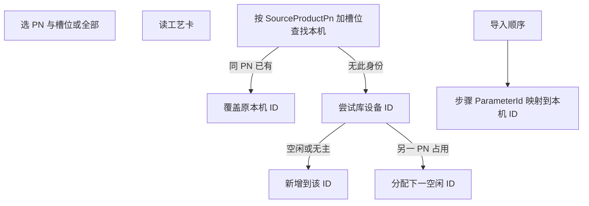

# 工艺库导入：多选 + 跨 PN 只新增

## 问题

当前导入只替换编辑器、单条、不落本机库。本机预设文件是 `{DataDirectory}/controller-parameters/{id}.json`（顺序同理 `controller-sequences/{id}.json`），**全局按设备 ID 1–500 落盘**，没有产品 PN。两个产品槽 `00` 都会抢 ID 1。

## 规则（写入本机预设）

按**工艺库身份**而不是死盯库内设备号：

| 情况 | 行为 |
|------|------|
| 本机已有同 `SourceProductPn` + 同槽位/同库顺序 ID | **覆盖**该条（沿用已分配的本机 ID，即使上次因冲突被分到 4） |
| 本机没有该身份，且首选 ID（槽+1 / 库 SequenceId）空闲或无主 | **新增**到首选 ID |
| 首选 ID 已被**另一产品 PN**占用 | **新增**：取 1–500 中下一个空闲 ID，绝不覆盖 |

无 `SourceProductPn` 的旧文件（设备导入/手改）视为已占用 → 后导入的产品走新增，避免冲掉。

顺序导入时：步骤里的 `ParameterId` 是库内设备号（槽+1）。必须按「该 PN 已导入参数」的映射改写成**本机 ID**。缺的槽位先按同一规则自动导入参数卡，再写顺序。

生产换产/工艺库「下发到设备」仍按库槽位+1 写控制器，**不改**。本机重分配只影响编辑器本地库与从编辑器下发的目标 ID。状态栏写清「槽 00 → 本机 ID 4（未覆盖 PN-A 的 ID 1）」。

## 实现要点

**归属字段**（不进协议 `TighteningParameterTemplate`）：

- [`ControllerParameterPresetDocument`](src/AutoScrew.Infrastructure/Hardware/LocalJsonControllerParameterPresetStore.cs)：`SourceProductPn`、`SourceSlotId`
- [`ControllerSequencePresetDocument`](src/AutoScrew.Infrastructure/Hardware/LocalJsonControllerSequencePresetStore.cs)：`SourceProductPn`、`SourceSequenceId`
- [`ControllerParameterPresetSummary`](src/AutoScrew.Application/Abstractions/IControllerParameterPresetService.cs) / 顺序列表摘要同样带出，左侧列表可显示 PN

**服务**（逻辑放 Infrastructure，HMI 只调 API）：在 [`IProcessLibraryService`](src/AutoScrew.Application/Abstractions/IProcessLibraryService.cs) 增加例如：

- `ImportSlotsToLocalAsync(productPn, IReadOnlyList<int>? slotIds)` — `null`/空 = 该 PN 全部槽
- `ImportSequencesToLocalAsync(productPn, IReadOnlyList<int>? sequenceIds)` — 先保证引用槽位已导入，再 remap 步骤并保存

返回：每条本机 ID、是否新增、库身份 → 本机 ID 对照。ID 用尽（1–500）则失败并说明。

[`UploadProcessCardAsync`](src/AutoScrew.Infrastructure/ProcessLibrary/ProcessLibraryService.cs) / 上传顺序 JSON 里现有的 `SaveLocalPresetAsync(slot+1)` **改走同一分配器**，否则工艺库上传仍会跨 PN 覆盖。

**对话框**：[`ProcessLibrarySlotPickerDialog`](src/AutoScrew.Hmi/Views/ControllerDevice/ProcessLibrarySlotPickerDialog.xaml) 与顺序选择框：

- `ListBox.SelectionMode=Extended`
- 按钮「导入该 PN 全部」
- 确认返回 `ConfirmedSlotIds` / `ConfirmedSequenceIds` + `ImportAll`

**编辑器**：[`ControllerParameterViewModel.ImportFromProcessLibraryAsync`](src/AutoScrew.Hmi/ViewModels/ControllerParameterViewModel.cs) / 顺序 VM 对等：调用批量导入 → 刷新左侧列表 → 编辑器加载第一条（或仅一条时加载该条）。不再只 `ApplyTemplate` 不落盘。

文案：`Strings.zh-CN.xaml` / `en-US.xaml`；[`doc/PROCESS_LIBRARY.md`](doc/PROCESS_LIBRARY.md) 补导入规则与跨 PN 映射。

## 测试（先写失败再实现）

[`tests/AutoScrew.Tests`](tests/AutoScrew.Tests)：临时目录作 `DataDirectory` + 迷你工艺库。

1. PN-A 槽 00,01 → 本机 1,2；再导 PN-B 槽 00 → 本机 **3**，文件 `1.json` 内容仍是 PN-A
2. 再导 PN-A 槽 00 → 仍覆盖 **1**，不新开 ID
3. PN-B 顺序步骤 ParameterId=1 → 保存后步骤为 **3**
4. 同 PN 缺槽位：只导入 01 时新增，不删 00
5. 1–500 占满且均属其他 PN → 抛错，不覆盖
