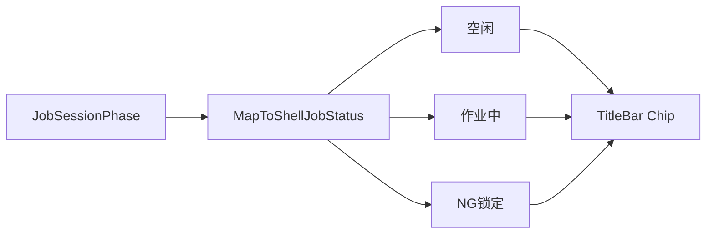

# 标题栏作业状态机标识

## 目标

在 [`MainWindow.xaml`](src/AutoScrew.Hmi/MainWindow.xaml) 的 `TitleBar.TrailingContent` 中，于**计算器按钮左侧**（放在记事本之前，更靠窗体中部）增加大号、彩色状态徽章，标识当前作业台状态。

## 状态映射（3 档，醒目优先）

以 `JobSessionPhase` 归并为操作员可读的三档（用户强调空闲/运行；**NG 单独红色**，避免锁屏时被误认为「运行」）：

| 显示 | 相位 | 颜色 |
|------|------|------|
| 空闲 | `Idle` / `SnPending` / `SnRejected` / `Completed` | 灰蓝 / muted 底 + 深字 |
| 作业中 | `LoadingRecipe` / `Running` / `AwaitFlip` | 绿 / 强调色底 + 白字 |
| NG 锁定 | `NgLocked` | 红（`BrushNg`）底 + 白字 |

文案用本地化键（不直接 `ToString()`）：

- `S.Shell.JobPhase.Idle` → 空闲 / Idle
- `S.Shell.JobPhase.Running` → 作业中 / Running
- `S.Shell.JobPhase.NgLocked` → NG 锁定 / NG Locked

Tooltip 可带当前细相位（如「待翻面」），复用或新增短说明键。



## 实现要点

### 1. Shell VM 订阅会话相位

在 [`MainShellViewModel.cs`](src/AutoScrew.Hmi/ViewModels/MainShellViewModel.cs)：

- 注入已注册的单例 `OperatorSessionController`
- 订阅 `Changed`，在 UI 线程刷新：
  - `JobPhaseLabel`（本地化短文案）
  - `JobPhaseBrush` / `JobPhaseForeground`（或 enum + 转换器）
  - `JobPhaseTooltip`（细相位说明）
- `Dispose` / 构造对称退订；文化切换时重刷文案

映射逻辑放在 Shell 侧小方法即可（约 15 行），不必新建 Domain 类型。

### 2. TitleBar XAML

在 [`MainWindow.xaml`](src/AutoScrew.Hmi/MainWindow.xaml) `TrailingContent` 的 `StackPanel` **最前**（记事本/计算器左侧）插入：

```xml
<Border MinWidth="120" Height="36" CornerRadius="6" Padding="16,0"
        Background="{Binding JobPhaseBackground}" Margin="0,0,12,0">
  <TextBlock Text="{Binding JobPhaseLabel}" FontSize="18" FontWeight="Bold"
             Foreground="{Binding JobPhaseForeground}"
             HorizontalAlignment="Center" VerticalAlignment="Center"
             ToolTip="{Binding JobPhaseTooltip}"/>
</Border>
```

样式要求：字号 ≥18、加粗、固定最小宽度，颜色随状态切换。

### 3. 字符串

[`Strings.zh-CN.xaml`](src/AutoScrew.Hmi/Themes/Strings.zh-CN.xaml) / [`Strings.en-US.xaml`](src/AutoScrew.Hmi/Themes/Strings.en-US.xaml) 增加 `S.Shell.JobPhase.*`（及可选 tooltip 键）。

### 4. 不改动范围

- 不改 `JobSessionPhaseMachine` / 作业业务逻辑
- 作业页底部已有 `PhaseDisplay` 可保留；本次只加壳层标题栏徽章

## 验收

- 空闲启动：标题栏显示「空闲」（灰）
- 扫码进入作业 / 拧紧：切换为「作业中」（绿/强调色）
- NG 锁屏：切换为「NG 锁定」（红）
- 复位/完成后回到「空闲」
- 切换中英文：文案正确更新
