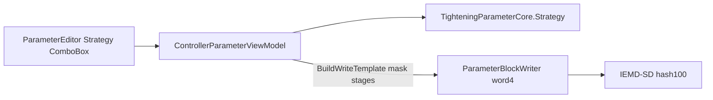

# 拧紧参数四种策略（完整对齐设备）

**目标：** 上位机「拧紧参数」支持设备 CH05 四种锁附策略，位置在参数 ID 行下方（对齐图2），写设备行为与手册 A.3.1 `#100` 的 `0xCC` 一致。

**架构：** 策略是 HMI/本地语义字段（349-word 块内无独立策略寄存器）。编辑器持有 `TighteningStrategy`；可见阶段由策略映射到既有 6 槽 `Stages[]`；`#100` 写入时 `word4`(0xCC)：自创=1，其余=0，并对非策略阶段槽清零以便控制器自动识别。

**协议依据（已核实 PDF A-25）：**

| 0xCC | 含义 |
|------|------|
| 0 | 自动识别策略 |
| 1 | 固定为自创 |

阶段槽（0-based）与策略映射：

| 策略 | 可见槽 | 写前保留槽 | 0xCC |
|------|--------|------------|------|
| 标准 Standard | 0–3（启动/旋入/预紧/拧紧） | 0–3，清 4–5 | 0 |
| 加强 Enhanced | 仅 3（拧紧） | 仅 3，清其余 | 0 |
| 预定位 PrePosition | 0–1（启动/旋入） | 0–1，清其余 | 0 |
| 自创 SelfDefined | 最多 6（可增删） | 已配置槽，`word4=1` | 1 |



## 关键改动文件

- 新增 [`src/UDL.Delta.IemdSd/Protocol/TighteningStrategy.cs`](src/UDL.Delta.IemdSd/Protocol/TighteningStrategy.cs) — 枚举 + 槽位掩码/推断辅助
- 修改 [`TighteningParameterCore.cs`](src/UDL.Delta.IemdSd/Protocol/TighteningParameterCore.cs) — 增加 `Strategy`（本地 JSON 持久化；不进 Raw）
- 修改 [`ParameterBlockWriter.cs`](src/UDL.Delta.IemdSd/Internal/ParameterBlockWriter.cs) / [`IemdSdClient.WriteParameterAsync`](src/UDL.Delta.IemdSd/IemdSdClient.cs) — `#100` 传入 `word4`
- 修改 [`ControllerParameterViewModel.cs`](src/AutoScrew.Hmi/ViewModels/ControllerParameterViewModel.cs) — 策略属性、`VisibleStageItems`、切换/加载/写入
- 修改 [`ParameterEditorView.xaml`](src/AutoScrew.Hmi/Views/ControllerDevice/ParameterEditorView.xaml) — ID 下 ComboBox；拧紧 Tab 绑 `VisibleStageItems`；自创通用阶段编辑区
- 修改 [`ControllerParameterStageItem.cs`](src/AutoScrew.Hmi/ViewModels/ControllerParameterStageItem.cs) — 自创布局标志与阶段标题
- 字符串 [`Strings.zh-CN.xaml`](src/AutoScrew.Hmi/Themes/Strings.zh-CN.xaml) / [`Strings.en-US.xaml`](src/AutoScrew.Hmi/Themes/Strings.en-US.xaml)
- 测试 [`tests/UDL.Delta.IemdSd.Tests/`](tests/UDL.Delta.IemdSd.Tests/) — 策略掩码、推断、`word4` 映射

## 实现要点

### 1. 领域层

```csharp
public enum TighteningStrategy : ushort
{
    Standard = 0,
    Enhanced = 1,
    PrePosition = 2,
    SelfDefined = 3,
}
```

- `GetActiveStageIndices(strategy)` / `ApplyStrategyMask(stages, strategy)`：写设备前对非活动槽 `new TighteningStageCore()` 清零（在**写出副本**上做，编辑器内存保留切换前数据）。
- `InferFromStages(stages)`：设备 `#150` 回读无 Strategy 时推断——槽 4/5 有内容→自创；仅槽 3→加强；仅 0+1→预定位；0–3 有内容且 4/5 空→标准；其余→自创。
- `Core.Strategy` 随本地预设 JSON 读写；`ApplyCoreToRaw` **不**写入 Strategy。

### 2. 驱动写通路

[`ParameterBlockWriter.WriteAsync`](src/UDL.Delta.IemdSd/Internal/ParameterBlockWriter.cs) 当前：

```csharp
ModbusCommandInvocation.WithWritePayload(
    ModbusFunctionCodes.WriteParameter,
    template.RawBlock,
    word2: _toolIndex,
    word3: template.ParameterId); // word4 默认 0
```

改为：先对 Core 应用策略掩码再 `ApplyCoreToRaw`；`word4: strategy == SelfDefined ? 1 : 0`。

### 3. HMI

- 在「参数 ID」行与 `SummaryText` **之间**增加一行：标签「策略」+ `ComboBox`（标准/加强/预定位/自创）。
- `VisibleStageItems` 替代现仅取前 4 的 `StandardStageItems`；拧紧设定 `TabControl`/`SelectedStageIndex` 改绑可见列表。
- 策略切换：重建可见列表；标准策略继续强制槽 0 为角度控制；`CoerceStandardStageMode` 仅在标准/预定位命名布局下生效。
- **自创**：显示最多 6 槽；沿用现有 Add/Remove；阶段内容用通用控件（控制模式单选 + 主目标 + 转速 + 监视），因索引 0–3 的 `IsStartStage` 等命名布局在自创下不适用。
- **加强**：只显示槽 3，现有「拧紧」模板自动适用。
- **预定位**：显示槽 0–1。
- 摘要文案增加策略名（如 `标准 · 4阶段有效`）。
- 从设备加载：`InferFromStages` 填 Strategy；从本地加载：用 JSON 中的 Strategy。

### 4. 非目标（本期不做）

- Yield point（控制模式 5）
- Quick Start `#101`
- 设备端策略弹窗像素级复刻（上位机用 ComboBox 即可）

## 验证

- 单元测试：掩码清槽、推断四种策略、`SelfDefined → word4=1`
- 手工：切换四种策略看拧紧 Tab 阶段数；本地保存再打开 Strategy 保持；脱机/真机 `#100` 写入后设备 HMI 显示对应策略（尤其预定位/加强）
