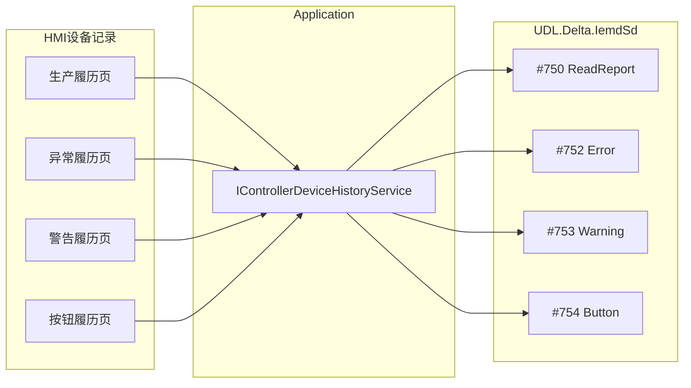

# 设备记录（生产/异常/警告/按钮履历）实现方案

## 定位与隔离（必须遵守）

- **锦上添花**：只服务技术员查看控制器履历；失败只影响本页 Snackbar，**不得**阻断扫码、作业、`#302`、拧紧周期、换产。
- **不碰核心**：不改 [`OperatorSessionController`](src/AutoScrew.Application/Services/OperatorSessionController.cs)、[`MainViewModel`](src/AutoScrew.Hmi/ViewModels/MainViewModel.cs) 作业逻辑、[`IemdSdLockStationHardware`](src/AutoScrew.Infrastructure/Hardware/IemdSdLockStationHardware.cs) 产线拧紧路径、AutoRun/挂起恢复。
- **页面独立**：四个子页各自 Page + ViewModel；仅共享新建的 History **服务接口**，互不嵌套、不共用一个「万能大页」。
- **Application 可新增**：现成没有履历应用服务时，**新增** `IControllerDeviceHistoryService`（及可选码表接口）；Infrastructure 实现；HMI 只依赖该接口。
- **设备忙**：履历读走现有 client 会话锁；若作业占用设备，本页提示「设备忙」并重试/放弃，**不**抢锁打断周期。

## 可行性结论

| 子页（厂商屏） | Modbus 命令 | 驱动现状 | 能否实现 |
|---|---|---|---|
| 生产履历 | **#750** | 已有 `ReadReportAsync` → [`ProductionReport`](src/UDL.Delta.IemdSd/Protocol/ProductionReport.cs)（缺日期时间等字段） | 能 |
| 异常履历 | **#752** | 已有 `ReadErrorReportAsync`，仅返回 `int[]` | 能 |
| 警告履历 | **#753** | 已有 `ReadWarningReportAsync`，仅返回 `int[]` | 能 |
| 按钮履历 | **#754** | 已有 `ReadButtonReportAsync`，仅返回 `int[]` | 能 |

相关清履历：`#700` 清生产条目、`#701` 清异常+警告；**无**单独清按钮履历命令。曲线 `#751`、排序字段包 `#760` **不纳入本期**（厂商工具栏「趋势」可后做）。

说明文字（「旋入阶段:超出最大扭矩值」等）**不在 Modbus 上**，需本地 AL/NG/WN 码表（手册 CH12）。第一期可先显示代码，码表逐步补齐。

**不要**复用 [`HistoryDashboardPage`](src/AutoScrew.Hmi/Views/Pages/HistoryDashboardPage.xaml)（本机 SN/PN 作业库）；设备记录只读控制器缓冲区。

## 导航与 UI（对齐设备配置，四页独立）

在 [`MainShellViewModel.RebuildMenuItems`](src/AutoScrew.Hmi/ViewModels/MainShellViewModel.cs) **仅追加**侧栏分组 **设备记录**（权限同 `CanUseConfiguration`），放在「设备配置」旁；默认启动页仍是作业台。

四个**独立**子页（各注册 DI、各有 VM）：

| 子页 | Page | ViewModel |
|---|---|---|
| 生产履历 | `DeviceProductionHistoryPage` | `DeviceProductionHistoryViewModel` |
| 异常履历 | `DeviceExceptionHistoryPage` | `DeviceExceptionHistoryViewModel` |
| 警告履历 | `DeviceWarningHistoryPage` | `DeviceWarningHistoryViewModel` |
| 按钮履历 | `DeviceButtonHistoryPage` | `DeviceButtonHistoryViewModel` |

每页自有：工具栏（刷新；清空按协议可用性）+ `DataGrid` + 底部分页。列对齐帮助图：

- **生产**：日期时间、工具、旋入角度、拧紧角度、最终扭矩、状态 OK/NG  
- **异常**：日期时间、AL/NG 代码、说明  
- **警告**：日期时间、WN 代码、说明  
- **按钮**：日期时间、按钮 ID、使用者、修改前、修改后  

## 驱动层补齐（尽量旁路、可加不可破）

1. **履历列表字段**  
   - 优先在履历专用解析中补日期时间等展示字段；若扩展 [`ProductionReport`](src/UDL.Delta.IemdSd/Protocol/ProductionReport.cs)，**只加可选属性**，不改变产线 `ReadReportAsync` 现有字段语义与调用方。  
   - `#752/#753/#754`：新建 `ErrorReportEntry` / `WarningReportEntry` / `ButtonReportEntry` + 解析；正确 `wordCount`（7 / 7 / 12）。

2. **条数 / 最新 ID**  
   - 读状态寄存器条数供分页；按 ID 倒序拉取。仅 History 服务使用。

3. **单测**：履历 payload 解析；不修改作业/拧紧既有测试的期望行为。

## 应用层服务（新增）

在 Application 新增抽象，Infrastructure 实现（经 `IStationDeviceService.GetClient`，**不**注入 `OperatorSessionController`）：

[`IControllerDeviceHistoryService`](src/AutoScrew.Application/Abstractions/)（路径以实际仓库为准）：

- `GetCountsAsync` / `ReadProductionPageAsync` / `ReadErrorPageAsync` / `ReadWarningPageAsync` / `ReadButtonPageAsync`  
- 可选本期后做：`ClearProductionAsync`（#700）、`ClearErrorWarningAsync`（#701）  
- 码表可同层小接口或静态帮助类；未知码显示「（无本地说明）」

四个 VM **只依赖**该服务 + 设备可用性提示；页面互不调用。

## HMI 实现要点

- [`App.xaml.cs`](src/AutoScrew.Hmi/App.xaml.cs) 注册四页、四 VM、History 服务。  
- 字符串：`S.Nav.DeviceRecords` 及各列 key（zh/en）。  
- 分页串行读，失败局限本页。  
- 异常页 AL/NG 前端筛选可选。  
- 清空 / CSV / 曲线：属增强，**默认放阶段 B/C**，避免拖慢核心交付。

## 分期交付

| 阶段 | 内容 |
|---|---|
| **A（本期）** | 新增 History 服务 + 侧栏四独立页 + 刷新/列表/分页；码表可空 |
| **B** | 清空 #700/#701 + 确认 + 审计（仍不进作业路径） |
| **C** | CSV；补 CH12 码表 |

## 风险与约束

- 大缓冲勿一次拉满；分页按需。  
- 作业占用设备时本页提示忙，不抢周期。  
- 与「系统 → 历史回顾」并存：文案区分设备缓冲 vs 本机追溯。  
- Diff 范围控制在：UDL 履历解析增量、新 Application/Infrastructure 服务、新 HMI 页/菜单字符串；**禁止**顺手重构作业台。