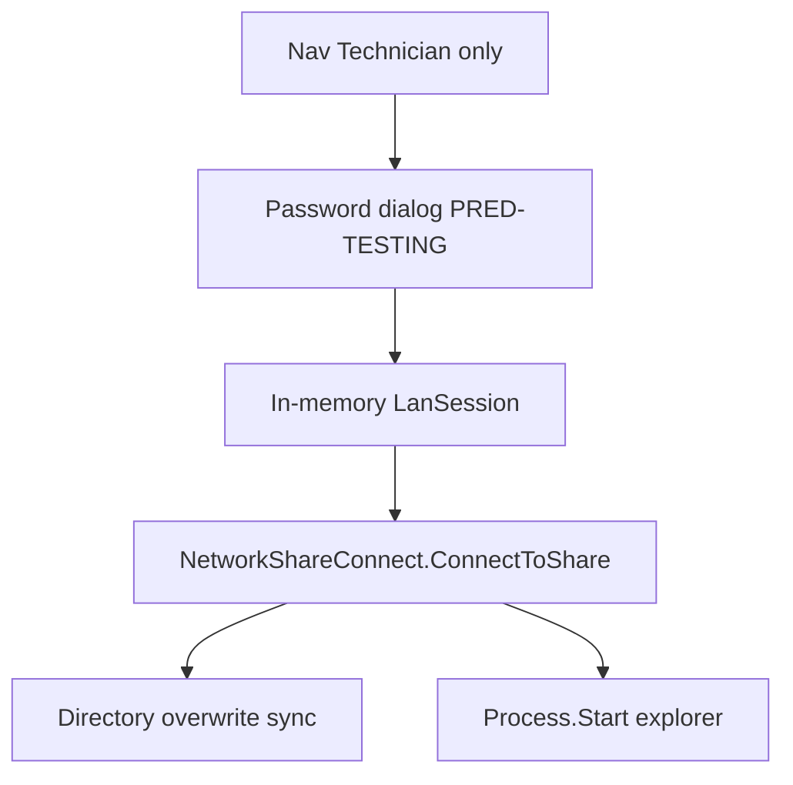

# 技术员高级局域网文件维护页

## 已确认决策

- **鉴权 1B**：技术员及以上可见导航；**进入页面须手输 PRED-TESTING 密码**（口令仅存内存会话，离页清除，不写配置/日志）。固定用户名 `PRED-TESTING`（可带 `LanShareDomain`），**不**自动使用 `LanSharePasswordAes256` 做本页操作（密文仍仅供归档等后台路径）。
- **能力 2C**：主能力 = **双目录覆盖同步**；辅能力 = **用当前会话凭证打开资源管理器**到指定 UNC/本机路径。不做页内完整资源管理器（无树控件拷贝/粘贴/重命名 UI）。

## 架构

## 1. Infrastructure：会话连接 + 目录同步

扩展 [`NetworkShareConnect`](src/AutoScrew.Infrastructure/Lan/NetworkShareConnect.cs) / 新增服务（建议 `ILanPrivilegedFileService` + `LanPrivilegedFileService`）：

| API | 行为 |
|-----|------|
| `TryUnlockAsync(password, cancellationToken)` | 对 `LanShareAccess.ResolveLanRoot()` 的 share root 调用 `ConnectToShare(PRED-TESTING, password)`；成功则把密码保留在 **进程内私有字段**（`SecureString` 或短生命周期 string，页面 Dispose/NavigatedFrom 清零） |
| `EnsurePathConnected(path)` | 若 path 为 UNC，对 `GetShareRoot(path)` 再用会话口令连接；本机路径跳过 |
| `MirrorDirectoryAsync(source, target, ct)` | 递归创建目录 + 覆盖复制文件；返回计数（新建/覆盖/失败列表）；后台 `Task.Run` |
| `OpenInExplorer(path)` | `EnsurePathConnected` 后 `explorer.exe` / `Process.Start` 打开目录 |
| `Lock()` | 清除会话口令 |

校验：源/目标存在且为目录；目标不得等于源或其子路径（防自毁）。同步前 HMI 二次确认。

审计：[`AuditHelper`](src/AutoScrew.Hmi/Services/AuditHelper.cs) 记录 `LanFile.Unlock` / `LanFile.Sync` / `LanFile.OpenExplorer`（路径与结果；**禁止**记口令）。

DI：在现有 Infrastructure/`App.xaml.cs` 注册单例或 Scoped 服务（与 `LanShareAccess` 并列）。

## 2. HMI：页面与导航

新增（对齐 [`ProcessLibraryPage`](src/AutoScrew.Hmi/Views/Pages/ProcessLibraryPage.xaml.cs) 模式）：

- `MainAppSection.LanFileMaintenance`
- `LanFileMaintenancePage` + `LanFileMaintenanceViewModel`
- 侧栏：**系统**分组下，技术员可见（与 Settings 同级），文案如「高级文件 / LAN File Maintenance」
- [`App.xaml.cs`](src/AutoScrew.Hmi/App.xaml.cs) `AddSingleton` Page/VM；[`MainShellViewModel`](src/AutoScrew.Hmi/ViewModels/MainShellViewModel.cs) 菜单、`OnNavigationViewSelectionChanged`、`ResolvePageType` 分支

**解锁 UI**：进入页或未解锁时遮罩/对话框：只读用户名 `PRED-TESTING`、`PasswordBox`、连接（用 MES/`OptionalNetworkArchiveRoot` 解析出的根做探测）。失败显示 WNet 错误；成功解锁后显示主区。

**主区布局**：

1. 状态：已解锁 / LAN 根只读展示  
2. **双目录同步**：源路径、目标路径（浏览文件夹）、「开始覆盖同步」、进度与结果摘要  
3. **打开资源管理器**：路径框（默认可填 LAN 根）+「打开」  
4. 离开页面 / 点「锁定」→ `Lock()`

字符串：[`Strings.zh-CN.xaml`](src/AutoScrew.Hmi/Themes/Strings.zh-CN.xaml) / en-US。

## 3. 安全边界（写进实现注释与简短 doc 备注）

- 口令不落盘、不进审计详情、不绑到 `appsettings`  
- 本页不展示/不编辑 `LanSharePasswordAes256`  
- 操作员不可见该导航  
- 同步为**覆盖写**；确认框明确「将覆盖目标中同名文件」

## 4. 测试

- `GetShareRoot` / 目标路径合法性（源=目标、目标为源子目录）单元测试  
- 本机临时目录 `MirrorDirectory` 覆盖行为测试（不依赖真 UNC）  
- VM：未解锁时 Sync/Open 命令 `CanExecute=false`（可选）

## 5. 明确不做

- 页内文件树、拖拽、单文件编辑器  
- 用配置密文静默解锁（与 1B 冲突）  
- 改动 SN 归档路径或工艺库业务逻辑
