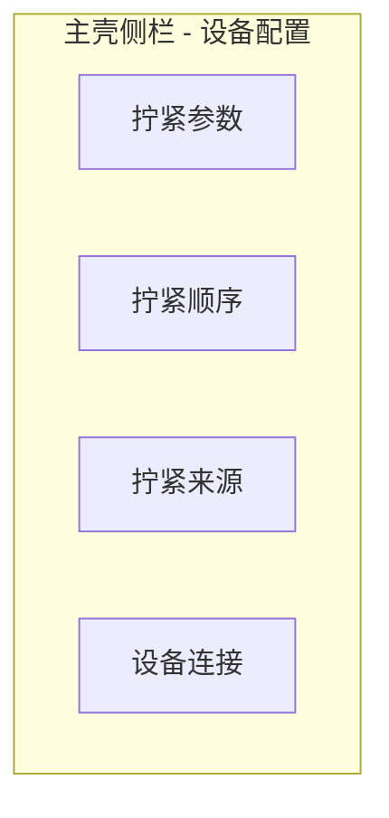
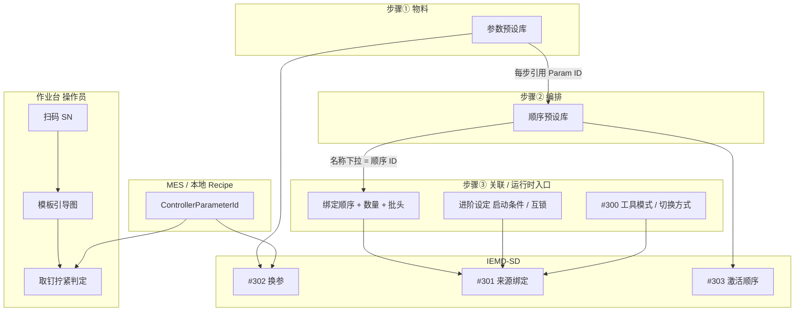

# IEMD-SD 工艺工作台 HMI 交互线框（草案）

| 版本 | 日期 | 状态 |
|------|------|------|
| 0.3 | 2026-06-11 | **草案**：步骤③ 来源 = ①② 关联层；CH07 三张截图对照 |
| 0.2 | 2026-06-22 | 线框 + 台达 CH05–07 GUI 研读对照 |

**需求追溯**：[PRD.md](PRD.md) §IEMD-SD 控制器三步工艺配置（V1.3）  
**协议参考**：[driverAnaC.md](driverAnaC.md) §5.6.1 / §5.8 / §5.9  
**对照参考**：[MULTI_SURFACE_UI_WIREFRAME.md](MULTI_SURFACE_UI_WIREFRAME.md)（作业台/模板线框风格）

**范围**：技术员级「拧紧参数 / 拧紧顺序 / 拧紧来源」统一为 **工艺工作台** Hub；不含 EHS、急停、互锁、扭矩保护绕过。  
**非范围**：WPF 代码实现（本文仅原型）；螺钉模板一键生成顺序（P2 建议）。

---

## 1. 设计原则

1. **保留设备三步语义**：与台达 IEMD-SD 设备 HMI「参数 → 顺序 → 来源」心智一致，避免上位机发明另一套命名。
2. **单一入口、步骤驱动**：侧栏由三个平级页合并为 **工艺工作台**；内部用步骤条串联，减少「配完参数忘记改来源」的割裂。
3. **产线模式置顶**：`HostGuided`（上位机引导 + `#302`）与 `DeviceProgram`（设备顺序 + `#301`/`#303`）在顶栏常驻，切换后各步骤必填/只读联动。
4. **简易 / 高级分层**：默认只露产线常用项（目标扭矩、阶段 1–3、顺序步骤绑定）；高级折叠对齐 Modbus 349 word / 530 word 全字段。
5. **人类单位与枚举**：界面显示 N·m、秒；控制模式用中文下拉（扭矩/角度/扭矩率…），禁止裸 `0–4`。
6. **预设库互联**：顺序步骤选参来自参数预设库（下拉摘要），非裸 `Param ID` 数字框。
7. **危险操作可审计**：写设备、删除预设、激活 `#302`/`#303` 前确认框 + `AuditConfig`（对齐现有参数页）。
8. **部署可验收**：第四步「部署校验」提供 FAT 勾选清单，对应 PRD FAT 建议。
9. **来源是关联层，不是第三套 CRUD**：步骤③ 不重复维护参数/顺序内容；它从步骤② **顺序预设库**（间接引用步骤① 参数）中 **选取、绑定、设定运行规则**，再写入 `#300`/`#301`/`#303`。设备 HMI「名称」下拉中的 `ControllerA/B/C` 即已建 **顺序**，非裸参数 ID。

**权限**：`UserRole >= Technician`（与现有 `CanUseConfiguration` 一致）；操作员侧栏不可见。

---

## 2. 现状问题（为何重做）

| 问题 | 现状 | 工作台目标 |
|------|------|------------|
| 三页割裂 | 参数 / 顺序 / 来源各自工具栏，无上下文 | Hub 步骤条 + 全局模式 |
| 协议裸暴露 | `mNm`、`×0.1s`、控制模式整数 | N·m、秒、枚举下拉 |
| 字段过少 | 349 word 仅 ~15% 可编辑 | 简易默认 + 高级全量 |
| 顺序弱绑定 | DataGrid 裸 `Param ID` | 预设下拉 + 跳转参数 |
| 来源藏底部 / 与①②割裂 | 来源页独立 CRUD，未关联顺序库 | 步骤③ **绑定② + 摘要①**；顶栏模式联动 |
| 无部署闭环 | 无 FAT 清单 | 步骤④勾选验收 |

**现有实现文件**（2026-06 已改为设备式三独立页；原工艺工作台 Hub 已移除）：

- [`ControllerParameterPage.xaml`](../src/AutoScrew.Hmi/Views/Pages/ControllerParameterPage.xaml)
- [`ControllerSequencePage.xaml`](../src/AutoScrew.Hmi/Views/Pages/ControllerSequencePage.xaml)
- [`ControllerSourcePage.xaml`](../src/AutoScrew.Hmi/Views/Pages/ControllerSourcePage.xaml)

---

## 3. 信息架构

### 3.1 导航



- **当前实现**：侧栏「设备配置」下 **三个独立菜单项**，与台达 IEMD-SD 设备 HMI 首页三入口一一对应（CH05/06/07）。
- **入口文案**：`S.Nav.ControllerParams` / `S.Nav.ControllerSequence` / `S.Nav.ControllerSource`。
- **产线模式**：`HostGuided` / `DeviceProgram` 已移至 **拧紧来源** 页底部（不再使用工艺工作台顶栏）。

**实现文件**（2026-06 设备式三页）：

- [`ControllerParameterPage.xaml`](../src/AutoScrew.Hmi/Views/Pages/ControllerParameterPage.xaml)
- [`ControllerSequencePage.xaml`](../src/AutoScrew.Hmi/Views/Pages/ControllerSequencePage.xaml)
- [`ControllerSourcePage.xaml`](../src/AutoScrew.Hmi/Views/Pages/ControllerSourcePage.xaml)
- [`ParameterEditorView.xaml`](../src/AutoScrew.Hmi/Views/ControllerDevice/ParameterEditorView.xaml)
- [`SequenceEditorView.xaml`](../src/AutoScrew.Hmi/Views/ControllerDevice/SequenceEditorView.xaml)
- [`SourceEditorView.xaml`](../src/AutoScrew.Hmi/Views/ControllerDevice/SourceEditorView.xaml)

### 3.2 与产线 / 模板 / MES 的关系



**三步心智（与台达 CH05→06→07 一致）**：

| 步骤 | 角色 | 产出 | 下游消费 |
|------|------|------|----------|
| ① 拧紧参数 | **物料库** | 单颗螺钉工艺（阶段、扭矩、拧松…） | ② 每步点选；HostGuided 时 Recipe `#302` |
| ② 拧紧顺序 | **编排** | 多步流程（参数引用、Qty、Navigator） | ③「名称」绑定对象；DeviceProgram 时 `#303` |
| ③ 拧紧来源 | **关联 + 运行入口** | 选哪条顺序、几颗、批头、进阶互锁 | `#300`/`#301`；作业开始激活 |

| 产线模式 | 作业台行为 | 工作台重点配置 |
|----------|------------|----------------|
| **HostGuided**（默认） | 模板引导 + 每钉 `#302`（Recipe `ControllerParameterId`） | 步骤① 参数库 **必填**；② 可选；③ 主要确认 `#300` 手动 + 进阶互锁（`#301` 绑定可灰显） |
| **DeviceProgram** | 作业开始写 `#301` + `#303`；**跳过** `#302` | 步骤①② **均必填**；③ **从②选顺序**（设备「名称」列）+ 数量/批头/进阶设定，与截图一致 |

---

## 4. 全局壳层线框

### 4.1 布局 ASCII

```
┌─ 工艺工作台 ───────────────────────────────────────────────────────────┐
│ 产线模式  (●) 上位机引导 HostGuided    ( ) 设备顺序 DeviceProgram          │
│ 设备      ● 已连接 192.168.1.10  |  仿真模式（设备命令已禁用）            │
│ 同步      ⚠ 参数 #12 与设备不一致  [与设备对比]                            │
├────────────────────────────────────────────────────────────────────────┤
│  ① 拧紧参数 ──────► ② 拧紧顺序 ──────► ③ 拧紧来源 ──────► ④ 部署校验   │
│     ● 进行中          ○ 待完成           ○ 待完成            ○ 待完成      │
├────────────────────────────┬───────────────────────────────────────────┤
│  （步骤相关左栏）            │  （步骤相关主编辑区）                        │
│                            │                                           │
│                            │  [状态栏 Message]                          │
└────────────────────────────┴───────────────────────────────────────────┘
```

### 4.2 顶栏元素

| 元素 | 行为 |
|------|------|
| 产线模式单选 | 写入 `controller-source.json` 的 `ProductionTighteningMode`；切换时 InfoBar 提示对步骤②③的影响 |
| 设备状态 | 复用 `IStationDeviceService`；仿真时显示「仿真模式」并禁用读/写/激活 |
| 同步指示 | 本地 JSON 与上次 `#150`/`#200`/`#350` 读回不一致时显示 ⚠ |
| 全局读/写 | 可选：按当前步骤调用对应功能码（或各步骤内独立按钮） |

### 4.3 步骤条交互

| 操作 | 行为 |
|------|------|
| 点击步骤 | 切换主区内容；未保存时提示保存或放弃 |
| 步骤状态图标 | ● 当前；✓ 已完成（本地已保存且校验通过）；○ 未访问 |
| 上一步 / 下一步 | 底栏辅助按钮（可选） |

---

## 5. 步骤 ① 拧紧参数

### 5.1 线框 ASCII

```
┌─ ① 拧紧参数 ──────────────────────────────────────────────────────────┐
│ [新建] [保存本地] [删除] [导入 JSON] [导出 JSON]  |  [读设备 #150] [写设备 #100] [试激活 #302] │
├──────────────────┬────────────────────────────────────────────────────┤
│ 预设库 [搜索…]    │  ┌─ 摘要卡 ─────────────────────────────────────┐  │
│ ┌──────────────┐ │  │ ID 12 · M3 座面 · 目标 0.45 N·m · 3 阶段有效   │  │
│ │●12 M3座面    │ │  │ [静态扭矩-角度示意条]                          │  │
│ │ 15 M4深孔    │ │  └──────────────────────────────────────────────┘  │
│ │ 20 返修弱拧  │ │  [简易] [阶段 1-6] [拧松] [高级 ▾]                    │
│ └──────────────┘ │  ┌─ 简易 ────────────────────────────────────────┐  │
│ [+ 新建预设]      │  │ 参数 ID [12]    名称 [M3 座面________]          │  │
│                  │  │ 最小角 [0°]     最大角 [360°]                   │  │
│                  │  │ 最大时间 [30.0 s]  （内部 300 ×0.1s）           │  │
│                  │  │ ── 阶段 1 ──  模式[扭矩▼] 目标[0.45 N·m] 转速[800]│  │
│                  │  │ ── 阶段 2 ──  模式[角度▼] 目标[90°]   转速[400] │  │
│                  │  │ ── 阶段 3 ──  模式[扭矩率▼] …（可折叠）         │  │
│                  │  └───────────────────────────────────────────────┘  │
└──────────────────┴────────────────────────────────────────────────────┘
```

### 5.2 左侧预设库

| 列 / 行 | 内容 |
|---------|------|
| 搜索框 | 按 ID、名称过滤 |
| 列表行 | `{ID:D3} · {名称} · {阶段1目标扭矩 N·m}`（非仅 `001 · 名称`） |
| 选中 | 右侧加载 `controller-parameters/{id}.json` |
| 新建 | 分配未占用 ID（1–500），复制当前或空白模板 |

### 5.3 摘要卡

- 显示：ID、名称、有效阶段数、阶段 1 目标扭矩、最大角度。
- 右侧 **静态示意**：水平阶段条（非 ScottPlot 实时曲线），帮助技术员快速辨认参数轮廓。
- 点击「与设备对比」：diff 本地 vs `#150` 读回（高级/P1）。

### 5.4 编辑区分页

| 分页 | 层级 | 字段 |
|------|------|------|
| **简易** | 默认 | 见 §9.1 简易字段表 |
| **阶段 1–6** | 默认 | 每阶段：控制模式、转速、目标扭矩/角度、最大/最小扭矩；阶段 4–6 默认折叠 |
| **拧松** | 默认 | 第一段角度、第一段速度、侦测扭矩（简易 3 项） |
| **高级 ▾** | 折叠 | 见 §9.2 高级字段表（座面、补偿、延时、曲线采样等） |

### 5.5 设备操作

| 按钮 | 功能码 | 前置条件 | 确认 |
|------|--------|----------|------|
| 读设备 | `#150` | 真机已连接 | 覆盖本地编辑时确认 |
| 写设备 | `#100` | 真机已连接 | Caution + 确认 |
| 试激活 | `#302` | 真机；来源须手动（步骤③） | 输入试钉数（默认 1）+ 确认 |

### 5.6 交互表

| 场景 | 行为 |
|------|------|
| 修改未保存切换预设 | 对话框：保存 / 放弃 / 取消 |
| 删除预设 | 确认 + 审计；若被顺序引用则警告列表 |
| 仿真模式 | 读/写/激活禁用；本地 CRUD 可用 |
| ID 冲突 | 保存时校验 1–500 唯一 |

---

## 6. 步骤 ② 拧紧顺序

### 6.1 模式联动 InfoBar

| 产线模式 | InfoBar 文案 |
|----------|--------------|
| HostGuided | 「产线由上位机模板 + `#302` 引导螺钉位；顺序用于 DeviceProgram 模式或 FAT，非必填。」 |
| DeviceProgram | 「产线由本顺序驱动；请确保每步参数预设与工艺一致。」 |

### 6.2 线框 ASCII

```
┌─ ② 拧紧顺序 ──────────────────────────────────────────────────────────┐
│ [新建] [保存本地] [删除] [导入] [导出]  |  [读设备 #200] [写设备] [激活 #303] │
├──────────────────┬────────────────────────────────────────────────────┤
│ 顺序预设库        │  顺序 ID [3]  名称 [顶面 6 钉________]               │
│ ┌──────────────┐ │  导航模式 [General ▼]  [√] 定位臂                   │
│ │●03 顶面6钉   │ │  ── 步骤时间轴 ──────────────────────────────────  │
│ │ 05 底面4钉   │ │  (1)─(2)─(3)─(4)─(5)─(6)─[+]   ← 拖拽排序           │
│ └──────────────┘ │  ┌─ 当前：步骤 2 ────────────────────────────────┐  │
│                  │  │ 参数预设 [▼ 12 · M3 座面 0.45 N·m]  Tool [1]   │  │
│                  │  │ [高级 ▾]                                        │  │
│                  │  │   导航坐标 X[120] Y[80]                         │  │
│                  │  │   图像码 [0]                                    │  │
│                  │  │   定位臂 X/Y/Z mm …                             │  │
│                  │  └───────────────────────────────────────────────┘  │
└──────────────────┴────────────────────────────────────────────────────┘
```

### 6.3 步骤时间轴

| 交互 | 行为 |
|------|------|
| 点击步骤圆点 | 选中并显示下方步骤卡 |
| 拖拽 | 调整顺序（替代「仅删末步」） |
| `+` | 在末尾插入一步；中间插入用步骤卡菜单 |
| 删除 | 任意步可删（至少保留 0 步时禁止保存 DeviceProgram） |
| 参数预设下拉 | 数据来自步骤① `Presets`；显示 `{ID} · {名称} · {扭矩}` |
| 无效预设 | 红色描边 + 「预设 #99 不存在」 |

### 6.4 高级抽屉（每步）

| 块 | Modbus | UI |
|----|--------|-----|
| 导航坐标 | `#201`/`#251` Set n (X,Y) | 两列 NumberBox |
| 图像码 | `#202`/`#252` | 0–21 |
| 定位臂 | `#203`/`#253` XL/XH/YL/YH/ZL/ZH | 六列 mm（定位臂开启时必填校验） |

### 6.5 P2 增强（文档预留）

- **从模板导入**：选择产品模板面 → 按 `assemblySequence` 生成 N 步，参数 ID 从 Recipe 或手工映射表填充。
- **与画板对齐**：导航坐标叠加模板底图预览（二期视觉）。

---

## 7. 步骤 ③ 拧紧来源

> **核心理解（v0.3）**：来源页不是与参数、顺序并列的第三套资料库，而是对前两步的 **关联操作**——在已建 **顺序**（内含对参数的引用）上，选择 **哪条顺序跑、跑几颗、用哪批头、满足什么启动/互锁规则**，再落到 `#300`/`#301`/`#303`。  
> 设备 HMI 表格列「**名称**」旁的顺序图标 + 下拉 `ControllerA` / `ControllerB` / `ControllerC`，即步骤② 已保存的顺序预设，**不是**步骤① 的参数 ID。

### 7.0 与步骤①② 的联动（工作台必须体现）

| 联动 | 设备表现 | 工作台线框 |
|------|----------|------------|
| 未建顺序就进来源 | 「名称」下拉为空或仅默认项 | 步骤③ 禁用绑定表，提示「请先在 ② 创建顺序」+ [跳转 ②] |
| 选顺序后 | 显示顺序名；**数量** 常默认 = 顺序总步数（可改） | 绑定行旁 **摘要卡**：`03 顶面6钉 · 6 步 · 参数 #12,#15…` + [在 ② 中编辑] |
| 顺序内参数变更 | 设备不自动改来源数量 | 摘要卡 ⚠「顺序已改，请确认数量」 |
| 进阶设定 | 齿轮弹窗，按来源 ID 存 | 折叠区或弹窗；写入 `controller-source.json` 扩展块 |

**对照截图**（`iemd_manual_extract/gui/`）：

| 文件 | 设备场景 |
|------|----------|
| `07_source_single_axis_dual_tool.png` | 顶栏 **单轴独立**：工具1 / 工具2 各一块；名称 `ControllerA`×8、`ControllerB`×4 |
| `07_source_dual_axis_interactive.png` | 顶栏 **双轴交互**：单表绑定 `ControllerC`×6 |
| `07_source_advanced_settings_dialog.png` | 行内 **设定** 齿轮 → **进阶设定**（启动条件 + 12 条规则） |

### 7.1 设备操作模式 Tab（`#300` 操作模式）

设备在来源页顶栏用三个 Tab 切换整机工具拓扑（与步骤② 的 Tool1/2/Mix 呼应，但是 **运行层** 配置）：

| Tab | 设备文案 | 绑定 UI | 典型场景 |
|-----|----------|---------|----------|
| 单轴独立 | 單軸獨立 | **工具1**、**工具2** 两个分区表，各行独立选顺序 | 两把枪各跑不同顺序 |
| 双轴交互 | 雙軸交互 | **单表**「交互」，一行绑定一条顺序 | 两轴交替步进（截图 ControllerC×6） |
| 双轴同动 | 雙軸同動 | 单表「同动」（手册：同步拧紧） | 两轴同时动作 |

**切换方式**（全模式共有）：`手动设定` / `批头` / `条码`（设备：手動設定 / 批頭 / 掃碼）；旁 **上传/下载** 图标对应 USB 配方，上位机用 JSON 导入导出替代。

### 7.2 线框 ASCII — 单轴独立（对齐截图 1）

```
┌─ ③ 拧紧来源 ──────────────────────────────────────────────────────────┐
│ 关联摘要  顺序库 3 条可用  |  当前绑定引用 ②#03、②#05  [管理顺序 →]      │
│ [保存本地]  [读设备 #350/#351]  [写设备 #300/#301]  [激活 #303]          │
├────────────────────────────────────────────────────────────────────────┤
│ 运行拓扑  (●) 单轴独立   ( ) 双轴交互   ( ) 双轴同动                     │
│ 切换方式  [手动设定 ▼]  [✎]                    [↑导入] [↓导出]          │
├──────────────────────────────┬─────────────────────────────────────────┤
│ ┌─ 工具 1 ─────────────────┐ │ ┌─ 工具 2 ───────────────────────────┐ │
│ │ 名称          数量  批头 设定│ │ 名称          数量  批头  设定      │ │
│ │ [≋] ControllerA▼  8   —  ⚙│ │ [≋] ControllerB▼  4   —   ⚙        │ │
│ │  └ 摘要: 02 底面8钉·8步    │ │  └ 摘要: 05 侧板4钉·4步             │ │
│ └──────────────────────────┘ │ └────────────────────────────────────┘ │
└──────────────────────────────┴─────────────────────────────────────────┘
```

- **名称** 下拉：数据源 = `controller-sequences/*.json` 列表（显示名 = 顺序 `Name`，值 = `SequenceId`）。
- **数量**：本工具本次运行螺钉数；默认建议 = 所选顺序步数，允许改小（截断）或改大（需校验与顺序步数一致策略）。
- **批头**：对应 `#301` Bit ID；条码模式下由扫描填充。
- **⚙ 设定**：打开 §7.4 进阶设定弹窗。

### 7.3 线框 ASCII — 双轴交互（对齐截图 2）

```
┌─ ③ 拧紧来源 ──────────────────────────────────────────────────────────┐
│ 运行拓扑  ( ) 单轴独立   (●) 双轴交互   ( ) 双轴同动                     │
│ 切换方式  [手动设定 ▼]                         [↑导入] [↓导出]          │
├────────────────────────────────────────────────────────────────────────┤
│ 子页签 [交互]                                                            │
│ ┌──────────────────────────────────────────────────────────────────┐  │
│ │ 名称              数量    批头    设定                             │  │
│ │ [≋] ControllerC ▼   6      —      ⚙                              │  │
│ │      └ 摘要: 03 顶面6钉 · 6 步 · 参数 #12×4, #15×2  [在②编辑]      │  │
│ └──────────────────────────────────────────────────────────────────┘  │
│ [一键部署] = 校验 ② 存在 → 写 #300 + #301 + #303（确认框）              │
└────────────────────────────────────────────────────────────────────────┘
```

### 7.4 进阶设定弹窗（对齐截图 3）

设备每行来源绑定有独立 **进阶设定**（ID 1…N，可删/复制/粘贴）。工作台 **DeviceProgram 必填**、**HostGuided 可选**（扫码互锁、最大运行时间等产线仍可能需要）。

```
┌─ 进阶设定 ─────────────────────────────────────────────── [×] ┐
│ ID [1]   [🗑] [复制] [粘贴]                                    │
├───────────────────────────────────────────────────────────────┤
│ 启动条件  [下拉] [下拉] [下拉]                                  │
│           [kgf·cm ▼ ✎]  |  [下压 ▼]     ← 与设备一致；可换算 N·m │
├───────────────────────────────────────────────────────────────┤
│  1. 拧紧 OK 后禁止拧松              [OFF]                      │
│  2. 拧紧 NG 后禁止拧松              [OFF]                      │
│  3. 单颗螺钉最大拧紧 NG 次数        [ON ] [999999]             │
│  4. 单颗螺钉最大拧松 NG 次数        [ON ] [999999]             │
│  5. 拧紧 NG 自动下一颗              [OFF]                      │
│  6. 拧松 OK 回上一颗                [OFF]                      │
│  7. 扫码为空禁止启动                [OFF]                      │
│  8. 螺钉数量完成清除扫码            [OFF]                      │
│  9. 螺钉数量未完成禁止扫描          [OFF]                      │
│ 10. 最大运行时间                    [ON ] [9999999] 秒          │
│ 11. 螺钉数量完成重置数量            [ON ]                      │
│ 12. 拧紧信号提早消失时提示          [OFF]                      │
├───────────────────────────────────────────────────────────────┤
│                              [取消]  [确定]                     │
└───────────────────────────────────────────────────────────────┘
```

### 7.5 产线模式差异（步骤③）

#### HostGuided

```
┌─ ③ 拧紧来源 ──────────────────────────────────────────────────────────┐
│ ┌─ 上位机引导模式（当前）────────────────────────────────────────────┐  │
│ │ 作业台按 SN→模板 引导螺钉位；每钉由上位机下发 #302 切换参数。          │  │
│ │ MES/本地 Recipe：ControllerParameterId（见 LOCAL_RECIPES.md）       │  │
│ └────────────────────────────────────────────────────────────────────┘  │
│ 设备运行模式 (#300)  [只读预览]  单工具 / 手动切换                      │
│ 绑定表 (#301)        [灰显或折叠]  说明：顺序由模板+Recipe 驱动，非设备步进 │
│ 进阶设定             [可选 ▾]  扫码互锁、最大运行时间（产线 FAT 常用）   │
└────────────────────────────────────────────────────────────────────────┘
```

#### DeviceProgram

与 §7.2–7.4 相同；**绑定表必填**；主按钮 **「一键部署」** = 写 `#300` + `#301` + `#303`（需确认 + 审计）。

### 7.6 模式差异表

| 字段 / 行为 | HostGuided | DeviceProgram |
|-------------|------------|---------------|
| 步骤② 前置 | 可选 | **必填**（否则名称下拉无项） |
| 绑定表「名称」 | 灰显或仅预览 | **下拉 = ② 顺序库** |
| 数量 / 批头 | 通常由模板+Recipe | **必填**，对齐 `#301` |
| 进阶设定 | 可选（扫码/超时） | **建议全开**（对齐设备） |
| 写 `#303` | 隐藏或 FAT 专用 | **一键部署** 主路径 |
| 摘要卡跳转② | 可选 | **强提示** |

---

## 8. 步骤 ④ 部署与校验

### 8.1 线框 ASCII

```
┌─ ④ 部署校验 ──────────────────────────────────────────────────────────┐
│ 产线模式：HostGuided    设备：● 已连接                                   │
├────────────────────────────────────────────────────────────────────────┤
│ FAT 清单（可勾选，状态持久化到本地）                                      │
│ [ ] 1. 参数：#150 回读与本地预设 #12 diff 无差异                          │
│ [ ] 2. 参数：#100 写入预设 #12 成功                                       │
│ [ ] 3. 来源：#350 读回为手动来源                                        │
│ [ ] 4. HostGuided：试激活 #302（参数 12，1 钉）拧紧 OK                  │
│ [ ] 5. （DeviceProgram）顺序 #200 回读与本地 #03 一致                     │
│ [ ] 6. （DeviceProgram）#301+#303 激活后连续 3 钉 OK                    │
│ [ ] 7. 切回 HostGuided 后 #302 仍可用（PRD FAT 建议）                    │
│                                                                        │
│ [运行选中项]  [全部自动跑（维护模式）]  [导出 FAT 报告 JSON]               │
└────────────────────────────────────────────────────────────────────────┘
```

### 8.2 FAT 清单详表

| # | 项 | 适用模式 | 操作 | 通过标准 |
|---|-----|----------|------|----------|
| 1 | 参数 diff | 全部 | 读 `#150` vs 本地 | 关键字段一致或用户确认差异 |
| 2 | 参数写入 | 全部 | 写 `#100` | 无异常码 |
| 3 | 来源模式 | HostGuided | 读 `#350` | 手动来源 |
| 4 | 试激活参数 | HostGuided | `#302` + 1 次拧紧 | 设备 OK |
| 5 | 顺序 diff | DeviceProgram | 读 `#200` | 与本地一致 |
| 6 | 顺序激活试跑 | DeviceProgram | `#301`+`#303` + 3 钉 | 连续 OK |
| 7 | 模式回切 | 全部 | 切换 HostGuided 再试 `#302` | 不回归 |

---

## 9. 附表：字段映射

### 9.1 步骤① 简易字段

| UI 标签 | 显示单位 | 协议 / 模型 | Modbus | 现有 ViewModel |
|---------|----------|-------------|--------|----------------|
| 参数 ID | — | 1–500 | `#100`/`#150` 块 ID | `ParameterId` |
| 名称 | — | ASCII | 参数块名称区 | `Name` |
| 最小角度 | ° | `MinAngleDeg` | A.3.1 | `MinAngleDeg` |
| 最大角度 | ° | `MaxAngleDeg` | A.3.1 | `MaxAngleDeg` |
| 最大拧紧时间 | s（×0.1s 存） | `MaxTighteningTimeTenthSec` | A.3.1 | `MaxTighteningTimeTenthSec` |
| 阶段 n 控制模式 | 下拉 | `TighteningControlMode` | 阶段 FA | `Stage.ControlMode` |
| 阶段 n 目标扭矩 | N·m（mNm 存） | `TargetTorqueMilliNm` | 阶段 | `Stage.TargetTorqueMilliNm` |
| 阶段 n 目标角度 | ° | `TargetAngleDeg` | 阶段 | `Stage.TargetAngleDeg` |
| 阶段 n 转速 | rpm | `SpeedRpm` | 阶段 | `Stage.SpeedRpm` |
| 阶段 n 最大/最小扭矩 | N·m | `Max/MinTorqueMilliNm` | 阶段 | 已有绑定 |
| 拧松第一段角度 | ° | `Loosen.Segment1AngleDeg` | 拧松块 | `Loosen` |
| 拧松第一段速度 | rpm | `Loosen.Segment1SpeedRpm` | 拧松块 | `Loosen` |
| 拧松侦测扭矩 | N·m | `Loosen.DetectTorqueMilliNm` | 拧松块 | `Loosen` |

**控制模式下拉文案**（`TighteningControlMode`）：

| 值 | UI 中文 | UI English |
|----|---------|------------|
| 0 | 角度 | Angle |
| 1 | 扭矩 | Torque |
| 2 | 扭矩率 | Torque rate |
| 3 | 钳制扭矩 | Clamp torque |
| 4 | 钳制角度 | Clamp angle |

### 9.2 步骤① 高级字段（折叠）

| UI 分组 | 协议属性（`TighteningParameterCore`） |
|---------|--------------------------------------|
| 全局 | `LastStageServoOn`, `LinkedCompensationParamId`, `MaxLoosenTimeTenthSec`, `MaxLoosenAngleDeg` |
| 延时 | `TighteningStartDelayCentiSec`, `LoosenStartDelayCentiSec` |
| 座面/曲线 | `CurveSampleStartTorqueMilliNm`, `SeatAngleStartTorqueRate`, `SeatPointAngleCorrectionTenthDeg` |
| 判定/供料 | `FinalCurrentJudgeEnabled`, `FeederResultDelayTenthSec` |
| 补偿 | `ToolPrecisionCompTenthPercent`, `TorqueRateAngleDelayTenthDeg` |
| 阶段高级 | `Direction`, `TargetTorqueRate`, `AccelTimeMs`, `PauseTimeMs`, 钳制/分段字段等（`TighteningStageCore` 余下成员） |
| 拧松高级 | `TighteningLoosenCore` 未在简易区列出的字段 |

### 9.3 步骤② 顺序字段

| UI 标签 | 存储 | Modbus | 现有 |
|---------|------|--------|------|
| 顺序 ID | `controller-sequences/{id}.json` | `#200`/`#250` | `SequenceId` |
| 名称 | JSON | 0xD2–0xE5 | `Name` |
| 导航模式 | General/Navigator | 0xE6 | `NavigatorModeIndex` |
| 定位臂 | 0/1 | 0xE7 | `PositioningArmEnabled` |
| 步骤 Tool ID | 每步 | 0xF0–0x153 | DataGrid |
| 步骤 Param ID | 每步 → **预设下拉** | 0x154–0x217 | DataGrid → 改版 |
| 导航/图像/定位臂 | 每步高级 | `#201`–`#253` | DataGrid |

### 9.4 步骤③ 来源字段

| UI 标签 | 存储 | Modbus | 现有 | 备注 |
|---------|------|--------|------|------|
| 产线控制模式 | `controller-source.json` | 运行时逻辑 | `ProductionControlModeIndex` | 顶栏 HostGuided / DeviceProgram |
| 运行拓扑 Tab | JSON | `#300` word3 操作模式 | `OperatingModeIndex` | 单轴独立 / 双轴交互 / 双轴同动 |
| Tool 索引 | JSON | `#300` word2 | `ToolIndex` | 单轴独立时工具1/2 分区 |
| 切换方式 | JSON | `#300` word4 | `SwitchingMethodIndex` | 手动 / 批头 / 条码 |
| **名称（绑定）** | JSON | `#301` 0x137 | `BindingId` | **下拉数据源 = ② 顺序 ID**，非参数 ID |
| 绑定类型 | JSON | `#301` 0x136 | `BindingTypeIndex` | DeviceProgram 固定「顺序」 |
| 数量 | JSON | `#301` 0x138–9 | `ScrewCount` | 默认 = 顺序步数 |
| 批头 | JSON | `#301` 0x13A | `BitId` | 批头切换模式必填 |
| 条码 | JSON | `#301` 条码区 / `#401` | `Barcode` | 条码切换模式 |
| 顺序摘要 | 只读 UI | — | **无** | 从 `controller-sequences/{id}.json` 聚合 |
| 进阶设定 ID | JSON 扩展 | `#351` 块（待协议对齐） | **无** | 12 条规则 + 启动条件 |
| 启动条件 | JSON 扩展 | 进阶块 | **无** | 扭矩单位、下压等 |

---

## 10. 附表：产线模式 × 步骤差异

| 步骤 | HostGuided | DeviceProgram |
|------|------------|---------------|
| 顶栏模式 | 选中 HostGuided | 选中 DeviceProgram |
| ① 参数 | **必填**（Recipe 引用 ID） | **必填**（顺序每步引用） |
| ② 顺序 | 可选；InfoBar 说明 | **必填**；步骤数 = 螺钉总数 |
| ③ 来源 | `#300` 手动预览；`#301` 灰显；进阶可选 | **绑定 ② 顺序** + 数量/批头/进阶 + `#303` |
| ④ FAT | 侧重 #150/#100/#302/#350 | 侧重 #200/#301/#303 + 回切 #302 |
| 作业台 | 模板 + `#302` | 无 `#302`；设备步进 |

---

## 11. 交互与状态（全局）

| 场景 | 行为 |
|------|------|
| 未保存离开工作台 | 导航拦截确认 |
| 写设备失败 | InfoBar Error + `StatusMessage` + 审计 failure |
| 读设备覆盖 | 确认对话框 |
| 参数被顺序引用时删除 | 列出引用顺序 ID，禁止或强制解除 |
| 技术员以下角色 | 侧栏无「工艺工作台」 |
| 真机维护 | 步骤④试跑仅维护模式（与 PRD 脱机验证一致） |

---

## 12. 与设备 HMI 对照表

研读来源：中文 PDF 截图 + 英文手册 CH05–07；GUI 索引见 [iemd_manual_extract/README.md](iemd_manual_extract/README.md)。

### 12.1 对照拍摄清单

| # | 设备画面 | 状态 | 文件 |
|---|----------|------|------|
| 1 | 首页主菜单 | 已提取 | `iemd_manual_extract/gui/00_home_main_menu.jpg` |
| 2 | 参数 — 拧紧阶段（角度/夹紧） | 已提取 | `05_param_tightening_stage_*.jpg` |
| 3 | 参数 — 阶段进阶设定弹窗 | 已提取 | `05_param_stage_advanced_dialog.jpg` |
| 4 | 顺序 — Navigator 3D 引导 | 已提取 | `06_sequence_navigator_3d.jpg` |
| 5 | 顺序 — 首页入口 | 已提取 | `06_sequence_menu_entry.jpg` |
| 6 | 来源 — 单轴独立（工具1/2） | 已对照 | `07_source_single_axis_dual_tool.png` |
| 7 | 来源 — 双轴交互 | 已对照 | `07_source_dual_axis_interactive.png` |
| 8 | 来源 — 进阶设定弹窗 | 已对照 | `07_source_advanced_settings_dialog.png` |
| 9 | 下发 / 激活确认 | 待补拍 | 设备内保存；Modbus 确认由工作台步骤④承担 |

### 12.2 字段对照表

| 设备菜单路径 | 设备字段/操作 | 工艺工作台对应 | 差异/备注 |
|--------------|---------------|----------------|-----------|
| 首页 → 拧紧参数 | 参数列表 ID + 标题 | 步骤① 预设库 | 设备无摘要扭矩行；线框可加 |
| 拧紧参数 → 新建 | Quick Start 最终扭矩 | 步骤① 新建向导 | **线框待补** Quick Start |
| 拧紧参数 → 策略 | Standard / Self-defined 等 | 步骤① 简易层 | 当前上位机无策略选择 |
| 拧紧参数 → 拧紧设定 | 阶段色条 + 子 Tab | 步骤① 阶段 Tab | 设备可视化更强 |
| 拧紧参数 → 阶段 | 控制模式、限位 ON/OFF | 步骤① 简易 + 高级 | 单位 kgf·cm vs 线框 N·m |
| 拧紧参数 → 齿轮 | 进阶设定弹窗 | 步骤① 高级折叠 | 设备弹窗 vs 线框折叠 |
| 首页 → 拧紧顺序 | ID / Mode / Title | 步骤② 顺序库 | 设备有 Tool1/2/Mix |
| 拧紧顺序 → 编辑 | 点选参数、Qty、Bit ID | 步骤② 时间轴 + 下拉 | 方向一致 |
| 拧紧顺序 → Navigator | 图 + 拖钉 + D-pad | 步骤② 高级抽屉 | 设备远强于 DataGrid |
| 首页 → 拧紧来源 | 单轴独立 / 双轴交互 / 双轴同动 Tab | 步骤③ 运行拓扑 Tab | 线框加 HostGuided 说明卡 |
| 拧紧来源 → 切换方式 | Manual / Bit / Barcode | 步骤③ 切换方式 | 一致 |
| 拧紧来源 → 名称 | **下拉 = 已建顺序** ControllerA/B/C | 步骤③ 绑定表「名称」 | **关联 ②，非 ① 参数 ID** |
| 拧紧来源 → 数量 / 批头 | Qty、Bit | 步骤③ 同名列 | 数量默认 = 顺序步数 |
| 拧紧来源 → 设定 ⚙ | 进阶设定 12 条 + 启动条件 | 步骤③ 弹窗 §7.4 | 上位机 `controller-source` 待扩展 |
| 拧紧来源 → 绑定 | 顺序 + 进阶设定 | 步骤③ DeviceProgram | 设备无 Recipe / HostGuided |
| Modbus | — | 试激活 #302 / #303 | 设备内无；上位机 FAT |

### 12.3 菜单路径对照

| 设备（台达 10.1 寸） | 上位机（工艺工作台线框） |
|----------------------|--------------------------|
| 首页 → 拧紧参数 | 设备配置 → 工艺工作台 → ① |
| 首页 → 拧紧顺序 | 工艺工作台 → ② |
| 首页 → 拧紧来源 | 工艺工作台 → ③ |
| （无） | 工艺工作台 → ④ 部署校验 |
| 运行结果 / 报表履历 | 作业台（操作员域） |

---

## 13. 设备 HMI 与工艺工作台优劣分析

> 精选截图：`doc/iemd_manual_extract/gui/`；英文正文：`iemd_manual_extract/en_chapters.txt`。

### 13.1 台达三步 GUI 要点

**全局**：首页四阶梯入口（参数→顺序→来源→结果）+ 底栏六图标常驻。

**CH05 参数**：500 组；Quick Start；四种策略（Standard 四阶段 / Self-defined 最多 6 阶段）；基本/拧紧/拧松三 Tab；**彩色阶段流程条** + 子 Tab；限位 **ON/OFF**；进阶设定弹窗；USB 导入导出。

**CH06 顺序**：从参数库**点选**加入；Qty、Bit ID；**Navigator**（产品图/3D + 步骤条 + 拖钉 + D-pad + 定位臂 XYZ）。

**CH07 来源**（见 `07_source_*.png`）：顶栏 **单轴独立 / 双轴交互 / 双轴同动**；切换方式手动/批头/条码；表格 **名称 = ② 顺序**、数量、批头、**设定⚙**；进阶设定含启动条件（kgf·cm、下压）及 12 条互锁（OK/NG 后禁止拧松、最大 NG 次数、扫码互锁、最大运行时间等）。**来源是对 ② 的选取与运行规则，不是孤立第三库。**

### 13.2 对照总表

| 维度 | 台达设备 HMI | 工艺工作台线框 |
|------|--------------|----------------|
| 入口 | 首页 + 底栏 | Hub 步骤条 |
| 三步串联 | 靠经验；来源「名称」实际绑 ② 但不明示 | **强制 ①→②→③→④**；③ 摘要 + 跳转 ② |
| 参数 UX | 策略 + 流程图 + 全字段 | 简易/高级 + 摘要卡 |
| 顺序 UX | Navigator 可视化 | 时间轴 + 下拉（待加强） |
| 产线/MES | 无 | **HostGuided / Recipe** |
| 联调 diff / FAT | 无 | **有** |
| 触控 | 10.1 寸大按钮 | PC 键鼠 |

### 13.3 设备长处（应借鉴）

1. 工艺语言（Standard、Rundown、Pre-tighten）优于裸 Stage 编号。
2. Quick Start 适合演示与 FAT 首钉。
3. 阶段色条让「当前在第几段」一目了然。
4. 顺序从参数库点选——与线框预设下拉同证。
5. Navigator 与 AutoScrew **模板画板同构**（P2 可打通）。
6. 来源 **名称下拉 = 顺序库**（用户三张截图印证）；进阶保护项完备，上位机待暴露。

### 13.4 设备短板（工作台应补）

1. 无 HostGuided / DeviceProgram / MES / 多面模板。
2. 三步无强制顺序，易漏配来源导致 `#302` 无效。
3. 无本地 vs 设备 diff、无审计。
4. **当前 AutoScrew 三页**既未学到设备深度，也未发挥 PC 集成优势。

### 13.5 工作台长处与风险

**长处**：产线模式顶栏、FAT、Recipe 联动、预设摘要、Modbus 集中联调。

**风险**：简易层若砍掉策略/流程图会弱于设备；顺序若无 Navigator 会明显落后；单位需支持 kgf·cm ↔ N·m。

### 13.6 线框 v0.3 修订建议

| 优先级 | 修订 |
|--------|------|
| P0 | 策略选择 + Quick Start；阶段色条 + 子 Tab |
| P0 | 顺序步骤参数库点选/下拉（替换裸 ID） |
| P1 | 阶段限位开关 + 进阶弹窗；**来源绑定表 + 顺序下拉 + 进阶设定弹窗（§7.4）** |
| P2 | Navigator 复用模板画板；底栏快捷图标 |

### 13.7 结论

**外壳用工作台**（产线模式、步骤条、FAT、MES），**内核学设备**（策略、流程图、Navigator、**来源绑顺序 + 进阶**）。不要抛弃 CH05→06→07 命名与顺序；**③ 必须显式关联 ②（必要时回溯 ① 摘要）**。

---

## 14. 分期实现建议

| 阶段 | 内容 | 交付物 |
|------|------|--------|
| **P0** | Hub + 步骤条 + 产线模式；**策略/Quick Start/阶段色条**；顺序预设下拉；侧栏入口 | `ControllerWorkbenchPage` |
| **P1** | 进阶弹窗、来源进阶设定、FAT、diff/审计 | 替换原三页 |
| **P2** | **Navigator←模板画板**；底栏快捷；作业台模式指示 | PRD 条目 |

**本地存储路径不变**（[PRD](PRD.md)）：

- `controller-parameters/{id}.json`
- `controller-sequences/{id}.json`
- `controller-source.json`

**建议新增**（P1）：

- `controller-workbench-fat.json` — FAT 勾选状态与报告时间戳

---

## 15. 与现有代码映射（实现时）

| 原型 | 可复用 | 需新增 |
|------|--------|--------|
| 参数 CRUD | `ControllerParameterViewModel` + `ControllerParameterPresetService` | 摘要卡、单位转换、高级区分组 |
| 顺序 CRUD | `ControllerSequenceViewModel` + `ControllerSequencePresetService` | 时间轴、预设下拉、拖拽 |
| 来源 | `ControllerSourceViewModel` + `ControllerSourceConfigService` | **顺序下拉、绑定摘要、运行拓扑 Tab、进阶弹窗** |
| 导航 | `MainShellViewModel` | `MainAppSection.ControllerWorkbench` |
| 审计 | `AuditHelper` + `AuditCategory.Config` | 来源页补审计 |

---

## 16. 变更记录

| 版本 | 日期 | 说明 |
|------|------|------|
| 0.1 | 2026-06-11 | 初稿：Hub + 四步骤线框 |
| 0.2 | 2026-06-22 | 台达 CH05–07 GUI 提取；§12 填实；§13 优劣分析 |
| 0.3 | 2026-06-11 | 步骤③ = ①② 关联层；CH07 三张截图；§7 重写；运行拓扑 Tab |
