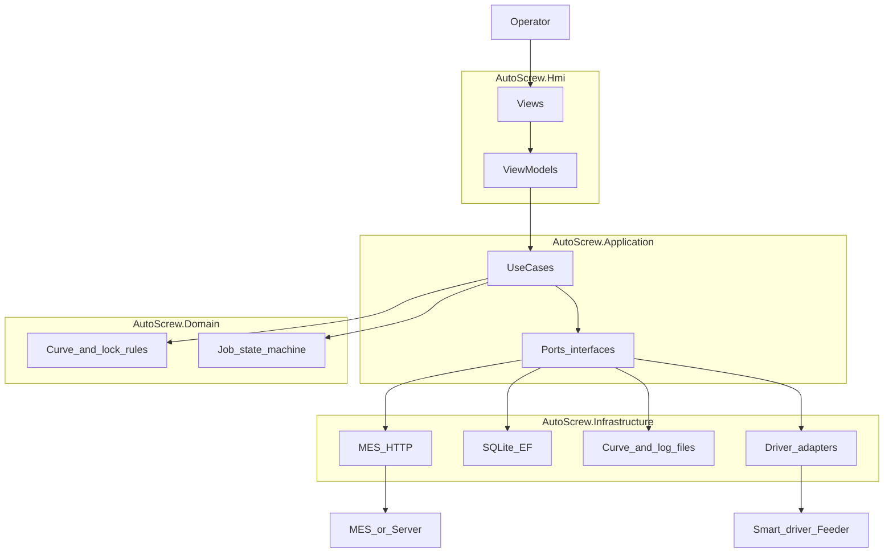

# 软件方案设计

本文档描述**智能锁附作业台**上位机软件的架构、模块边界与技术实现要点。需求与验收指标以 [doc/PRD.md](doc/PRD.md) 及公司后续发布的接口/验收文档为准；本设计不替代 SPEC 或 MES 字段定稿。

| 版本 | 日期 | 作者 | 说明 |
|------|------|------|------|
| 0.1 | 2026-05-11 | — | 初稿：对齐当前技术选型与分层方案 |

---

## 1. 设计目标与范围

### 1.1 产品定位

- **形态**：单工位 Windows 桌面程序（对外可称「作业台工具」），部署于产线 PC。
- **职责**：扫码校验 SN、从 MES/服务器拉取 PN 与工艺模板、产品图螺钉位引导、与智能电批/供料设备协同、扭矩–角度曲线采集与规则判定、结果与曲线本地归档及上传、权限与审计。

### 1.2 与 PRD 的对应关系（摘要）

| PRD 能力域 | 设计侧落点 |
|------------|------------|
| 手持电批 + 气吸供料 + 快换 | 设备驱动适配层（协议/SDK 待定），上位机不绑定具体型号 |
| 分段扭矩/转速/角度、曲线判定 | Domain 规则与曲线管线；与 UI 线程解耦 |
| HMI：黄闪/黄常/绿/红、1Hz 闪烁、大图打点 | WPF 视图 + VM 状态；Storyboard / VisualState |
| ≥50 组任务、SN→PN、返修标记 | Application 用例 + 本地/远端配置模型 |
| MES：校验、下发、回传 | Infrastructure.Mes；断网队列与重传 |
| 断网缓存、断电恢复、日志分级 | Infrastructure 持久化 + Serilog |

### 1.3 非目标（本期不展开实现细节）

- 具体现场总线/PLC 品牌与报文（若与电批解耦则由下位或网关承担）。
- 二期视觉防错（见 [readme.md](../readme.md) 范围说明）。

---

## 2. 技术选型

与 [doc/技术调研.md](doc/技术调研.md) 及当前决议一致。

| 类别 | 选型 | 说明 |
|------|------|------|
| 运行时 | .NET 8 | LTS 方向与团队栈一致 |
| UI | WPF | 数据绑定、动画、大图叠加热区；**不采用 WinForms**（含 SunnyUI 等 WinForms 工业控件路线已否决） |
| MVVM | CommunityToolkit.Mvvm | `ObservableObject`、`RelayCommand`、源生成器 |
| 日志 | Serilog | 文件滚动；可选远端 Sink（如 Seq）视部署而定 |
| HTTP 韧性 | Polly | 与 `HttpClientFactory` 配合：重试、超时、熔断 |
| 本地库 | SQLite + EF Core（推荐） | 出站上传队列、作业 checkpoint、`lock_record`/`screw_detail` 等；若团队倾向轻量可评估 LiteDB，需在技术调研中单列对比 |
| 配置 | appsettings.json + 用户目录覆盖 | 与程序集解耦，改配置不重编 |
| 曲线图控件 | 待定其一 | **ScottPlot.WPF** / **LiveCharts2** / **OxyPlot**；首版建议优先 **ScottPlot**（性能）或 **LiveCharts2**（MVVM）；定稿后写入技术调研 |

传输与敏感数据原则：对外 **TLS 1.2+**；本地敏感配置优先 **DPAPI** 或与 IT 约定 **AES + 机绑密钥**（字段级要求随 MES 定稿）。

---

## 3. 解决方案结构

单解决方案、多项目，避免过度分层。仓库根目录已提供 **AutoScrew.sln**，项目置于 `src/` 下。

```text
AutoScrew.sln
├── src/AutoScrew.Hmi                 # WPF：Views、ViewModels、资源与主题
├── src/AutoScrew.Application         # 用例服务：扫码会话、任务生命周期、编排
├── src/AutoScrew.Domain              # 领域模型、状态机、判定规则、值对象
├── src/AutoScrew.Infrastructure      # MES、EF/SQLite、文件导出、设备适配实现
└── src/AutoScrew.Contracts（可选）   # DTO、MES 契约、Api 常量，供 Hmi 与测试共用
```

- **Hmi**：不直接引用设备 SDK；通过 Application 接口或 DI 注入的抽象端口调用。
- **Application**：事务脚本式用例 + 接口端口（`IMesClient`、`ILockSessionRepository` 等），保持可测。
- **Domain**：无 UI、无 HTTP；纯规则与状态。
- **Infrastructure**：实现上述端口；含 **MockMesClient** 供 α 联调（对齐 PRD 风险应对）。

---

## 4. 逻辑架构



---

## 5. 核心用例与状态（作业会话）

与 PRD「操作员旅程」一致，上位机维护**一次作业会话**（从有效 SN 到全部螺钉完成或中止）。

建议状态（可随实现微调命名）：

1. **Idle**：等待扫码或空闲。
2. **SnPending**：弹窗等待 SN；校验中。
3. **SnRejected**：无效 SN，提示重扫。
4. **LoadingRecipe**：拉取 PN、模板、产品图与螺钉位列表。
5. **Running**：按序引导螺钉位；每钉含取钉/锁附/曲线判定子状态（可内嵌子 FSM）。
6. **NgLocked**：NG 后界面锁定，仅技术员/管理员可解锁或进入返修流程。
7. **Completed**：生成日志包、触发上传、可复位到 Idle。

**断电恢复**：在 `Running` / `NgLocked` 等关键迁移点写入 SQLite checkpoint（当前 SN、PN、当前螺钉索引、各位置结果摘要）；启动时检测未完成会话并提示恢复或作废（策略与 PRD/EHS 评审一致）。

---

## 6. 模块设计要点

### 6.1 HMI（WPF）

- **主作业屏**：产品图 + 螺钉位控件列表；每位状态绑定 `ScrewStationVm`（待作业黄闪 1Hz、进行中黄常亮、OK 绿、NG 红）。
- **实现要点**：闪烁用 `Storyboard` 或 `VisualStateManager`；避免在 VM 里操作 DispatcherTimer 散落到多处，可封装 `BlinkBehavior` 或样式触发器。
- **大图打点**：`Canvas` 叠加 Ellipse/自定义控件，坐标自模板（归一化坐标 × 实际显示尺寸）；注意 **DPI 缩放** 与窗口尺寸变化时的重算。
- **权限**：操作员仅作业相关页；技术员参数页；管理员系统设置。登录后注入 `ICurrentUser` 或等效上下文。

### 6.2 曲线与判定（Domain + Application）

- **采集路径**：设备适配将采样推送至**非 UI 线程**管道（如 `Channel<T>` 或阻塞队列），**固定容量环形缓冲**，防止内存无限增长。
- **判定**：Domain 提供纯函数或可测试服务（输入序列片段 + 工艺阈值，输出事件/结果枚举），与 PRD 3.2.1 异常类型对齐（浮锁、滑牙、斜锁、卡钉、漏锁等）。
- **展示**：ViewModel 订阅聚合后的曲线点集（可降采样用于显示），详细原始数据落盘 CSV（路径与命名对齐 PRD 草案）。

### 6.3 MES 与离线（Infrastructure）

- **客户端**：`IMesClient`：`ValidateSnAsync`、`GetRecipeAsync`、`UploadResultAsync` 等（实际方法名随 IT 契约）。
- **韧性**：Polly 重试（仅对幂等/可安全重试接口）；超时与熔断记录到日志。
- **出站队列**：上传失败或离线时写入 SQLite 表；后台定时或连通性事件触发重传；上传成功标记 **幂等键**（避免重复）。
- **Mock**：α 阶段默认可切换至 Mock，字段映射表单独维护（待 `DATA_AND_TRACE` 或 IT 文档定稿后迁入）。

### 6.4 设备适配（Infrastructure）

- 定义 **`ISmartDriver`**、**`IFeeder`**（或合并为 `ILockStationHardware`）等端口，方法粒度与供应商 SDK 对齐后再固化。
- **仿真实现**：无硬件时返回合成曲线与状态，供 UI 与规则单测。
- **禁止**：在未确认的安全策略下绕过扭矩保护、互锁或急停相关逻辑（见仓库 `CLAUDE.md`）。

### 6.5 文件与路径

- PRD 给出网络路径示例：`\\Server\Production\2.1测试数据\{SN}\`。设计约定：**先写本地工作目录**，成功后**可选**复制或上传至网络归档；网络不可用时仍保证本地完整数据，避免阻塞产线。

---

## 7. 数据模型（草案）

与 PRD 3.3.2 建议表一致，实施时以迁移脚本为准。

- **lock_record**：`sn`, `pn`, `station`, `operator`, `start_time`, `end_time`, `result`, …
- **screw_detail**：`record_id`, `position`, `part_no`, `torque_final`, `angle_final`, `curve_path`, …
- **error_log**：`record_id`, `error_code`, `error_msg`, `resolve_by`, `resolve_time`, …
- **outbox_upload**（建议增）：`payload_json`, `created_at`, `sent_at`, `retry_count`, `last_error`, …

审计日志：参数变更、解锁、返修标记等**仅追加**。

---

## 8. 安全与合规（软件侧）

- 传输：**HTTPS**（TLS 1.2+）。
- 密码/令牌：不明文写日志；会话超时与锁屏策略与现场约定。
- 角色：操作员 / 技术员 / 管理员三级；敏感操作二次确认（可选）。

---

## 9. 构建、部署与运维

- **RID**：`win-x64` 为主；发布形态（框架依赖 vs 自包含）按现场 IT 策略选择。
- **版本**：程序集版本 + 可见「关于」页；便于产线回溯。
- **配置分环境**：Development / Production 转换开关（Mock MES、日志级别）。

---

## 10. 测试策略

- **Domain**：规则与状态机单元测试（给定曲线片段 → 期望 NG/OK）。
- **Application**：用例集成测试 + Mock `IMesClient` / Mock 硬件。
- **Hmi**：关键 VM 逻辑测；UI 自动化可选，非首版阻塞项。

---

## 11. 文档与追溯

- 需求变更：同步 PRD / 需求表。
- MES 字段与曲线存储变更：在恢复或替代的追溯文档（如 `doc/DATA_AND_TRACE.md`）中先行更新，再改实现与本文相关小节。

---

## 12. 修订策略

架构级变更（例如增加第二工位、更换 UI 栈）须更新本文版本号与修订表；纯实现细节可在代码与 XML 注释中维护，不必重复粘贴到本文。
