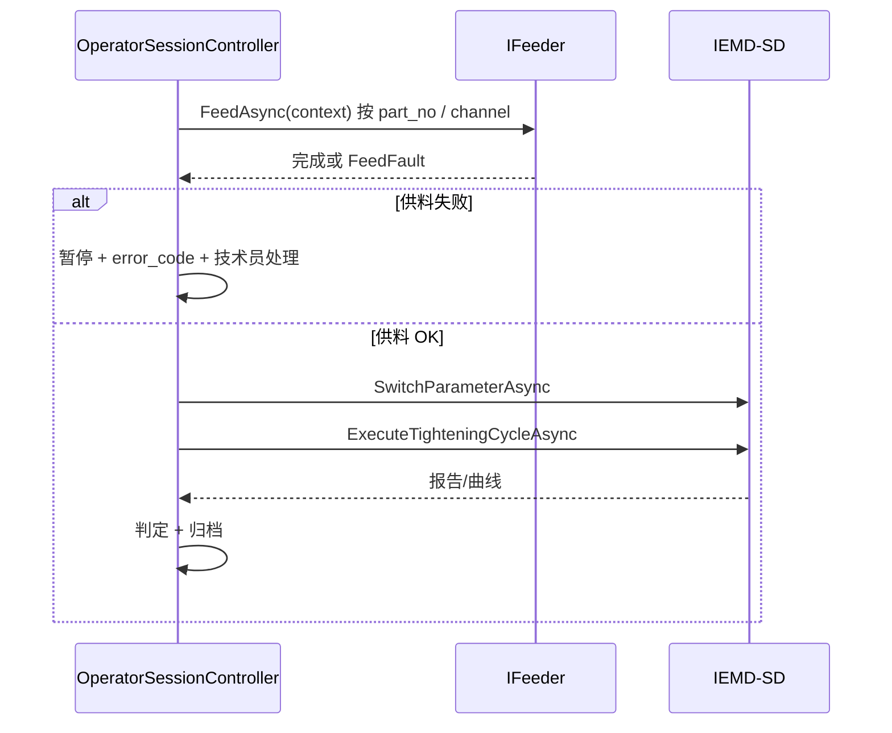

# 程控供料器 — 控制契约（草案）

| 版本 | 日期 | 说明 |
|------|------|------|
| 0.1 | 2026-06-11 | PRD V1.1 业务流程变更：上料/供钉由上位机自动触发；本文档为驱动实现前的占位契约 |

**权威追溯**：[PRD.md](PRD.md) §3.2.1a、[TODO.md](TODO.md) T-06/T-06a

---

## 1. 定位

单工位除 **IEMD-SD 智能电批**（Modbus，见 [driverAnaC.md](driverAnaC.md)）外，新增 **程控供料/上料设备**：

- 上位机在每颗螺钉拧紧**之前**下发供料指令
- 供料成功后，`OperatorSessionController` 才进入 `#302` 换参与拧紧周期
- 取消操作员人工放钉、镊子取钉

软件端口（规划）：

| 抽象 | 职责 | 当前代码 |
|------|------|----------|
| `IFeeder` | 按螺钉上下文触发上料、读完成/故障 | **未实现**；[`PickScrewAsync`](../src/AutoScrew.Application/Abstractions/ILockStationHardware.cs) 经 [`SimulatedLockStationHardware`](../src/AutoScrew.Infrastructure/Hardware/SimulatedLockStationHardware.cs) 仿真 |
| `ILockStationHardware` | 编排取钉 + 拧紧 | [`IemdSdLockStationHardware`](../src/AutoScrew.Infrastructure/Hardware/IemdSdLockStationHardware.cs) 内 `_feederSim` 待替换 |

---

## 2. 单钉时序（目标）

---

## 3. 待现场定稿项（**实现前必填**）

下列项由设备厂商 / 电气提供后填入本文，**勿在代码中编造寄存器**：

| 项 | 说明 |
|----|------|
| 通信方式 | Modbus TCP/RTU、串口自定义、IO 网关、PLC 标签等 |
| 触发指令 | 写线圈/寄存器/程序步号；是否需螺钉料号或通道号参数 |
| 完成条件 | 到位传感器、真空 OK、设备状态字某位 |
| 超时 | 默认 ms；重试次数 |
| 故障码 | 缺料、卡料、真空不足、通信断等 → 映射 `FEED_xxx` |
| 安全 | 与急停/互锁关系；供料中是否禁止拧紧 |

---

## 4. 与 Recipe / 追溯

**输入（来自 MES Recipe，字段名待定稿）**：

- `part_no` / 螺钉料号
- 可选 `feeder_channel`、`feeder_program_id`

**追溯（定稿后写入 [DATA_AND_TRACE.md](DATA_AND_TRACE.md)）**：

- 每钉可选记录：`feed_ok`、`feed_duration_ms`、`feed_error_code`
- 审计：`Operation.FeedStart` / `Operation.FeedOk` / `Operation.FeedNg`

---

## 5. HMI 配置（规划）

- 技术员页：供料器连接（地址、从站、超时）+ Test / Apply（对齐电批 [`DeviceConnectionPage`](../src/AutoScrew.Hmi/Views/Pages/DeviceConnectionPage.xaml) 模式）
- 作业台：供料中状态文案（如「上料中…」）；供料失败复用 NG 模态或独立 FEED 遮罩（见 T-06b）

---

## 6. 维护约定

- 协议变更：**先改本文** → 再改驱动与 `IFeeder` → 同步 [TODO.md](TODO.md) T-06
- α FAT：供料单步 + 供料→拧紧联调 两步验收，再跑完整 SN 流程
