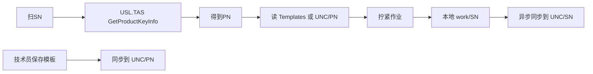

# AutoScrew — Fusion / 局域网对接待办与方案

| 版本 | 日期 | 说明 |
|------|------|------|
| 0.1 | 2026-07-31 | 初版：MES 正式规范未定稿；以 Fusion（USL.TAS）+ 局域网目录为拟定路径 |

**相关文档**

| 文档 | 关系 |
|------|------|
| [TODO.md](TODO.md) | 产线总清单（供料、品质等）；本文专述 SN/PN 与文件归档 |
| [DATA_AND_TRACE.md](DATA_AND_TRACE.md) | 追溯字段权威；Fusion/局域网契约**定稿后先改该文档再改代码** |
| [PRD.md](PRD.md) | SN→PN、模板与出站业务目标 |

---

## 1. 状态与边界

### 1.1 当前判断

- 正式 **MES / IT HTTP 契约尚未最终确认**。
- 与公司现场标准**最接近**的做法是 **Fusion / TMS**，经 **`USL.TAS.dll` → `USLTASLibraryInterface`** 调用（不是 AutoScrew 现有占位 REST）。
- 参考工程（打开模板 / SN 查资料）：
  - `C:\Users\menghl2\WorkSpace\Projects\Test Program\SW2219_ITL_FTS\library\MolexUtility\FusionControl.cs`
  - `C:\Users\menghl2\WorkSpace\Projects\Test Program\SW2219_ITL_FTS\library\UIOperateInterleaverFinalTest\UIOperateInterleaverFinalTest\OperateInteleaverFinalTest.xaml.cs`

### 1.2 AutoScrew 一期明确不做

| FTS / Fusion 能力 | AutoScrew 一期 |
|-------------------|----------------|
| 工序校验（`CurProcess == MESProcess`） | **不做** |
| `TriggerProcessMoveIn` | **不做** |
| `GetProdTestTemplate`（ATMS 终测 XML） | **不做**（非螺钉位产品模板） |
| `UploadTestData` / `TriggerTestResultUpload` | **默认不做**（待 IT 确认；见 F-08） |

### 1.3 一期要做的两件事

1. **SN→PN**：仅调用 `GetProductKeyInfo(SN)`，取得 PN（及可选 Spec/WO 日志）。
2. **模板与作业「上传」**：走**公司局域网共享目录**（账号参考 UUIStarter 的 PRED-TESTING / `pred-testing`），**不是** Fusion 结果上传。

产品钉位模板仍为 v2 JSON（`Templates/{PN}/` 或 UNC 下 `{PN}\`），与 [MULTI_SURFACE_TEMPLATE.md](MULTI_SURFACE_TEMPLATE.md) 一致。

---

## 2. 目标数据流

### 2.1 局域网目录约定（草案）

根路径配置项暂名：`AutoScrew:LanShareRoot`（示例：`\\fileserver\AutoScrew`）。

| 路径 | 内容 |
|------|------|
| `{LanShareRoot}\{PN}\` | 产品模板：`{PN}.product-template.json`、底图等 |
| `{LanShareRoot}\{SN}\` | 该件作业数据：曲线 CSV、`lock_log_*.json` 等 |

**产线原则**：本地（`TemplateDirectory` / `DataDirectory/work/{SN}`）先写成功；网盘复制失败**不阻塞**拧紧（对齐现有 `OptionalNetworkArchiveRoot` 思路，见 [DATA_AND_TRACE.md](DATA_AND_TRACE.md)）。

---

## 3. Fusion（SN→PN）实现方案

### 3.1 适配层

新增 `FusionMesClient : IMesClient`（挂到现有 [`ConfigurableMesClient`](../src/AutoScrew.Infrastructure/Mes/ConfigurableMesClient.cs) 路由，例如 `MesMode = Mock | Http | Fusion` 或 `UseFusion`）：

| `IMesClient` 方法 | Fusion 行为 |
|-------------------|-------------|
| `ValidateSnAsync` | `GetProductKeyInfo(SN)` → `SnValidationResult(true, partNumber, …)` |
| `GetRecipeAsync` | **不**调 `GetProdTestTemplate`；返回 PN，由 [`RecipeProvisioningService`](../src/AutoScrew.Application/Services/RecipeProvisioningService.cs) 解析本地/UNC 的 `{PN}` 模板 |
| `UploadResultAsync` | 一期：可空实现，或仅触发局域网 `{SN}` 归档；**不**默认接 TAS 上传 |

扫码主路径仍为：`MainViewModel` → `OperatorSessionController.SubmitSerialNumberAsync` → `ValidateSnAsync` → `LoadRecipeAndTemplateAsync`（见现有实现）。

### 3.2 最小 TAS 调用链（相对 FTS `OpenTemplate` 的裁剪）

FTS 完整链：`SetEmployeeAccount` → `GetStationName` → `GetProductKeyInfo` → **工序校验** → **MoveIn** → **GetProdTestTemplate**。

AutoScrew 拟定：

1. （若库要求）`SetEmployeeAccount(operatorOrServiceUser)`
2. （若站点登记要求）`GetStationName(Environment.MachineName)`
3. **`GetProductKeyInfo(SN)`** → PN / Spec / WO / CurProcess / Status  
4. **跳过**工序比较、MoveIn、`GetProdTestTemplate`

参考：`FusionControl.OpenTemplate` 内 `GetProductKeyInfo` 段（约 205–210 行附近）。

### 3.3 .NET 8 运行约束

| 项 | 说明 |
|----|------|
| 运行时 | HMI 为 .NET 8；`USL.TAS` 等为 .NET Framework 程序集，多数可兼容加载 |
| 平台 | 参考 FTS / MolexUtility：**优先 x86**（与现场 DLL 一致） |
| 线程 | TAS 调用放在 **STA** 线程（FTS 打开模板即如此） |
| 配置 | 部署现场 `USL.SYS.dll.config`（服务端点）；勿在仓库硬编码 URL |
| 依赖拷贝 | 从 FTS `bin\common`（或产线同版本）对齐：`USL.TAS.dll`、`USL.TAS.C.dll`、`USL.SYS.dll`、`USL.TDB.dll` 及配套依赖 |
| 失败降级 | Fusion 不可用时：明确错误提示；可选回退 Mock / 本地 `local-recipes.json`（产品策略另定） |

若 .NET 8 直接加载失败：再评估 **net461 小助手进程**（本清单不强制一期做）。

---

## 4. 局域网访问（参考 UUIStarter）

参考工程：

`C:\Users\menghl2\WorkSpace\Projects\Platform\Molex.OSBU.MIMS4.0\UUI_code\Tools\UUIStarter`

### 4.1 可复用机制

| 机制 | 文件 | 用途 |
|------|------|------|
| 预制权限账号名 | `MIMS.cfg` → `AuthorAccount` = `pred-testing` | 对应现场 **PRED-TESTING** / `pred-testing` |
| 加密口令文件 | `EncryptFilePath`（如 `\\Zh-mims-srv.oplink.com.cn\mims\EncryptFile.bin`），`ConfigManager.UnEncryptFile` / `UnOpEncrypt` | **口令不以明文入库** |
| UNC 连接 | `NetworkShareConnect.cs` → `WNetUseConnection` | `connectToShare(remoteUNC, username, password)` |
| 模拟登录 | `SharedTool.cs` → `LogonUser` + `ImpersonateLoggedOnUser` | 指定域账号访问文件 |

说明（`Welcome.txt` / `verList.txt`）：提升权限曾通过模拟登录获得 **PRED-TESTING** 权限。

### 4.2 AutoScrew 配置草案

| 配置键（草案） | 含义 | 默认/示例 |
|----------------|------|-----------|
| `LanShareRoot` | UNC 根 | `\\server\AutoScrew` |
| `LanUser` | 共享账号 | `pred-testing` |
| `LanDomain` | 域 | 现场域（如配置中的 ElevationDomain） |
| 口令 | 加密文件路径或 UserSecrets / 本地 `mes-settings` 扩展字段 | **禁止提交明文密码到 git** |

实现阶段可将 `NetworkShareConnect` / `SharedTool` 思路移植到 `AutoScrew.Infrastructure`（见 TODO F-04）。

---

## 5. 与现有代码映射

| 能力 | 现有锚点 | Fusion / 局域网落地 |
|------|----------|---------------------|
| MES 端口 | [`IMesClient`](../src/AutoScrew.Application/Abstractions/IMesClient.cs) | `FusionMesClient` |
| 路由开关 | [`ConfigurableMesClient`](../src/AutoScrew.Infrastructure/Mes/ConfigurableMesClient.cs)、Mes 页 / `mes-settings.json` | 增加 Fusion 模式 |
| 模板本地库 | [`IProductTemplateLocalStore`](../src/AutoScrew.Application/Abstractions/IProductTemplateLocalStore.cs)、`TemplateDirectory` | 读本地或 UNC `{PN}`；保存后同步网盘 |
| Recipe 装配 | [`RecipeProvisioningService`](../src/AutoScrew.Application/Services/RecipeProvisioningService.cs) | Fusion 只给 PN；模板仍本地/UNC |
| 作业目录 | `DataDirectory/work/{SN}`（DATA_AND_TRACE） | 完成后异步同步到 UNC `{SN}` |
| 网络镜像先例 | `OptionalNetworkArchiveRoot` | 可扩展为正式 `LanShareRoot` 策略 |

字段与目录定稿后：**先更新** [DATA_AND_TRACE.md](DATA_AND_TRACE.md)，再改 DTO / 实现。总清单 [TODO.md](TODO.md) 可择机增加指向本文的交叉链接。

---

## 6. 分阶段 TODO

完成项将 `[ ]` 改为 `[x]`，并注明日期。

| ID | 状态 | 任务 | 说明 |
|----|------|------|------|
| F-01 | [ ] | 契约草案写入 [DATA_AND_TRACE.md](DATA_AND_TRACE.md) | Fusion SN→PN 最小字段；局域网 `{PN}`/`{SN}` 目录 |
| F-02 | [ ] | 引入 USL 依赖 + x86/STA 冒烟 | 仅验证 `GetProductKeyInfo`；带 `USL.SYS.dll.config` |
| F-03 | [ ] | 实现 `FusionMesClient` + Mes 页/配置切换 | `ValidateSnAsync`；`GetRecipeAsync` 不拉 ATMS XML |
| F-04 | [ ] | 局域网连接 | 参考 UUIStarter：`pred-testing` + 加密凭证 + `WNetUseConnection` / 模拟登录 |
| F-05 | [ ] | PN 模板同步 | 技术员保存 → 同步到 `{LanShareRoot}\{PN}\`；启动/扫码可读 UNC |
| F-06 | [ ] | SN 作业数据异步归档 | `work\{SN}` → `{LanShareRoot}\{SN}`；失败不堵产线 |
| F-07 | [ ] | FAT | 真 SN 查 PN；Fusion 失败提示/fallback；断网归档策略 |
| F-08 | [ ] | （可选）IT 确认后 | TAS 结果上传或正式 REST MES；再改 DATA_AND_TRACE |

---

## 7. 安全约定

- **禁止**将 PRED-TESTING / `pred-testing` 的口令明文写入仓库、本文件或公开配置样例。
- 口令优先：加密文件（UUIStarter 模式）、UserSecrets、或仅本机 `mes-settings.json`（已在 `.gitignore` / 用户数据目录）。
- 审计日志不得记录完整口令；可记「局域网连接成功/失败」与账号名。

---

## 8. 维护约定

- 若 IT 最终规定与 Fusion 冲突：以 IT 书面契约为准，并回写本文 §1 / §6。
- 本文只跟踪 **Fusion SN→PN + 局域网归档**；供料器、曲线判定等仍见 [TODO.md](TODO.md)。
- 未确认前，不得将「正式 MES 已对接」标为已完成。
