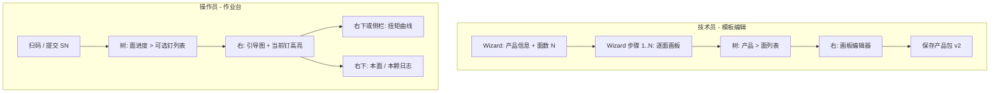

# 多面模板 HMI 交互线框（草案）

| 版本 | 日期 | 状态 |
|------|------|------|
| 0.1 | 2026-05-21 | **草案**：线框级说明，非视觉稿；实现以 WPF-UI 浅色主题为准 |

**数据契约**：[MULTI_SURFACE_TEMPLATE.md](MULTI_SURFACE_TEMPLATE.md)

**参考交互**：业务提供的「左树 + 右详情 / 日志」校准任务界面（树节点状态图标 + 右侧明细）。

---

## 1. 设计原则

1. **模板编辑**与**作业运行**共用同一套「面」概念，但权限与导航策略不同。
2. **Master–Detail（树 + 右栏）**负责「选哪一面 / 看进度」；**Wizard** 负责「首次建模板时的顺序引导」——二者组合，不互斥。
3. 右侧 **2D 画板**复用现有 `TemplateBoardView` / 作业引导视图，避免重复实现打点逻辑。
4. 状态色与 PRD 一致：待做黄闪、进行中黄、OK 绿、NG 红；树节点用同色小图标。

---

## 2. 信息架构



---

## 3. 模板编辑（Technician）

入口：主壳导航 **「螺钉模板」**（现有 `TemplateNavPage`，权限 `CanUseTemplateBoard`）。

### 3.1 模式 A：新建产品（Wizard）

适用于「先定个数，再逐面编辑，最后一起保存」。

| 步骤 | 标题 | 内容 | 操作 |
|------|------|------|------|
| 0 | 产品信息 | PN、显示名、Revision；**面数量 N**（SpinBox，≥1，常用默认 6） | 下一步 |
| 1 | 面清单 | 表格：序号、`surfaceId`（可编辑）、显示名 `name`、作业顺序 `order`；可增删行（总数=N） | 下一步 |
| 2..N+1 | 编辑面 k | 嵌入现有画板 UI：底图、尺寸、打点、螺钉类型 | 上一步 / 下一步 |
| 最后 | 预览与保存 | 汇总：总钉数、各面钉数、缺失底图警告 | **保存** / 取消 |

**保存行为**：写入一个 `*.product-template.json`（schema v2）；资源图片写入同目录 `images/`。

**线框（ASCII）**

```
┌─────────────────────────────────────────────────────────────┐
│ 新建产品模板  [步骤 2/8]  编辑面：顶面 (TOP)                  │
├─────────────────────────────────────────────────────────────┤
│  ○ 产品信息  ● 面清单  ○ 面1  ○ 面2 ... ○ 保存               │
├──────────────────────────┬──────────────────────────────────┤
│ （步骤≥2 时左侧可折叠）    │  [加载底图] [应用尺寸] [保存本面]   │
│                          │  ┌────────────────────────────┐  │
│                          │  │      画板 + 螺钉标注        │  │
│                          │  └────────────────────────────┘  │
│                          │  状态：本面 12 钉，0 个超出边界    │
├──────────────────────────┴──────────────────────────────────┤
│        [上一步]                              [下一步]        │
└─────────────────────────────────────────────────────────────┘
```

### 3.2 模式 B：打开 / 维护已有产品（Tree + Detail）

适用于已存在 v2 包时的日常改点、换图。

```
┌─────────────────────────────────────────────────────────────┐
│ 螺钉模板编辑    PN: K1927020    [打开…] [新建向导…] [保存]   │
├──────────────┬──────────────────────────────────────────────┤
│ ▼ K1927020   │  当前面：顶面 (TOP)  order=1                 │
│   ├ ● 顶面   │  ┌────────────────────────────────────────┐ │
│   ├ ○ 底面   │  │           TemplateBoardView             │ │
│   ├ ○ 侧面A  │  └────────────────────────────────────────┘ │
│   └ …        │  工具栏（与现有一致）                          │
├──────────────┴──────────────────────────────────────────────┤
│ 未保存更改 *                                                 │
└─────────────────────────────────────────────────────────────┘
```

- 左侧树：产品根 + N 个面；选中面切换右侧画板 **DataContext**（当前面 VM）。
- **保存**：整包写入（非单面单文件）；切换面前若有未保存改动 → `ConfirmTips`。
- **打开**：文件过滤器 `*.product-template.json`；v1 文件提示「将包装为单面 v2」。

### 3.3 树节点图标（编辑态）

| 图标 | 含义 |
|------|------|
| 灰点 | 未编辑 / 无底图 |
| 蓝点 | 已编辑，未保存到磁盘 |
| 绿勾 | 已保存且通过校验 |
| 黄叹 | 校验警告（如缺底图但有点位） |

---

## 4. 作业台（Operator）

入口：主壳 **「作业台」**（`OperationNavPage` / `MainViewModel`）。

### 4.1 布局：Tree + 引导 + 曲线

在现有 `OperationPageView` 三栏思路上扩展：**左侧增加进度树**（可折叠，默认宽度 220px）。

```
┌─────────────────────────────────────────────────────────────┐
│ [扫码] [SN________] [提交]  [当前钉：取钉+拧紧]  [复位]       │
├──────────┬─────────────────────────────┬────────────────────┤
│ SN: …    │                             │ 扭矩–角度（最近）   │
│ PN: …    │   当前面引导图               │ ┌────────────────┐ │
│          │   （黄闪 = 待打钉）          │ │   ScottPlot    │ │
│ ▼ 面进度 │                             │ └────────────────┘ │
│  ● 顶面  │                             │ 日志 / 状态         │
│    ✓ 1   │                             │ 17:15:35 OK #3     │
│    ● 2   │                             │ 17:15:40 ERR …     │
│  ○ 底面  │                             │                    │
├──────────┴─────────────────────────────┴────────────────────┤
│ Phase: RunningSurface2   消息：请锁附顶面第 2 钉              │
└─────────────────────────────────────────────────────────────┘
```

### 4.2 树结构（运行态）

| 层级 | 节点 | 行为 |
|------|------|------|
| 根 | 当前 SN / PN | 只读 |
| 一级 | 各面 `name` | 状态：未开始 / 进行中 / 完成 / NG锁定 |
| 二级（可选） | 面内钉 `index` | 显示 OK/NG/Pending；**默认仅展开当前面** |

**操作员点击策略**（待 [MULTI_SURFACE_TEMPLATE.md](MULTI_SURFACE_TEMPLATE.md) §5 定稿）：

| 策略 | UI 行为 |
|------|---------|
| 严格顺序（推荐默认） | 仅当前面、当前钉可执行；树中未来面/钉灰显不可点 |
| 技术员解锁后 | 与现有 `UnlockNgCommand` 类似，允许指定面返修 |

### 4.3 可选：作业 Wizard 模式

若产线要求「一步一步」、减少误触，可在 **设置** 中切换：

- **标准模式**：§4.1 树 + 大图（信息量大，适合熟手）
- **向导模式**：全屏分步 —— ① 确认 SN → ② 当前面大图 → ③ 完成本面后自动「下一面」全屏提示

向导模式与树模式 **共用同一 Session 状态机**，仅 UI 壳不同。

### 4.4 树节点图标（运行态）

| 图标 | 含义 |
|------|------|
| 空心圆 | 未开始 |
| 黄闪 / 黄实心 | 进行中 / 待打 |
| 绿勾 | OK |
| 红叉 | NG（面或钉） |
| 锁 | NG 锁定，需技术员解锁 |

---

## 5. 与现有 WPF-UI 主壳的关系

| 区域 | 现状 | 多面后 |
|------|------|--------|
| `MainWindow` + `NavigationView` | 作业台 / 模板 / … | 不变；多面 UI 在 **页内** 布局 |
| `TemplateBoardView` | 单画布 | 作为 **面编辑器** 嵌入；VM 绑定 `CurrentSurface` |
| `OperationPageView` | 单引导图 | 增加左侧 `TreeView` + 绑定 `CurrentSurface` 的 Markers |
| 对话框 | `ConfirmTips` / `ExitAskWindow` | 切换面未保存、跳面确认、NG 弹窗 |

---

## 6. ViewModel 切分建议（实现参考）

| VM | 职责 |
|----|------|
| `ProductTemplateEditorViewModel` | 产品包、面列表、Wizard 步骤、Save/Load v2 |
| `SurfaceBoardViewModel` | 单面画板（由现有 `TemplateBoardViewModel` 演化或组合） |
| `OperatorSessionController` | 面进度、当前 `(surfaceId, localIndex)`、完成判定 |
| `MainViewModel` | 作业 UI 绑定：树、引导图、曲线、日志 |

---

## 7. 关键交互流程

### 7.1 技术员：新建六面产品

1. 模板页 → **新建向导** → N=6 → 填写面 ID/名称  
2. 逐步完成 6 个画板 → **保存** → 生成 v2 JSON  
3. 将文件放入 `AutoScrew:TemplateDirectory` 或由 MES 下发路径  

### 7.2 操作员：多面锁附

1. 作业台 → 扫码提交 SN → 加载 v2 包  
2. 树显示 6 面；自动进入 `order=1` 的面  
3. 按面内顺序逐钉：取钉+拧紧 → 树与引导图更新  
4. 当前面全部 OK → 提示翻面 → 解锁下一面（或等待确认）  
5. 全部面 OK → 会话 Complete → MES 出站  

### 7.3 NG 返修

1. 某钉 NG → 面状态 NG，作业锁定  
2. 技术员登录 / 解锁 → 树中选中 NG 钉 → 返修流程（PRD：独立返修扭矩，标记 REWORK）  

---

## 8. 非目标（本线框不包含）

- 三维 CAD / 六面展开自动投影  
- 视觉相机对位（二期）  
- 具体 Wizard 动画与 spacing token（交给 WPF-UI 主题）  

---

## 9. 验收要点（GUI / FAT 可引用）

| ID | 场景 | 期望 |
|----|------|------|
| UI-MS-01 | 新建 N=6 模板并保存 | 单 JSON + 资源目录；`surfaceCount=6` |
| UI-MS-02 | 打开 v1 单文件 | 提示并包装为单面 v2 可编辑 |
| UI-MS-03 | 操作员扫 SN 加载 v2 | 树显示 N 面；引导图显示第一面 |
| UI-MS-04 | 严格顺序 | 不可点击未解锁面 |
| UI-MS-05 | 面内逐钉 | 当前钉黄闪，完成后变绿 |
| UI-MS-06 | 整单完成 | 六面均绿方可 Complete |
| UI-MS-07 | NG 锁定 | 操作员无法继续，技术员可解锁返修 |

---

## 10. 修订记录

| 版本 | 日期 | 说明 |
|------|------|------|
| 0.1 | 2026-05-21 | 初稿：Wizard + Tree 双模式线框、作业台布局、验收条目 |
