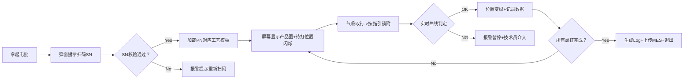

# 自动取螺钉系统需求PRD


文档修订记录

| 版本 | 日期       | 作者 | 修订内容                                            |
| :--- | :--------- | :--- | :-------------------------------------------------- |
| V1.0 | 2026-05-07 | Lmh  | 初稿创建，基于《智能锁附系统开发 (V1).xls》需求梳理 |
|      |            |      |                                                     |

---


## 项目背景与核心痛点

| 维度         | 现状描述                                                     | 自动化目标                                                   |
| :----------- | :----------------------------------------------------------- | :----------------------------------------------------------- |
| **物料管理** | 多型号螺钉混用，员工需手动准备、计数、镊子取放               | 气吸式自动供料+精准取钉，取消人工计数/镊子操作（省约4.5s/颗） |
| **品质风险** | 无磁性螺钉放置管控难，每周出现漏装、错装、未打紧；26年1月已发生客诉 | 全流程防错+实时曲线判定，消除人为失误                        |
| **效率瓶颈** | 手动锁附耗时约48s/颗，电动锁附约27s/颗                       | 智能分段锁附+工艺优化，目标再节省约7.5s/颗                   |
| **数据追溯** | 依赖人工记录或离散设备，无法按SN精准追溯                     | 100%数据自动上传，支持MES按SN/位置归档                       |


## 项目目标
| 目标类型     | 具体指标                   | 验收标准                 |
| :----------- | :------------------------- | :----------------------- |
| 🎯 效率目标   | 单颗螺钉锁附节拍 ≤ 20s     | 连续100颗测试，P95 ≤ 20s |
| 🎯 品质目标   | 漏装/错装/未打紧发生率 = 0 | 小批量验证≥1000pcs零异常 |
| 🎯 追溯目标   | 数据上传成功率 ≥ 99.9%     | 断网缓存+重传机制验证    |
| 🎯 稳定性目标 | 连续7天试运行无关键故障    | 掉钉率≤0.3%，歪斜率<1%   |


## 项目范围

✅ 包含范围（In-Scope）：
• 手持式智能电批硬件（含气吸供料、多吸头快换）

• 锁附控制软件（扭矩/角度/转速分段控制+曲线判定）

• HMI交互界面（扫码→指引→作业→反馈全流程）

• MES系统对接（SN校验、工艺下发、数据回传）

• 异常处理机制（浮锁/滑牙/斜锁/卡钉/漏锁自动报警）


## 用户角色与使用场景

### 2.1 角色定义
| 角色         | 职责                         | 核心诉求                               |
| :----------- | :--------------------------- | :------------------------------------- |
| 👷 产线操作员 | 执行螺钉锁附作业             | 界面指引清晰、操作简便、异常提示明确   |
| 🔧 设备技术员 | 参数配置、异常处理、设备维护 | 参数开放可调、日志完整、快换结构便捷   |
| 📊 质量工程师 | 监控锁附质量、分析异常数据   | 曲线可回溯、判定规则可配置、报表可导出 |
| 💻 MES管理员  | 系统集成、数据对接、权限管理 | 接口标准、断点续传、字段映射清晰       |

### 2.2 核心用户旅程（Operator Flow）



#### 技术员配置模板

模板配置主要是上传到MES每一个PN需要操作的结构图 [MES交互]

配置当前的电批的参数 [设备交互]

技术员就是管理员


#### 操作员操作

用户拿起电批

上位机进入弹框输入SN

输入SN之后上位机检索MES获取相关的PN 所有数据 

加载PN 加载模板

模板是一个结构的平面图 平面图上有螺钉位置 

上位机标识螺钉位置，进入黄色闪烁，代表待处理

用数字标识处理顺序，比如1 2 3 4 

如果当前位置已经处理，提示成功或者失败NG 成功则进入下一个点位，失败则弹框提示NG 等待确认重试


## 软件功能需求详述

#### 3.2.1 锁附控制核心
```yaml
扭矩控制:
  - 分段控制: 预锁附 → 锁附 → 紧固 三阶段独立配置
  - 参数范围: 转速20~2000rpm；角度±5°精度；扭矩±3%精度
  - 动态判定: 实时绘制扭矩-角度曲线，斜率≥0.5N·m/°

异常检测:
  - 浮锁: 扭矩未达下限即停止
  - 滑牙: 角度超限扭矩不增长
  - 斜锁/歪斜: 轴线夹角>3°实时报警
  - 卡钉: 转速异常下降+扭矩突变
  - 漏锁: 工序完成校验数量不匹配

防错机制:
  - 吸头外径 ≤ 螺钉头外径+0.6mm（软件校验+硬件限位）
  - 过扭保护: 实际扭矩>110%设定值立即停机
```

#### 3.2.2 HMI交互设计
| 界面元素   | 交互逻辑                                 | 视觉规范                       |
| :--------- | :--------------------------------------- | :----------------------------- |
| 📱 主作业屏 | 扫码后自动加载产品图，待打位置`黄色闪烁` | 闪烁频率1Hz，对比度≥4.5:1      |
| 🟢 状态反馈 | 锁附中→黄色常亮；OK→绿色；NG→红色+弹窗   | 颜色符合ISO 3864安全色标       |
| ⚠️ 异常处理 | NG时锁定界面，仅技术员权限可解锁/返修    | 弹窗含错误代码+处理建议        |
| 📁 数据入口 | 底部快捷入口：参数配置/日志查询/系统设置 | 权限分级：操作员仅可见作业界面 |

#### 3.2.3 任务与配置管理
```
✅ 任务模板：
• 预存≥50组任务项，支持PN一键关联
• 模板字段：螺钉料号、扭矩曲线、转速、角度、判定规则、吸头型号

✅ 工艺配置（后台开放）：
• 规则引擎：支持“与/或”逻辑组合判定条件
• 返修流程：独立配置返修扭矩/角度，数据标记"REWORK"
• 图片管理：支持PNG/JPG格式产品指引图，坐标标注打点位置

✅ 权限控制：
• 三级权限：操作员（仅作业）、技术员（参数调整）、管理员（系统配置）
• 操作日志：记录所有参数修改+操作行为，不可删除
```

### 3.3 数据与集成需求
#### 3.3.1 MES对接接口
​	MES数据字段最终确认

#### 3.3.2 数据存储规范
```
📁 本地存储路径：\\Server\Production\2.1测试数据\{SN}\
├── lock_log_{timestamp}.json
├── torque_curve_{pos}_{ts}.csv
├── product_image_{pn}.png
└── error_report_{ts}.log

🗄️ 数据库字段（建议）：
• 主表：lock_record (sn, pn, station, operator, start_time, end_time, result)
• 明细表：screw_detail (record_id, position, part_no, torque_final, angle_final, curve_path)
• 异常表：error_log (record_id, error_code, error_msg, resolve_by, resolve_time)
```

---

## 非功能需求

### 可靠性与安全性
```
✅ 可靠性：
• 连续7×24h试运行，关键功能故障率=0
• 断网续传：本地缓存≥24h数据，网络恢复后自动重传
• 断电保护：异常断电时当前任务状态可恢复

✅ 安全性：
• 符合公司EHS标准：无尖锐外露、气动泄漏检测、急停按钮
• 数据加密：传输采用TLS 1.2+，敏感字段AES加密
• 权限隔离：操作员无法修改工艺参数，所有变更留痕
```

### 可维护性
```
💻 软件维护：
• 配置文件独立于程序，修改无需重新编译
• 日志分级（INFO/WARN/ERROR），支持远程抓取
• 固件支持OTA升级，升级失败自动回滚
```

---

## 验收标准（精简版）

### 5.1 功能验收
```gherkin
Scenario: 正常锁附流程
  Given 操作员扫码有效SN "CL-E-20260507-001"
  When 按指引完成所有螺钉锁附
  Then 每个位置状态变绿
  And MES收到完整数据包
  And 本地生成lock_log文件

Scenario: 歪斜异常检测
  Given 螺钉轴线与吸嘴夹角调整为5°
  When 执行取钉动作
  Then 界面弹出"螺钉歪斜"报警
  And 设备锁定需技术员解锁
  And 记录error_code: "SKEW_003"
```

### 
### 5.3 文档交付物
```
✅ 必须交付：
• 《设备操作说明书》（含图文步骤+异常处理））
• 《验收测试报告》（含原始数据+签字页）
```

---


## 项目计划与里程碑


| 阶段     | 关键交付                     | 准入条件                   | 准出条件                          |
| :------- | :--------------------------- | :------------------------- | :-------------------------------- |
| α验证    | 调试记录+联动报告+整改方案   | 硬件到货+测试环境就绪      | 核心功能通过+关键问题闭环         |
| β验证    | 优化交付单+验证报告+培训记录 | α问题整改完成+产线空闲窗口 | ≥1000pcs零重大异常+操作员考核通过 |
| 正式导入 | 批量报告+维护手册+售后确认   | β验收签字+生产计划确认     | 连续7天达产+建立预防性维护机制    |

---


## 风险与应对策略

| 风险项                 | 影响等级 | 发生概率 | 应对措施                                    | 责任人        |
| :--------------------- | :------- | :------- | :------------------------------------------ | :------------ |
| 🔸 无磁性螺钉吸取不稳定 | 高       | 中       | α阶段增加真空度闭环监控；备用方案：微型夹爪 | 供应商+王自召 |
| 🔸 快换结构精度衰减     | 中       | 中       | 设计定位销+磨损检测；备件包含3套吸头        | 结构工程师    |
| 🔸 MES接口联调延期      | 高       | 低       | 提前输出接口协议+Mock服务；预留2周缓冲期    | 软件负责人    |
| 🔸 产线节拍不达标       | 高       | 中       | DOE优化转速/角度参数；并行取钉+预定位设计   | 工艺工程师    |
| 🔸 操作员抵触新流程     | 中       | 高       | 早期介入培训；设置"老模式"过渡开关（限时）  | 七分厂主管    |

---

## 📎 附录

### A. 术语表
| 术语 | 解释                               |
| :--- | :--------------------------------- |
| PN   | Part Number，产品物料编码          |
| SN   | Serial Number，产品序列号          |
| 浮锁 | 螺钉未完全贴合工件表面即停止锁附   |
| 滑牙 | 螺纹损坏导致扭矩无法继续上升       |
| DOE  | Design of Experiment，实验设计方法 |

### B. 参考文档
1. 《智能锁附系统开发 (V1).xls》- 七分厂需求书
2. 《智能锁附系统验收标准》- QF-SQP0646-1 A0
3. 《3/31 供应商研成来访会议记录》
4. 公司《MES系统接口规范》- IT-2025-08
