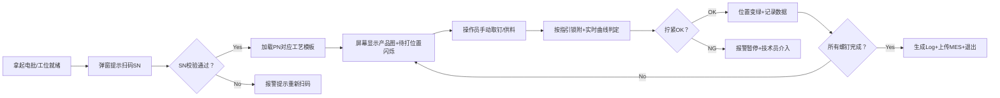

# 自动取螺钉系统需求PRD


文档修订记录

| 版本 | 日期       | 作者 | 修订内容                                            |
| :--- | :--------- | :--- | :-------------------------------------------------- |
| V1.0 | 2026-05-07 | Lmh  | 初稿创建，基于《智能锁附系统开发 (V1).xls》需求梳理 |
| V1.1 | 2026-06-11 | —    | **业务流程升级**：新增程控供料设备，上料/供钉由上位机自动触发；单工位双设备协同（供料器 + 电批） |
| V1.2 | 2026-06-11 | —    | **产品模板本地库**：`Templates/{PN}/` 统一存储；MES 拉取模板包 + SQLite 同步状态；操作员 SN 双路径（MES 优先、本地回退） |
| V1.3 | 2026-06-11 | —    | **IEMD-SD 三步工艺配置**：拧紧参数 / 拧紧顺序 / 拧紧来源 HMI；产线双模式（上位机引导 + 设备顺序程序） |
| V1.4 | 2026-08-11 | —    | **供料范围回退**：程控供料改为现场**手动**；取消上位机供料驱动/调度；α 仅控 **IEMD-SD** 锁附 |

---


## 项目背景与核心痛点

| 维度         | 现状描述                                                     | 自动化目标                                                   |
| :----------- | :----------------------------------------------------------- | :----------------------------------------------------------- |
| **物料管理** | 多型号螺钉混用，员工需手动准备、计数、镊子取放               | α：**现场手动取钉/供料**；上位机只做锁附引导与防错（程控供料自动化已取消） |
| **品质风险** | 无磁性螺钉放置管控难，每周出现漏装、错装、未打紧；26年1月已发生客诉 | 全流程防错+实时曲线判定，消除人为失误                        |
| **效率瓶颈** | 手动锁附耗时约48s/颗，电动锁附约27s/颗                       | 智能分段锁附+工艺优化，目标再节省约7.5s/颗                   |
| **数据追溯** | 依赖人工记录或离散设备，无法按SN精准追溯                     | 100%数据自动上传，支持MES按SN/位置归档                       |


## 项目目标
| 目标类型     | 具体指标                   | 验收标准                 |
| :----------- | :------------------------- | :----------------------- |
| 🎯 效率目标   | 单颗螺钉锁附节拍 ≤ 20s     | 连续100颗测试，P95 ≤ 20s |
| 🎯 品质目标   | 漏装/错装/未打紧发生率 = 0 | 小批量验证≥1000pcs零异常 |
| 🎯 追溯目标   | 数据上传成功率 ≥ 99.9%     | 断网缓存+重传机制验证    |
| 🎯 稳定性目标 | 连续7天试运行无关键故障    | 掉钉率≤0.3%，歪斜率<1%   |


## 项目范围

✅ 包含范围（In-Scope）：
• 手持式智能电批硬件（含气吸取钉、多吸头快换；取钉由操作员手动完成）

• 锁附控制软件（扭矩/角度/转速分段控制+曲线判定）— **唯一必须受控驱动：IEMD-SD**

• HMI交互界面（扫码→指引→**手动取钉**→锁附→反馈全流程）

• MES系统对接（SN校验、工艺下发、数据回传 / LAN 归档）

• 异常处理机制（浮锁/滑牙/斜锁/卡钉/漏锁等锁附异常报警）

❌ 不包含（Out-of-Scope · V1.4）：
• 程控供料器上位机驱动、供料调度、供料器独立配置页（现场确认：**手动供料**）

**单工位受控设备（软件边界）**

| 设备 | 职责 | 上位机触发要点 |
| :--- | :--- | :--- |
| **IEMD-SD 智能电批** | 分段拧紧、扭矩–角度采集、设备侧 OK/NG | 来源模式 `#300`、换参 `#302`、拧紧周期、报告 `#750`/曲线 `#751` |
| **供料** | 操作员现场手动取钉/放钉 | **不上位机控制**；无 `IFeeder` 实现义务 |
| **（可选）握持/到位 DI** | 电批就绪、安全互锁 | 与拧紧 `TriggerMode` 配合；具体 IO 映射现场定稿 |

> V1.1 曾规划程控供料自动化；**V1.4 已取消**。历史草案见 [FEEDER_CONTROL.md](FEEDER_CONTROL.md)（已作废）。


## 用户角色与使用场景

### 2.1 角色定义
| 角色         | 职责                         | 核心诉求                               |
| :----------- | :--------------------------- | :------------------------------------- |
| 👷 产线操作员 | 执行螺钉锁附作业             | 界面指引清晰、操作简便、异常提示明确   |
| 🔧 设备技术员 | 参数配置、异常处理、设备维护 | 参数开放可调、日志完整、快换结构便捷   |
| 📊 质量工程师 | 监控锁附质量、分析异常数据   | 曲线可回溯、判定规则可配置、报表可导出 |
| 💻 MES管理员  | 系统集成、数据对接、权限管理 | 接口标准、断点续传、字段映射清晰       |

### 2.2 核心用户旅程（Operator Flow）

**V1.4 变更**：供料改回**操作员手动**；上位机只引导锁附顺序与 IEMD 拧紧/判定（无供料器调度）。




#### 技术员配置模板

模板配置主要是上传到MES每一个PN需要操作的结构图 [MES交互]

配置当前的电批的参数 [设备交互]

技术员就是管理员

#### 产品模板本地库与 MES 双路径（V1.2）

| 主题 | 说明 |
| :--- | :--- |
| **存储位置** | `{HMI.exe 同级}/Templates/{PN}/`：含 `{PN}.product-template.json` 与各面背景图（相对路径，如 `images/top.png`） |
| **命名规则** | 与 [MULTI_SURFACE_TEMPLATE.md](MULTI_SURFACE_TEMPLATE.md) v2 一致；默认文件 `{PN}.product-template.json` |
| **技术员** | 模板编辑器默认在该目录新建/保存；保存后 SQLite 标记 `PendingUpload`（待上传 MES） |
| **操作员** | 扫码 SN → MES 校验 PN → **优先**从 MES 下载模板包到本地 → 失败则读本地 `Templates/{PN}/` → 加载引导图与螺钉位 |
| **MES 同步** | SQLite `product_template_sync` 记录：本地仅、已从 MES 下载、待上传、已同步、失败；后续可将本地目录上传 MES |

#### 操作员操作

用户拿起电批（或工位进入就绪）

上位机进入弹框输入 SN

输入 SN 之后上位机检索 MES 获取相关的 PN 所有数据（**失败时使用本地 Templates 目录回退**）

加载 PN、加载模板（MES 模板包下载或本地 JSON）

模板是一个结构的平面图，平面图上有螺钉位置

上位机标识螺钉位置，进入黄色闪烁，代表待处理

用数字标识处理顺序，比如 1 2 3 4

**对每个待打位置：**

1. **操作员手动**取钉/上料（上位机不控制供料器）
2. 操作员按产品图与顺序**锁附**（电批扳机或半自动触发；上位机换参 `#302` 等）
3. 实时曲线判定 OK/NG

如果当前位置已经处理：成功则进入下一个点位；失败则弹框提示 NG，等待技术员解锁/重试

**操作员负责**：按指引取对应螺钉并完成锁附；上位机负责顺序引导、IEMD 控制与品质判定


## 软件功能需求详述

#### 3.2.1 锁附控制核心
```yaml
单钉作业编排（V1.4）:
  - 供料: 操作员现场手动（上位机不调度）
  - 换参: IEMD-SD #302 切换当前螺钉拧紧参数
  - 锁附: 电批拧紧周期 + 扭矩–角度曲线采集
  - 判定: 曲线规则 ∪ 设备 NG → OK/NG → 下一钉或锁定

扭矩控制:
  - 分段控制: 预锁附 → 锁附 → 紧固 三阶段独立配置
  - 参数范围: 转速20~2000rpm；角度±5°精度；扭矩±3%精度
  - 动态判定: 实时绘制扭矩-角度曲线，斜率≥0.5N·m/°

异常检测:
  - 浮锁: 扭矩未达下限即停止
  - 滑牙: 角度超限扭矩不增长
  - 斜锁/歪斜: 轴线夹角>3°实时报警
  - 卡钉: 转速异常下降+扭矩突变
  - 漏锁: 工序完成校验数量不匹配

防错机制:
  - 吸头外径 ≤ 螺钉头外径+0.6mm（软件校验+硬件限位）
  - 过扭保护: 实际扭矩>110%设定值立即停机
```

#### 3.2.1a 供料/上料控制（~~V1.1~~ → **V1.4 作废自动化**）

```yaml
状态: 已取消程控供料上位机驱动与调度
现场: 操作员手动取钉/供料
软件: 仅 IEMD-SD 锁附路径；无供料器配置页、无 Feed 联调验收义务
历史: FEEDER_CONTROL.md / TODO T-06* 仅作废档参考
```

#### 3.2.2 HMI交互设计
| 界面元素   | 交互逻辑                                 | 视觉规范                       |
| :--------- | :--------------------------------------- | :----------------------------- |
| 📱 主作业屏 | 扫码后自动加载产品图，待打位置`黄色闪烁` | 闪烁频率1Hz，对比度≥4.5:1      |
| 🟢 状态反馈 | 锁附中→黄色常亮；OK→绿色；NG→红色+弹窗   | 颜色符合ISO 3864安全色标       |
| ⚠️ 异常处理 | NG时锁定界面，仅技术员权限可解锁/返修    | 弹窗含错误代码+处理建议        |
| 📁 数据入口 | 底部快捷入口：参数配置/日志查询/系统设置 | 权限分级：操作员仅可见作业界面 |

#### 3.2.3 任务与配置管理
```
✅ 任务模板：
• 预存≥50组任务项，支持PN一键关联
• 模板字段：螺钉料号、扭矩曲线、转速、角度、判定规则、吸头型号

✅ 工艺配置（后台开放）：
• 规则引擎：支持“与/或”逻辑组合判定条件
• 返修流程：独立配置返修扭矩/角度，数据标记"REWORK"
• 图片管理：支持PNG/JPG格式产品指引图，坐标标注打点位置

✅ 权限控制：
• 三级权限：操作员（仅作业）、技术员（参数调整）、管理员（系统配置）
• 操作日志：记录所有参数修改+操作行为，不可删除
```


#### 3.2.4 模板库

现在需要实现模板的库管理 按照生产要求 一个产品实际上大概要用到集中螺钉 

其实一个螺钉对应一种锁附参数

也就是说设备配置其实可以说是从模板库里面拉取下来设置的

模板库要大而全 设备配置是一个子集合 因为它的参数是受限的

业务讨论希望可以建一个大而全的模板库，拉一下就配置到了设备 这样就很方便

| 层         | 管什么                                                    | 现状                                                  |
| :--------- | :-------------------------------------------------------- | :---------------------------------------------------- |
| A 工艺库   | **产品 PN** → 多槽螺钉工艺卡（TXT）→ 设备 Parameter 槽    | **已落地**：见 [PROCESS_LIBRARY.md](PROCESS_LIBRARY.md)（局域网/本机目录、上传、按 PN 下发） |
| B 设备包   | 本工位要用的子集：若干 Parameter + Sequence + Source 绑定 | 规划中（参数/顺序/来源一键打包）；可与 A 下发互补 |
| C 产品模板 | 底图、钉位、顺序、引用料号/参数                           | 已有 v2 `Templates/{PN}/`，不宜塞满电批全部字段       |

> **A 工艺库** 以产品 PN 为拉取键；TXT `参数：00` = 设备槽位 0。顺序/来源仍走设备配置页，可后续挂入同一产品目录。


### 3.3 数据与集成需求

#### 3.3.1 MES对接接口
​	MES数据字段最终确认

#### 3.3.2 数据存储规范
```
📁 本地存储路径：\\Server\Production\2.1测试数据\{SN}\
├── lock_log_{timestamp}.json
├── torque_curve_{pos}_{ts}.csv
├── product_image_{pn}.png
└── error_report_{ts}.log

🗄️ 数据库字段（建议）：
• 主表：lock_record (sn, pn, station, operator, start_time, end_time, result)
• 明细表：screw_detail (record_id, position, part_no, torque_final, angle_final, curve_path)
• 异常表：error_log (record_id, error_code, error_msg, resolve_by, resolve_time)
```

---

## 非功能需求

### 可靠性与安全性
```
✅ 可靠性：
• 连续7×24h试运行，关键功能故障率=0
• 断网续传：本地缓存≥24h数据，网络恢复后自动重传
• 断电保护：异常断电时当前任务状态可恢复

✅ 安全性：
• 符合公司EHS标准：无尖锐外露、气动泄漏检测、急停按钮
• 数据加密：传输采用TLS 1.2+，敏感字段AES加密
• 权限隔离：操作员无法修改工艺参数，所有变更留痕
```

### 可维护性
```
💻 软件维护：
• 配置文件独立于程序，修改无需重新编译
• 日志分级（INFO/WARN/ERROR），支持远程抓取
• 固件支持OTA升级，升级失败自动回滚
```

---

## 验收标准（精简版）

### 5.1 功能验收
```gherkin
Scenario: 正常锁附流程
  Given 操作员扫码有效SN "CL-E-20260507-001"
  When 操作员按指引手动取钉并完成所有螺钉锁附
  Then 每个位置状态变绿
  And MES/LAN 收到或归档完整数据包
  And 本地生成lock_log文件

# Scenario: 供料异常（程控供料）— V1.4 已取消，不再作为验收项

Scenario: 歪斜异常检测
  Given 螺钉轴线与吸嘴夹角调整为5°
  When 执行锁附动作
  Then 界面弹出"螺钉歪斜"报警
  And 设备锁定需技术员解锁
  And 记录error_code: "SKEW_003"
```

### 
### 5.3 文档交付物
```
✅ 必须交付：
• 《设备操作说明书》（含图文步骤+异常处理））
• 《验收测试报告》（含原始数据+签字页）
```

---

## IEMD-SD 控制器三步工艺配置（V1.3）

台达 SD3 设备 HMI 将工艺配置拆为三步，与手册附录 A.3 功能码一致（详见 `doc/driverAnaC.md` §5.6.1 / §5.8 / §5.9`）：

| 步骤 | 设备菜单 | Modbus | 上位机 HMI |
| :--- | :------- | :----- | :--------- |
| ① | 拧紧参数 | `#100`/`#150`/`#302` | **拧紧参数**页（已有） |
| ② | 拧紧顺序 | `#200`/`#250`/`#260`/`#303` + `#201`–`#253` | **拧紧顺序**页（步骤 / 导航坐标 / 图像码 / 定位臂） |
| ③ | 拧紧来源 | `#300`/`#301`/`#350`/`#351` | **拧紧来源**页（运行模式 / 切换方式 / 单来源绑定） |

**HMI 线框（草案）**：[CONTROLLER_TIGHTENING_UI_WIREFRAME.md](CONTROLLER_TIGHTENING_UI_WIREFRAME.md) — 三页合并为「工艺工作台」Hub、步骤条、简易/高级分层；实现前可与设备 HMI 对照表迭代。

**本地存储**

- 参数：`{DataDirectory}/controller-parameters/{id}.json`
- 顺序：`{DataDirectory}/controller-sequences/{id}.json`
- 来源（工位级）：`{DataDirectory}/controller-source.json`（含产线控制模式）

**产线双模式**（工位级，来源页配置）

| 模式 | 说明 | 作业开始 | 每钉换参 |
| :--- | :--- | :------- | :------- |
| **上位机引导**（HostGuided，默认） | 模板/MES 引导螺钉位；与现有 AutoScrew 流程一致 | `#300` 手动来源 | 每钉 `#302` |
| **设备顺序程序**（DeviceProgram） | 技术员在来源页绑定 param+sequence+screwCount | 写入 `#301` + `#303` 激活顺序 | **跳过** `#302`（设备按顺序步进） |

上位机在 DeviceProgram 模式下仍负责 SN/MES、供钉、曲线归档；模板中的 `ControllerParameterId` 仅作追溯展示。

**边界**：不替代 EHS/急停/互锁；二期视觉导航若引入需另开 PRD 条目。未配置来源或设备未连接时回退 HostGuided 并写审计日志。

**FAT 建议**：三页分别读写真机 → DeviceProgram 跑 3 钉顺序 → 切回 HostGuided 验证 `#302` 仍可用。

---

## 项目计划与里程碑


| 阶段     | 关键交付                     | 准入条件                   | 准出条件                          |
| :------- | :--------------------------- | :------------------------- | :-------------------------------- |
| α验证    | 调试记录+联动报告+整改方案   | 硬件到货+测试环境就绪      | 核心功能通过+关键问题闭环         |
| β验证    | 优化交付单+验证报告+培训记录 | α问题整改完成+产线空闲窗口 | ≥1000pcs零重大异常+操作员考核通过 |
| 正式导入 | 批量报告+维护手册+售后确认   | β验收签字+生产计划确认     | 连续7天达产+建立预防性维护机制    |

---


## 风险与应对策略

| 风险项                 | 影响等级 | 发生概率 | 应对措施                                    | 责任人        |
| :--------------------- | :------- | :------- | :------------------------------------------ | :------------ |
| 🔸 无磁性螺钉吸取不稳定 | 高       | 中       | α阶段增加真空度闭环监控；备用方案：微型夹爪 | 供应商+王自召 |
| 🔸 快换结构精度衰减     | 中       | 中       | 设计定位销+磨损检测；备件包含3套吸头        | 结构工程师    |
| 🔸 MES接口联调延期      | 高       | 低       | 提前输出接口协议+Mock服务；预留2周缓冲期    | 软件负责人    |
| 🔸 产线节拍不达标       | 高       | 中       | DOE优化转速/角度参数；并行取钉+预定位设计   | 工艺工程师    |
| 🔸 操作员抵触新流程     | 中       | 高       | 早期介入培训；设置"老模式"过渡开关（限时）  | 七分厂主管    |

---

## 📎 附录

### A. 术语表
| 术语 | 解释                               |
| :--- | :--------------------------------- |
| PN   | Part Number，产品物料编码          |
| SN   | Serial Number，产品序列号          |
| 供料/上料 | α：**操作员手动**取钉；上位机不控制供料器（V1.4） |
| 程控供料器 | 曾规划自动化设备；**本期不做**（见 V1.4） |
| 浮锁 | 螺钉未完全贴合工件表面即停止锁附   |
| 滑牙 | 螺纹损坏导致扭矩无法继续上升       |
| DOE  | Design of Experiment，实验设计方法 |

### B. 参考文档
1. 《智能锁附系统开发 (V1).xls》- 七分厂需求书
2. 《智能锁附系统验收标准》- QF-SQP0646-1 A0
3. 《3/31 供应商研成来访会议记录》
4. 公司《MES系统接口规范》- IT-2025-08
