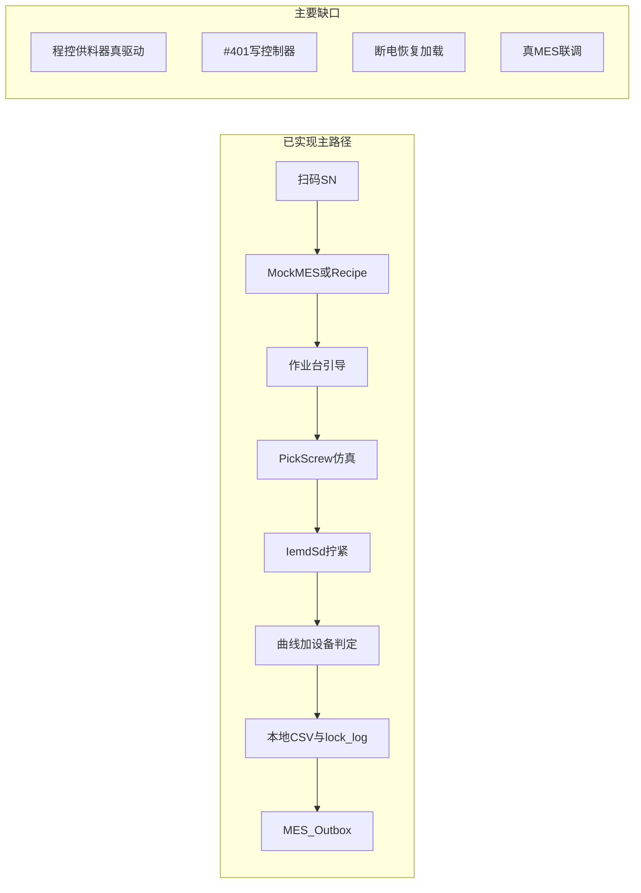

# AutoScrew 单工位半自动产线 — 待办与进度

| 版本 | 日期 | 说明 |
|------|------|------|
| 1.0 | 2026-06-11 | 初版：基于 [PRD.md](PRD.md) 单工位单设备半自动化差距梳理 |
| 1.1 | 2026-06-11 | 对齐 PRD V1.1：**程控供料器**纳入 In-Scope；T-06 升级为 P0 真驱动；更新双设备数据流 |

**权威追溯**

| 文档 | 用途 |
|------|------|
| [PRD.md](PRD.md) | 操作员旅程、功能需求、验收场景 |
| [driverAnaC.md](driverAnaC.md) | IEMD-SD Modbus 通信、联机步骤 |
| [IEMD_SD_MODBUS_COMMANDS.md](IEMD_SD_MODBUS_COMMANDS.md) | 附录功能码目录（149 条） |
| [FEEDER_CONTROL.md](FEEDER_CONTROL.md) | 程控供料器控制契约（协议定稿前占位） |
| [DATA_AND_TRACE.md](DATA_AND_TRACE.md) | MES/本地追溯字段、SQLite、Outbox |
| [MULTI_SURFACE_TEMPLATE.md](MULTI_SURFACE_TEMPLATE.md) | 多面产品模板 v2 |
| [DVT_GUI_TEST_BASIS.md](DVT_GUI_TEST_BASIS.md) | GUI 与 PRD 双轨测试基线 |

---

## 范围边界

**In（本期自动化目标 — PRD V1.1）**

- 单工位 `AutoScrew:StationId`、**双受控设备**：IEMD-SD 电批 + **程控供料/上料设备**
- 操作员：扫码 SN → MES 拉 PN/模板 → 产品图引导 → **软件触发供料** → 拧紧 → 判定 → 本地归档 + MES 出站
- 技术员：本地模板编辑、拧紧参数读写、**供料器与电批**设备连接配置

**Out（不在此清单标为 α 必达）**

- 多工位调度与多设备并行
- 视觉引导二期
- 50 组任务库完整产品化、规则引擎「与/或」配置 UI
- 系统维护全套 UI（`#500+` 权限/网络/IO 等）

---

## 1. 现状总览

| 层级 | 完成度 | 说明 |
|------|--------|------|
| 驱动 `UDL.Delta.IemdSd` | ~85%（Modbus） | 149 功能码目录、`ExecuteModbusCommandAsync`、产线相关强类型 API；**无 FTP 包** |
| 驱动 **程控供料器** | ~0% | **新增设备**；协议/寄存器待厂商定稿；需 `IFeeder` + Infrastructure 适配 |
| 硬件适配 `IemdSdLockStationHardware` | ~55% | `#300`/`#302`/拧紧/`#750`/`#751` 已接线；**取钉仍走 `_feederSim`** |
| 业务 `OperatorSessionController` | ~75% | SN→Recipe→自动拧紧调度→判定→归档；**供料仍为仿真**；无 checkpoint 恢复加载、漏锁 |
| HMI | ~70% | 作业台/模板/参数/设备页；NG 模态、自动拧紧已有；**无供料器配置页** |
| MES | ~30% | 默认 Mock；HTTP 占位；Outbox 重传骨架已有 |

---

## 2. 已完成（避免重复开发）

### 2.1 驱动层 — [`src/UDL.Delta.IemdSd`](../src/UDL.Delta.IemdSd)

- [x] Modbus TCP/RTU 传输、`ModbusSlaveId`、RTU 可配置帧间延迟（默认 10 ms）
- [x] 通用命令执行器 [`IemdSdCommandExecutor`](../src/UDL.Delta.IemdSd/Internal/IemdSdCommandExecutor.cs) + [`ExecuteModbusCommandAsync`](../src/UDL.Delta.IemdSd/IIemdSdClient.cs)
- [x] 功能码目录 [`ModbusCommandCatalog.g.cs`](../src/UDL.Delta.IemdSd/Modbus/ModbusCommandCatalog.g.cs)（149 条，见 [IEMD_SD_MODBUS_COMMANDS.md](IEMD_SD_MODBUS_COMMANDS.md)）
- [x] 拧紧参数 `#100`/`#150`：349 word Codec [`TighteningParameterCodec`](../src/UDL.Delta.IemdSd/Protocol/TighteningParameterCodec.cs)
- [x] 产线核心：`#302` 换参、`#750` 报告、`#751` 曲线分块读
- [x] 初始化：`#406`/`#533`/`#562`（[`IemdSdClient.InitializeAsync`](../src/UDL.Delta.IemdSd/IemdSdClient.cs)）
- [x] 强类型 API（驱动内已实现，**应用层多数未接线**）：条码 `#401`/`#451`、来源 `#300`/`#351`、履历 `#752`–`#760`、`#517` 单颗导出、系统/工具、运行状态区 [`ReadOperatingStatusAsync`](../src/UDL.Delta.IemdSd/Protocol/OperatingStatusSnapshot.cs)
- [x] 单元测试：[`tests/UDL.Delta.IemdSd.Tests`](../tests/UDL.Delta.IemdSd.Tests)

### 2.2 基础设施

- [x] 真机拧紧适配：[`IemdSdLockStationHardware.cs`](../src/AutoScrew.Infrastructure/Hardware/IemdSdLockStationHardware.cs)（`SwitchParameterAsync` → `ExecuteTighteningCycleAsync` → `ReadReportAsync`/`ReadCurveAsync`）
- [x] 参数预设：[`ControllerParameterPresetService`](../src/AutoScrew.Infrastructure/Hardware/ControllerParameterPresetService.cs) + HMI [`ControllerParameterPage`](../src/AutoScrew.Hmi/Views/Pages/ControllerParameterPage.xaml)
- [x] 单工位单设备：[`StationDeviceManager`](../src/AutoScrew.Infrastructure/Hardware/StationDeviceManager.cs) + [`DeviceConnectionPage`](../src/AutoScrew.Hmi/Views/Pages/DeviceConnectionPage.xaml)
- [x] 仿真切换：`AutoScrew:UseSimulatedHardware` → [`SimulatedLockStationHardware`](../src/AutoScrew.Infrastructure/Hardware/SimulatedLockStationHardware.cs) / `IemdSdLockStationHardware`
- [x] MES Outbox 重传：[`OutboxMesRetryHostedService`](../src/AutoScrew.Infrastructure/Mes/OutboxMesRetryHostedService.cs)
- [x] 用户审计 JSONL + SQLite：见 [DATA_AND_TRACE.md](DATA_AND_TRACE.md)

### 2.3 业务层

- [x] 会话状态机：[`OperatorSessionController.cs`](../src/AutoScrew.Application/Services/OperatorSessionController.cs) + [`JobSessionPhaseMachine`](../src/AutoScrew.Domain/Session/JobSessionPhaseMachine.cs)
- [x] SN → MES 校验 → Recipe + v2 产品模板加载
- [x] 多面 runtime：`ActiveSurfaceOrdinal`、`AwaitFlip`、按面 checkpoint 字段
- [x] 单钉周期：[`RunCurrentScrewCycleAsync`](../src/AutoScrew.Application/Services/OperatorSessionController.cs)（取钉 → 拧紧 → 曲线判定 ∪ 设备 NG）
- [x] 曲线判定：[`LockCurveEvaluator.cs`](../src/AutoScrew.Domain/Curves/LockCurveEvaluator.cs)（浮锁/滑牙等启发式）
- [x] NG 锁定 + 技术员 [`UnlockNgContinue`](../src/AutoScrew.Application/Services/OperatorSessionController.cs)
- [x] 本地曲线归档 + `lock_log` JSON
- [x] Checkpoint **写入**：[`PersistCheckpointAsync`](../src/AutoScrew.Application/Services/OperatorSessionController.cs) → [`EfLockSessionRepository`](../src/AutoScrew.Infrastructure/Persistence/EfLockSessionRepository.cs)

### 2.4 HMI

- [x] 作业台：[`OperationPageView`](../src/AutoScrew.Hmi/Views/OperationPageView.xaml) + [`MainViewModel`](../src/AutoScrew.Hmi/ViewModels/MainViewModel.cs)（SN、Marker 黄闪/绿/红、手动「运行当前螺钉」、翻面、NG 解锁）
- [x] 产品模板编辑：[`ProductTemplateEditorView`](../src/AutoScrew.Hmi/Views/ProductTemplateEditorView.xaml)（v2 多面）
- [x] 拧紧参数、设备连接、MES 连接页（[`MesPage`](../src/AutoScrew.Hmi/Views/Pages/MesPage.xaml)）
- [x] 角色登录：Development / MIMS MySQL（[`MimsMySqlAuthenticationService`](../src/AutoScrew.Infrastructure/Authentication/MimsMySqlAuthenticationService.cs)）

---

## 3. 待办清单

完成项将 `[ ]` 改为 `[x]`，并注明日期或 PR。

### P0 — 半自动产线闭环（必须先做）

| ID | 状态 | 任务 | 层级 | PRD | 主要改动 |
|----|------|------|------|-----|----------|
| T-01 | [x] | **拧紧触发与当前螺钉绑定**：AutoDi 或电批完成事件自动 `RunCurrentScrewCycleAsync`；维护模式保留手动按钮 | 业务+HMI | §2.2 | `AutoRunScrewCycle` / `MainViewModel` 自动调度；`ShowManualRunScrewButton` 技术员按钮 |
| T-02 | [x] | **控制器来源模式**：连接或作业开始时 `#300` 写「手动设定」（`#302` 前置） | 业务+驱动接线 | driverAnaC §5.6 | `IemdSdProductionSetup` + `StationDeviceManager` / `PrepareForJobAsync` |
| T-03 | [ ] | **SN 写控制器 `#401`**（现场若要求控制器侧条码追溯） | 业务 | §3.3 | `SubmitSerialNumberAsync` 成功后 [`WriteBarcodeAsync`](../src/UDL.Delta.IemdSd/IIemdSdClient.cs) |
| T-04 | [ ] | **真 MES 联调**：关 `UseMockMes`、IT 定稿字段、[`MesPage`](../src/AutoScrew.Hmi/Views/Pages/MesPage.xaml) 持久化 + 连通测试 | 业务+Infra | §3.3、§5.1 | [`MesHttpClient`](../src/AutoScrew.Infrastructure/Mes/MesHttpClient.cs)、[`MesViewModel`](../src/AutoScrew.Hmi/ViewModels/MesViewModel.cs) |
| T-05 | [x] | **NG 模态锁定**：NG 时弹窗 + 错误码/处理建议，仅技术员可解锁 | HMI | §3.2.2 | `OperationPageView` 全屏遮罩 + `ScrewNgAdvisor` |
| T-06 | [ ] | **程控供料器驱动与接线**：实现 `IFeeder`（或等效端口），替换 `_feederSim`；每钉 `PickScrewAsync` 触发真上料/供料指令 | 硬件+Infra | PRD §3.2.1a | 新驱动项目 + [`IemdSdLockStationHardware`](../src/AutoScrew.Infrastructure/Hardware/IemdSdLockStationHardware.cs)；HMI 供料器连接页 |
| T-06a | [ ] | **供料协议定稿文档**：寄存器/程序号、完成信号、超时与 error_code 枚举（**先文档后代码**） | 文档 | PRD V1.1 | [FEEDER_CONTROL.md](FEEDER_CONTROL.md)（待厂商资料回填） |
| T-06b | [ ] | **供料失败处理**：超时/缺料/卡料 → 暂停 + 错误码 + 技术员解锁（与 NG 或独立 FEED 态） | 业务+HMI | PRD 验收供料场景 | `OperatorSessionController`、`ScrewNgAdvisor` |

### P1 — 品质 / 追溯 / 恢复

| ID | 状态 | 任务 | 层级 | 依据 |
|----|------|------|------|------|
| T-07 | [ ] | 启动时 **加载 checkpoint** 恢复未完成作业 | 业务 | PRD 断电保护；[`LoadLatestCheckpointAsync`](../src/AutoScrew.Application/Abstractions/ILockSessionRepository.cs) 已有，**未被 Session 调用** |
| T-08 | [ ] | `lock_records` / `screw_details` 写入 SQLite | Infra | [DATA_AND_TRACE.md](DATA_AND_TRACE.md) |
| T-09 | [ ] | MES 上报 **面号/位号**（`surface_id`、`local_index`） | 契约+业务 | DATA_AND_TRACE §多面 Phase 2 待定稿 |
| T-10 | [ ] | **漏锁**规则：全部螺钉位完成校验 | 业务 | PRD §3.2.1 |
| T-11 | [ ] | 拧紧过程 **实时曲线**刷新（非仅周期结束后） | HMI+业务 | PRD §3.2.1 |
| T-12 | [ ] | 设备 NG 时 `ClearErrorsAsync`；返修 `REWORK` UI | 业务+HMI | PRD §3.2.3；[`SetReworkMode`](../src/AutoScrew.Application/Services/OperatorSessionController.cs) 无 HMI |
| T-13 | [ ] | 歪斜/斜锁：曲线或设备字段提供 `AxisSkewDeg` | 判定+驱动 | PRD §3.2.1、验收 SKEW_003 |

### P2 — 配置 / 权限 / 任务管理

| ID | 状态 | 任务 | 层级 | 依据 |
|----|------|------|------|------|
| T-14 | [ ] | 操作员菜单裁剪（仅作业台） | HMI | PRD §3.2.3；[`MainShellViewModel`](../src/AutoScrew.Hmi/ViewModels/MainShellViewModel.cs) |
| T-15 | [ ] | 50 组任务预存 + PN 一键关联 | 业务+HMI | PRD §3.2.3 |
| T-16 | [ ] | 技术员模板 **上传 MES**（PN 结构图） | HMI+MES | PRD 技术员配置 |
| T-17 | [ ] | 吸头外径 vs 螺钉头 **运行时防错**（≤ 头径 +0.6 mm） | 业务 | PRD §3.2.1 |
| T-18 | [ ] | 作业完成屏 + 引导下一 SN | HMI | PRD §2.2 旅程终点 |
| T-19 | [ ] | 日志/审计查询对技术员开放 | HMI | PRD §3.2.2；[`LogsPage`](../src/AutoScrew.Hmi/Views/Pages/LogsPage.xaml) 导航当前隐藏 |

### P3 — 驱动与产线工程化（可选）

| ID | 状态 | 任务 | 说明 |
|----|------|------|------|
| T-20 | [ ] | `#517` BIN + **FTP 拉取解析** | Demo 路径；当前 `#751` Modbus 曲线可暂不阻塞 α |
| T-21 | [ ] | 剩余功能码强类型封装 | 已可用 `ExecuteModbusCommandAsync` 做联调 |
| T-22 | [ ] | 设备 FAT 检查清单脚本化 | 对齐 [driverAnaC.md](driverAnaC.md) §8 联机四步 |
| T-23 | [ ] | 真机 / 仿真控制器集成测试 | 驱动与 [`IemdSdLockStationHardware`](../src/AutoScrew.Infrastructure/Hardware/IemdSdLockStationHardware.cs) 回归 |

---

## 4. 驱动「完全实现」判定

### 4.1 库能力（Modbus 路径 — 基本达成）

- 任意附录 `#xxx` 可通过 [`ExecuteModbusCommandAsync`](../src/UDL.Delta.IemdSd/IIemdSdClient.cs) 调用
- 产线相关强类型 API 已在 [`IIemdSdClient`](../src/UDL.Delta.IemdSd/IIemdSdClient.cs) 暴露
- **未包含**：FTP 客户端、全部 149 码的独立强类型方法（约 110 码仅目录 + 通用入口）

### 4.2 产线接线（未达成 — 半自动 FAT 前需补）

下列应在 **应用启动 / 作业流程** 中实际调用，而非仅存在于驱动：

| 能力 | 驱动 API | 应用接线状态 |
|------|----------|--------------|
| 手动拧紧来源 | `WriteSourceModeAsync` (#300) | **已接线**（Apply/Test + `PrepareForJobAsync`） |
| 条码写控制器 | `WriteBarcodeAsync` (#401) | 未接线 |
| 换参 | `SwitchParameterAsync` (#302) | **已接线**（[`IemdSdLockStationHardware`](../src/AutoScrew.Infrastructure/Hardware/IemdSdLockStationHardware.cs)） |
| 拧紧周期 | `ExecuteTighteningCycleAsync` | **已接线** |
| 报告/曲线 | `ReadReportAsync` / `ReadCurveAsync` | **已接线** |
| 单颗 BIN 导出 | `SetPerScrewExportAsync` (#517) | 未接线（BIN+FTP 方案才需要） |
| 清错 / 运行状态 | `ClearErrorsAsync` / `ReadOperatingStatusAsync` | 未接线 |
| 取钉/供料 | `IFeeder.FeedAsync` / `PickScrewAsync` | **仿真**（待 T-06 程控供料器） |

**α 半自动不必做**：顺序/导航 `#200`–`#253` 的 HMI、系统设置 `#500+` 全套界面。

---

## 5. 产线接线对照（单工位双设备 — PRD V1.1）

| PRD 步骤 | 软件职责 | 当前状态 |
|----------|----------|----------|
| 拿起电批 → 弹窗扫码 SN | DI/握持检测 → 模态扫码 | 作业页内嵌 TextBox，无弹窗 |
| SN 校验 → 加载 PN 模板 | MES + 本地 v2 模板 | Mock MES 默认可用 |
| 黄闪待打位置 | Marker Pending 闪烁 | 已实现 |
| **程控供料/上料** | `PickScrewAsync` → **供料器指令** | **仿真 Delay**（T-06） |
| 按指引锁附 | `AutoRunScrewCycle` + Manual 扳机 | **已实现**（T-01） |
| 实时曲线判定 | `LockCurveEvaluator` + 设备 Status | 周期结束后展示曲线 |
| OK/NG 反馈 | Marker 绿/红 + NgLocked 模态 | **已实现**（T-05） |
| 完成 → Log + MES | `lock_log` + Outbox | 已实现（Mock 上传） |

---

## 6. 建议实施顺序（单工位 FAT 前）

| 阶段 | 任务 ID | 目标 |
|------|---------|------|
| Week 1 | T-01、T-02、T-05 | 真机拧紧半自动闭环 + NG 体验（**已完成**） |
| Week 2 | **T-06、T-06a**、T-04、T-03 | **程控供料 FAT** + 真 MES、条码 |
| Week 3 | T-07、T-08、T-06b、T-10、T-11 | 供料异常、追溯、漏锁、实时曲线 |
| Week 4 | T-14、T-15/T-16 | 权限、任务/MES 模板（视 IT 就绪） |

**联机最小路径**（见 [driverAnaC.md](driverAnaC.md) §8 + PRD §3.2.1a）：

1. `UseSimulatedHardware=false`，HMI **设备连接** Apply（电批）
2. **供料器**连接配置 Apply，单钉手动/自动触发 `Feed` 验证（T-06）
3. **拧紧参数**：#150 回读 → 修改 → #100 写入
4. 作业：扫码 → #300 手动来源 → `#302` → **供料** → 拧紧 → `#750`/`#751`
5. 关 Mock MES，验证出站（T-04）

---

## 7. 维护约定

- 本文件只跟踪**实现缺口**，不修改 [PRD.md](PRD.md) 中的 KPI 与验收数字
- MES / `surface_id` / 曲线字段变更：**先改** [DATA_AND_TRACE.md](DATA_AND_TRACE.md)，再改代码，并同步本清单相关 T-xx
- 功能码变更：**先改** [IEMD_SD_MODBUS_COMMANDS.md](IEMD_SD_MODBUS_COMMANDS.md)（`tools/generate_iemd_modbus_catalog.py`），再改驱动
- 二期能力（视觉、作业台多面物理引导等）未现场确认前**不得**在本清单标为已完成

---

## 8. 快速索引（关键源码）

| 模块 | 路径 |
|------|------|
| 作业编排 | `src/AutoScrew.Application/Services/OperatorSessionController.cs` |
| 硬件端口 | `src/AutoScrew.Application/Abstractions/ILockStationHardware.cs` |
| 真机适配 | `src/AutoScrew.Infrastructure/Hardware/IemdSdLockStationHardware.cs` |
| 驱动客户端 | `src/UDL.Delta.IemdSd/IIemdSdClient.cs` |
| 作业 HMI | `src/AutoScrew.Hmi/ViewModels/MainViewModel.cs` |
| MES 端口 | `src/AutoScrew.Application/Abstractions/IMesClient.cs` |
| 曲线判定 | `src/AutoScrew.Domain/Curves/LockCurveEvaluator.cs` |
