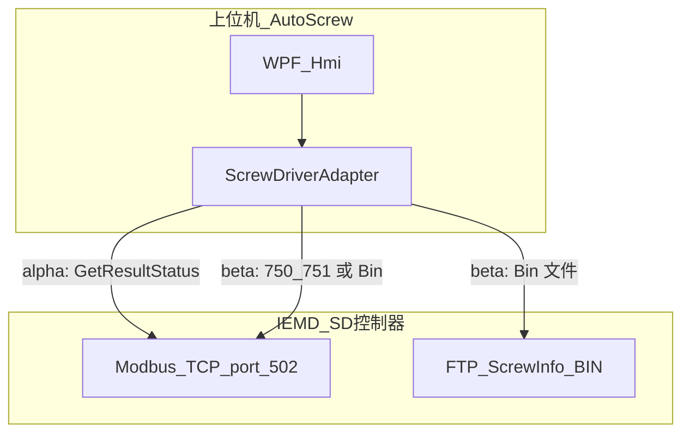
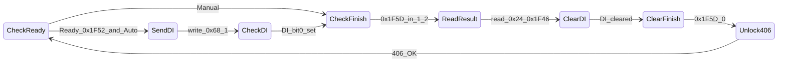

# 智能电批（IEMD-SD / 台达 SD3）通信与数据梳理

| 版本 | 日期 | 说明 |
|------|------|------|
| 1.0 | 2026-05-18 | 初版：汇总厂商 Help、三份 C# Demo、`IEMD-SD` 手册与 Bin 布局说明 |

**读者**：AutoScrew 上位机/驱动开发、联调工程师。  
**边界**：本文描述**控制器对外通信与数据形态**；产线 EHS、扭矩保护、MES 字段以 [PRD.md](PRD.md)、[DATA_AND_TRACE.md](DATA_AND_TRACE.md)、[SPEC.md](SPEC.md) 为准。  
**权威顺序**：现场合同与最新厂商手册 > 本文 > WinForm Demo（Demo 为示例，错误处理较粗糙）。

---

## 1. 资料索引

| 类型 | 路径 | 用途 |
|------|------|------|
| 交互示意图 | [Help/ScrewHelp.html](Help/ScrewHelp.html)、[Help/ScrewHelp/*.gif](Help/ScrewHelp/) | 拧紧/读结果/读曲线/换参/升级 **时序示意** |
| Demo：轻量结果 | [../SupplierDemo/ScrewDriverC# Winform(GetResultStatus)](../SupplierDemo/ScrewDriverC%23%20Winform(GetResultStatus)/) | Modbus only，`GetResultStatus`，窗体 `Example_GetResultStatus_V0.0.0.0` |
| Demo：全量 Modbus | [../SupplierDemo/ScrewDriverC# Winform(ModbusTCP)](../SupplierDemo/ScrewDriverC%23%20Winform(ModbusTCP)/) | `#750` + `#751` 分块读曲线，`Example_ModbusTCP_V0.0.0.3` |
| Demo：Modbus + FTP | [../SupplierDemo/ScrewDriverC# Winform(ModbusTCP+FTP)](../SupplierDemo/ScrewDriverC%23%20Winform(ModbusTCP+FTP)/) | `#517` 自动导出 Bin + FTP 下载解析 |
| **上位机驱动实现** | [../src/UDL.Delta.IemdSd](../src/UDL.Delta.IemdSd/) | .NET 8 类库：Modbus 邮箱、`#302`/`#750`/`#751`、GetResultStatus 拧紧周期 |
| **产线适配** | [../src/AutoScrew.Infrastructure/Hardware/IemdSdLockStationHardware.cs](../src/AutoScrew.Infrastructure/Hardware/IemdSdLockStationHardware.cs) | 实现 `ILockStationHardware`，供钉仍仿真 |
| Bin 字表 | 同目录 `BinFile Explain.xlsx`、`Bin檔解譯.xlsx` | Word 偏移与字段名（与 Demo `ParseFileBin` 交叉校验） |
| 厂商幻灯片 | 各 Demo 下 `電鎖通訊應用*.pptx` | 联调图示（未全文抽取） |
| 控制器手册（英文，权威） | [DELTA_IA-DCSS_SD3_UM_EN_20260310.pdf](DELTA_IA-DCSS_SD3_UM_EN_20260310.pdf) | SD3 系列操作手册；附录 A/B Modbus TCP/RTU 功能码 |
| 功能码索引 | [IEMD_SD_MODBUS_COMMANDS.md](IEMD_SD_MODBUS_COMMANDS.md) | 由英文手册生成的 149 条唯一功能码目录 |
| 控制器手册（中文，旧） | [../src/IEMD-SD系列10.1寸控制器(1).pdf](../src/IEMD-SD系列10.1寸控制器(1).pdf) | 台达 **SD3 系列**操作手册（528 页）；硬件/HMI/附录 Modbus·TCP |



---

## 2. 产品与网络前提

### 2.1 产品（手册摘录）

- 手册名：**台达 SD3 系列 — 智能螺丝锁附系统操作手册**（仓库 PDF 文件名含 `IEMD-SD系列10.1寸控制器`）。
- 通信：控制器提供 **Modbus TCP（以太网）**、**Modbus RTU（RS-485）**、**TCP/IP 自由通讯**（附录 B）；PC/PLC/HMI 均可作主站。
- 示例型号（手册）：`ASD-SD3021B-1` 等；10.1 寸 HMI 机型与 4.3 寸固件升级流程见 Help GIF。

### 2.2 网络与默认参数（手册 §9 + Demo）

| 项目 | 默认值 / 说明 |
|------|----------------|
| 控制器 IP | **192.168.1.11**（可改） |
| 子网掩码 | **255.255.255.0** |
| Modbus TCP | **端口 502**（三 Demo 一致，`EasyModbusTCP` 5.6.0） |
| VNC | 端口 **5900**，同步 HMI 画面 |
| FTP | 端口 **21**；用户 **admin** / 密码 **1234**（**产线必须修改**） |
| FTP 路径（Demo） | `ftp://{IP}/ScrewInfo/BIN/ID{n}.bin` |
| PC 网卡 | Demo 提供 `ncpa.cpl` 快捷方式，要求 PC 与控制器同网段 |

### 2.3 单颗结果导出为 Bin（手册 §9 + `#517`）

在 HMI **系统设定** 中可配置「单颗螺丝运行结果输出成档案」：

| 模式 | 生成时间 | 文件名规则 | 读取方式 |
|------|----------|------------|----------|
| 关闭 | — | — | — |
| CSV (HMI Disk) | ~2.5 s | 生产履历 ID（满 20 万笔覆盖） | FTP |
| CSV (USB) | ~3 s | USB 插入 Host | — |
| **BIN (HMI Disk)** | **~1 s** | 生产履历 ID **后两码**（满 **100** 笔循环） | **FTP** |

Demo 中通过 Modbus **`#517`** 写入 `CA=3` 开启 BIN 导出；与上位机 FTP 拉取配合。

---

## 3. Help 场景与 Demo 对照

打开本地 [ScrewHelp.html](Help/ScrewHelp.html) 可查看 GIF 时序。

| Help 菜单 | 能力 | Demo / 手册 |
|-----------|------|-------------|
| Quick Start → Tightening Start | 拧紧启动概念 | 三 Demo Step1–5 图、`QuickStart.gif` |
| Get Result → **Automation** | 上位机写 DI 触发，轮询完成 | `GetResultStatus` + `DIStart.gif` |
| Get Result → **Manual station** | 手扳/手柄启动，只轮询 | `LeverStart.gif`，不写 `0x68` |
| Read Report → Modbus TCP **#750** | 单次生产履历（报告块） | `ModbusTCP` SM 200–202 |
| Read Curve → Modbus TCP **#751** | 曲线 Scale / 角度 / 扭矩 / 参数 | `ModbusTCP` SM 300–332 |
| Read Curve → **FTP** | 下载 Bin 一次解析 | `ModbusTCP+FTP` |
| Switch Param ID → **#302** | 手动设定下切换拧紧参数 ID | Help 有 GIF；**三 Demo 未实现**；见 §5.6 |
| Update firmware 10.1 / 4.3 | HMI/BIOS 升级 | 仅 Help；见手册安装章节 |

---

## 4. Modbus 通信范式（三 Demo 共用）

### 4.1 功能码与单次长度

- 支持 **03H**（读保持寄存器）、**06H**（写单寄存器）、**10H**（写多寄存器）。
- RTU 帧间静止 ≥10 ms；TCP 无此要求。
- 手册 RTU 示例：单次读写 **≤10 word**；Demo 对大块数据使用 **120 word/次** 窗口循环（`ReadHoldingRegisters` / `WriteMultipleRegisters`），联调时需确认控制器是否允许。

### 4.2 命令邮箱（一问一答）

所有 **#xxx 功能代码** 均通过同一邮箱交互（手册 A.3 与各 Demo 一致）：

| 阶段 | 起始地址 (Hex) | 长度 (word) | 内容 |
|------|----------------|-------------|------|
| 写请求 | **0xC8** (200) | 10 | `[CmdNo, Ver, …, **1**, 0, 0, 0]` — 最后一组 `1` 为「发送命令」 |
| 读应答 | **0xCF** (207) | 3 | `[CmdNo, **Status**, **Err**]` — 成功：`Status==1 && Err==0` |
| 读数据 | **0xD2** (210) | 视命令 | 成功后批量读报告/曲线/参数 |

**超时**：Demo `IsTimeout(3000)` ms 超时重发。  
**地址习惯**：Demo 将 **十六进制保持寄存器号** 直接传给 EasyModbus（非 PLC「40001+偏移」）；移植 .NET 8 时需与手册位址表再对一次 **0/1 基**。

### 4.3 功能代码速查（Demo 已用）

| Cmd | 手册名称 | Demo 典型写法 (0xC8 起 10 word) | 说明 |
|-----|----------|----------------------------------|------|
| **100** | 拧紧参数写入 | 先写 **0xD2~0x22E**（349 word），再 `[100,0,tool,ParamID,0,0,1,…]` | 见 §5.6.1；HMI 技术员页可维护本地 JSON 并下发 |
| **150** | 拧紧参数读取 | `[150,0,tool,ParamID,0,0,1,…]` → 读 **0xD2~0x22E** | 与 #751 Mode=11 的 550 word **不是同一格式** |
| **302** | 手动设定下切换拧紧参数写入 | `[302,0,tool,ParamID,ScrewCountL,ScrewCountH,…,1,…]` | 切换方式须为「手动设定」；见 §5.6 |
| **406** | 限制拧紧操作写入 | `[406,0,0,…,1,…]` | GetResultStatus：**每轮读后发送**，Demo 注释为 Unlock |
| **517** | 单颗螺丝运行结果输出成档案写入 | `[517,0,**3**,…,1,…]` 开启 BIN；`3→0` 关闭 | 仅 FTP Demo |
| **533** | （Demo：AutoLock） | GetResult: word2=**1** 开启；ModbusTCP/FTP: word2=**0** 关闭 | 手册未在摘录中出现编号，以 Demo 为准 |
| **562** | 曲线取样频率读取 | `[562,0,0,…,1,…]` → 返回值在 **0xC8** | 得到 `CurveVer`，决定 ReportID 上限 |
| **750** | 生产履历调阅读取 | `[750,0,ReportL,ReportH,0,0,1,…]` | 成功后读 **0xD2** 起 **253 word**（Demo） |
| **751** | 曲线调阅读取 | `[751,0,ReportL,ReportH,**Mode**,0,1,…]` | Mode 见 §5.5；数据从 **0xD2** 起 |

### 4.4 运行时保持寄存器（轮询）

| 地址 (Hex) | 十进制 | 用途 | 备注 |
|------------|--------|------|------|
| **0x67** | 103 | DI 状态 | Bit0：Demo 写 `0x68=1` 后期望为 1 |
| **0x68** | 104 | DI 命令 | Bit0=1：自动化触发拧紧 |
| **0x6B–0x6C** | 107–108 | 生产履历笔数 | **低 word 在前**：`ID = [H]*65536 + [L]` |
| **0x24** | 36 | Total Angle | GetResultStatus 轻量读取 |
| **0x26** | 38 | 拧紧结果（旧） | 1=OK，2=NG；编译宏 `NeverClear` 时用 |
| **0x1F46–0x1F47** | 8006–8007 | Final + Prevail 扭矩 | DWORD，Demo `/1000` 得 N·m 量级 |
| **0x1F52** | 8018 | Ready | `==1` 时可发 DI（Demo） |
| **0x1F5D** | 8029 | 完成标志（新） | 1=OK，2=NG；读后写 0 清除 |

手册 **附录 A.2** 运作状态区（刷新约 **0.3 s**）另含大量实时量，例如：

- **0x26**：拧紧结果 (1 OK / 2 NG / 5 Pass)  
- **0x2B–0x2D**：最终扭矩、补偿扭矩、最终电流等  

上位机 α 阶段可仅用 Demo 使用的少量地址；β 阶段可按手册扩展。

### 4.5 ReportID 与 CurveVer

1. 启动时读 **0x6B** 当前履历 ID。  
2. 发送 **#562** 得 `CurveVer`（Demo 读回 **0xC8**）。  
3. 新拧紧：`0x6B` 变化后，Demo 将 `LastReportRow++`（与当前 ID 对齐策略见各 Demo）。  
4. **ReportID 上限**（Demo）：

| CurveVer | 最大 ID |
|----------|---------|
| 0 或 1 | 200000 |
| 2 或 3 | 100000 |
| 其他 | 50000 |

溢出后回绕到 **1**。

---

## 5. 三种 Demo 状态机

### 5.1 共同约定

- 定时器 **100 ms** 驱动状态机 `SM`。  
- **`AutoRunningCB`**：勾选 → 自动写 **DI**（`DIStart.gif`）；不勾选 → 仅轮询（`LeverStart.gif`）。  
- 连接：`ModbusClient`，IP 来自界面，`Port=502`。

### 5.2 GetResultStatus（轻量：OK/NG + 扭矩角度）

**源文件**：`ScrewDriverC# Winform(GetResultStatus)/Delta C#/Form1.cs`

**适用**：MES/工位只需 **合格与否 + 总角度 + 最终/ prevail 扭矩**，不需要完整曲线。

**初始化序列**：

1. 清 DI：`0x68 ← 0`  
2. 清完成：`0x1F5D ← 0`（新固件；旧固件用 `0x26`）  
3. **#533** AutoLock **开启**（word2=1）  
4. **#406**（限制拧紧操作 / Demo 称 Unlock）

**主循环**：



- 读结果：`0x1F5D ∈ {1,2}` → 读 `0x24`、`0x1F46`（双 word 扭矩）  
- **不调用** #750 / #751 / FTP  

### 5.3 ModbusTCP（全量：报告 + 分块曲线）

**源文件**：`ScrewDriverC# Winform(ModbusTCP)/Delta C#/Form1.cs`

**初始化**：读 ReportID → 清 DI → **#533 关闭 AutoLock** → **#562** 取 `CurveVer`

**检测到新履历**（`0x6B` 变化）后：

1. （可选）DI 触发流程  
2. **#750** → 读 **253 word** → `ReportInfoStuc`  
3. **#751 Mode=10** → Scale（含 `Curve_TotalPoint`）  
4. **#751 Mode=1/21/31/41** → 角度曲线分块（每块最多 **2000** point）  
5. **#751 Mode=4/5/24/25/34/35/44/45** → 扭矩曲线分块（每块最多 **1000** point，每点 2 word）  
6. **#751 Mode=11** → 参数块 **550 word**  
7. 拼接输出 `(Angle, Torque)` 列表  

### 5.4 ModbusTCP + FTP（Bin 一次下载）

**源文件**：`ScrewDriverC# Winform(ModbusTCP+FTP)/Delta C#/Form1.cs`

与 §5.3 类似，但：

- 初始化增加 **#517**：`[517,0,3,…]` 开启 **BIN (HMI Disk)** 自动导出  
- 检测到新履历并清 DI 后：  
  - `BinID = (LastReportRow - 1) % 100`  
  - FTP 下载 → `ParseFileBin`  
  - 本地缓存 `.\ScrewInfo\BIN\ID{n}.bin`

**FTP 示例（Demo，勿用于生产）**：

```text
ftp://{ControllerIP}/ScrewInfo/BIN/ID{BinID}.bin
User: admin  Password: 1234
```

### 5.5 #751 曲线 Mode（ModbusTCP Demo）

| Mode (word4) | 含义 | 单次最大读取 (word) |
|--------------|------|---------------------|
| **10** | Scale / 元数据 | 150 |
| **1** | 角度曲线段 0 | 2000 |
| **21** | 角度曲线段 1 | 2000 |
| **31** | 角度曲线段 2 | 2000 |
| **41** | 角度曲线段 3 | 2000 |
| **4,5,24,25,34,35,44,45** | 扭矩曲线各段 | 1000 点 × 2 word |
| **11** | 拧紧参数快照 | 550 |

ReportID 编码在命令 word2–3：`ReportL = ID % 65536`，`ReportH = ID / 65536`。

### 5.6 #302 切换拧紧参数 ID（手册有，Demo 无）

手册 **附录 A §#302**（PDF 约 A-40 页）：在拧紧来源为 **「手动设定」** 时，切换 **参数 ID 1–500** 及 **螺丝总数量**。

| 寄存器 | 内容 |
|--------|------|
| C8 | 302 |
| C9 | 0 |
| CA | 工具 0/1 |
| CB | 拧紧参数 ID |
| CC–CD | 螺丝总数量 L/H |
| CE | 1（发送） |

常见异常：切换方式非手动(1)、参数 ID 超范围、双轴交互禁止等。  
AutoScrew 扫码换 PN 工艺时，应在 α 联调阶段单独验证此命令，**不可照搬 GetResultStatus 的 #533 AutoLock 逻辑**。

### 5.6.1 #100 / #150 拧紧参数块（手册 A.3.1，已实现）

手册 **附录 A.3.1**：单条拧紧参数占用 **0xD2 ~ 0x22E**（**349 word**），含名称 ASCII（20 word）、基本设定、6 阶段各 50 word、拧松区等。

| 步骤 | #150 读 | #100 写 |
|------|---------|---------|
| 1 | 邮箱 `[150,0,tool,ParamID,…,1]` | 写满 **0xD2~0x22E** |
| 2 | 轮询 **0xCF~0xD1** OK | 邮箱 `[100,0,tool,ParamID,…,1]` |
| 3 | 读 **0xD2~0x22E** | 轮询 **0xCF~0xD1** OK |

**与 #751 Mode=11 区别**：曲线调阅 Mode=11 返回 **550 word** `ParamCommItemVer1` 快照；`#100`/`#150` 为控制器 HMI 参数表原生布局，移植时勿混用。

**AutoScrew 落地**：

- 驱动：`UDL.Delta.IemdSd` → `ReadParameterAsync` / `WriteParameterAsync`；`TighteningParameterCodec` 提供 Raw(349) + Core 字段互转。
- 本地预设：`{DataDirectory}/controller-parameters/{id}.json`。
- 工位设备：`{DataDirectory}/stations/{StationId}/devices.json`（最多 3 槽，网口 TCP / 串口 RTU）；`IStationDeviceService` 管理激活设备。
- HMI（技术员）：**生产 → 拧紧参数**；**系统 → 设备连接**；支持 JSON 导入导出、#150/#100/#302。
- 真机：`AutoScrew:UseSimulatedHardware=false` 后在设备连接页 **应用并重连**；`IemdSd` 节仅作首次迁移种子。
- 联调：控制器拧紧来源须 **手动设定**；参数 ID **1~500**。

- 联调：控制器拧紧来源须 **手动设定**；参数 ID **1~500**。

### 5.8 #200 / #250 拧紧顺序块（手册 A.3.2，已实现）

手册 **附录 A.3.2**：单条顺序占用 **0xD2 ~ 0x2E3**（**530 word**）。

| 相对偏移 | 内容 |
|----------|------|
| 0xD2–0xE5 | 名称 ASCII（20 word） |
| 0xE6 | General(0) / Navigator(1) |
| 0xE7 | 定位臂开关 0/1 |
| 0xF0–0x153 | Set 1–100 Tool ID |
| 0x154–0x217 | Set 1–100 Parameter ID（1–500） |

附属块（按顺序 ID 读写）：

| 功能码 | 范围 | 内容 |
|--------|------|------|
| #201/#251 | 0xD2–0x199 | 100 钉导航坐标 (X,Y) |
| #202/#252 | 0xD2–0x135 | 100 钉图像码 0–21 |
| #203/#253 | 0xD2–0x329 | 100 钉定位臂 (XL,XH,YL,YH,ZL,ZH) mm |

**AutoScrew 落地**：`TighteningSequenceCodec` + `controller-sequences/{id}.json`；HMI **配置 → 拧紧顺序**；激活 `#303`。

### 5.9 #300 / #301 拧紧来源（手册 A.3.3，已实现）

**#300 运行模式**（邮箱 word2=Tool, word3=Operating, word4=Switching）：

| word | 含义 |
|------|------|
| Tool | 0/1 |
| Operating | 0 单工具 / 1 双工具交替 / 2 双工具同步 |
| Switching | 0 手动 / 1 螺丝刀选择器 / 2 条码扫描 |

**#301 单来源内容**（0xD2–0x14A）：

| 偏移 | 内容 |
|------|------|
| 0xD2–0x135 | 条码 ASCII（100 word，条码模式） |
| 0x136 | 来源类型 0=参数 / 1=顺序 |
| 0x137 | Parameter/Sequence ID |
| 0x138–0x139 | 螺钉总数 L/H |
| 0x13A | Bit ID |

条码运行时写入 `#401`；扫码器高级 `#408`/`#452` 为来源子能力。

**AutoScrew 落地**：`controller-source.json` + HMI **配置 → 拧紧来源**；产线 `HostGuided`（`#300`+#302）或 `DeviceProgram`（`#301`+#303）。

### 5.7 #406 / #533 与手册名称差异

| Demo 用法 | 手册正式名称（摘录） |
|-----------|----------------------|
| #406 每轮解锁 | **#406 限制拧紧操作写入** |
| #533 word2=1/0 | Demo 注释 AutoLock；手册功能码总表未单独列出 533，以厂商确认为准 |

---

## 6. 数据结构摘录

### 6.1 #750 ReportInfo（ModbusTCP `ReportInfoStuc`）

Demo 自 **0xD2** 映射结构体（偏移为结构体内 **字偏移 Hex**，非 Modbus 全局地址）：

| 偏移 | 字段 | Demo 打印 |
|------|------|-----------|
| 0x13C | Tool | 工具号 |
| 0x145 | TighteningAngle | 拧紧角 |
| 0x146 | TotalAngle | 总角度 |
| 0x147 | Status | 1 OK / 2 NG |
| 0x148 | CT_Time | 节拍 |
| 0x17D | AppliedTorque_DW 等 | 最终+补偿扭矩，/1000 |

完整字段见 `Form1.cs` 中 `ReportInfoStuc`（`FieldOffset`）。

### 6.2 #751 Scale（`ReportScaleStuc`）

关键字段：

- `Curve_TotalPoint`：曲线点数  
- 各 Stage/Loosening 角度、扭矩、时间  
- `Curve_MaxTime/Angle/Torque` 等  

### 6.3 Bin 文件布局（`ParseFileBin` + xlsx）

Bin 为 **小端 UInt16 数组** `Data16[]`（由字节流每 2 字节组成）。下列为 **word 下标**（与 `BinFile Explain.xlsx` 一致）。

#### 6.3.1 区段总览

| Word 范围 | 内容 |
|-----------|------|
| 0–99 | SN（ASCII，字节 0–199） |
| 100–149 | 报告元数据（时间、Tool、Status、扭矩等） |
| 150–2149 | 曲线 **时间** 点（最多约 2000×4 段） |
| 2150–4149 | 曲线 **角度** |
| 4150–6149 | 曲线 **扭矩** |
| 6150–8149 | 曲线 **扭矩 rate** |
| **8150+** | **Scale** 块（阶段角/扭矩/时间、TotalPoint 等） |
| **8200+** | **Param** 块（550 word，与 #751 Mode 11 对应） |
| **32750+** | **OtherInfo**（可选，文件 ≥ 32950 word） |

#### 6.3.2 Scale 区（8150 + 偏移）

| 偏移 (8150+) | xlsx 名称 |
|--------------|-----------|
| 0–7 | Stage1–6 / Loosening1–2 **运行角度** |
| 8–15 | 各阶段 **最大扭矩** |
| 16–23 | 各阶段 **运行时间** |
| 24–27 | 曲线 Max Time / Angle / Torque / TorqueRate |
| **28** | **Total number of curve coordinates** |
| 29+ | 设定上下限、CurveVer 等 |

#### 6.3.3 曲线点分段（>2000 点）

与 Demo 一致，按点索引 `j` 切换基址：

| 点数 j | Time | Angle | Torque | TorqRate |
|--------|------|-------|--------|----------|
| 0–1999 | 150+j | 2150+j | 4150+j | 6150+j |
| 2000–3999 | 8750+(j-2000) | +2000 | +4000 | +6000 |
| 4000–5999 | 16750+(j-4000) | 同上规律 | | |
| 6000–7999 | 24750+(j-6000) | | | |

#### 6.3.4 报告区（约 word 100+）

- 时间：Unix 风格，`Days` @100 + `Seconds` @101–102  
- SN：`Byte2AsciiStr` @byte 200  
- Tool、ScrewNo、ParmID、Status、FinalTorque、TotalAngle 等与 #750 字段对应  

#### 6.3.5 FTP 文件 ID

`BinID = (ReportRow - 1) % 100`，与手册「ID 后两码、满 100 笔循环」一致。

---

## 7. 扭矩单位换算（Demo `TorqUnitcoef`）

控制器参数与结果可能为 **Nm / kgf·cm / lbf·in** 等。Demo 使用：

```text
ParamConvertNmThenConvertUserUnitCoef =
  TorqUnitcoef(1000 + TorqueUnit) / TorqUnitcoef(1000 + RawDataUnit)
```

常见系数（摘录）：Nm=1，kgf·cm=10.197，lbf·in=8.849，cNm=100 等。  
**展示单位以控制器当前 Param 为准**；写入 [DATA_AND_TRACE.md](DATA_AND_TRACE.md) 前与 SPEC 验收单位对齐。

---

## 8. 对 AutoScrew 的实现建议

### 8.0 已实现（仓库内）

| 组件 | 路径 | 说明 |
|------|------|------|
| 驱动库 | `src/UDL.Delta.IemdSd` | `IIemdSdClient`：Modbus TCP/RTU；`ExecuteModbusCommandAsync` 覆盖全部附录功能码；强类型 API（条码/来源/履历/参数/顺序/系统/工具）；`#100`/`#150`/`#302`/`#517`/`#750`/`#751` 等 |
| 参数预设 | `IControllerParameterPresetService` | 本地 JSON + 设备读写；HMI **拧紧参数** |
| 顺序/来源预设 | `IControllerSequencePresetService` / `IControllerSourceConfigService` | `controller-sequences/` + `controller-source.json`；HMI **拧紧顺序** / **拧紧来源** |
| 产线双模式 | `ProductionTighteningMode` + `IemdSdLockStationHardware` | HostGuided（#302）/ DeviceProgram（#301+#303） |
| 工位设备 | `IStationDeviceService` | 每工位最多 3 设备槽；TCP/RTU；HMI **设备连接** |
| 硬件适配 | `AutoScrew.Infrastructure` → `IemdSdLockStationHardware` | 实现 `ILockStationHardware`；使用激活工位设备 |
| 配置 | `appsettings.json` | `AutoScrew:StationId` + `UseSimulatedHardware=false` 接真机；设备地址在 HMI 保存 |
| 判定 | `OperatorSessionController` | **曲线规则 NG 或设备 Status NG 则螺钉 NG** |
| 单元测试 | `tests/UDL.Delta.IemdSd.Tests` | 功能码目录、命令执行器、`ReportReader`、参数 Codec、邮箱布局 |

**联机步骤（FAT）**：

1. 设置 `AutoScrew:StationId` 与 `UseSimulatedHardware=false`。
2. HMI **设备连接**：配置网口/串口（最多 3 槽），设激活设备并 **应用并重连**。
3. **拧紧参数**：#150 回读 → 修改 → #100 写入 → #302 激活。
4. 操作员流程：扫码 → `#302` ParamID → 拧紧 → `#750`/`#751` 曲线。

**FTP Bin**：`#517` 已在驱动中提供 `SetPerScrewExportAsync`；FTP 拉取可扩展 `UDL.Delta.IemdSd.Ftp` 或独立包。

### 8.1 分层（历史示意）

驱动端口已落地为 `UDL.Delta.IemdSd.IIemdSdClient`；Application 仍通过 `ILockStationHardware` 抽象，不直接引用 Modbus。

- **α（当前）**：GetResultStatus + `#750`/`#751` + `#302` + `#100`/`#150` 参数模板 + 通用 `ExecuteModbusCommandAsync`。  
- **β**：FTP Bin 文件拉取、多面引导 HMI（驱动已含 `#200`/`#250` 顺序读写 API）。  
- **工艺切换**：`ScrewRecipeDto.ControllerParameterId` 或 `IemdSd:ParameterIdByPosition`。  

### 8.2 禁止与改进项

- **禁止**绕过急停、安全门、扭矩保护互锁。  
- Demo `catch { ModB.Connect(); }` **不可**用于生产；应显式断线、重试上限、**Serilog** 日志。  
- FTP：**FluentFTP** 替代已弃用 `WebClient`；凭证走配置/密钥管理，禁用默认 `admin/1234`。  
- Modbus：.NET 8 可用 **FluentModbus** 或 **EasyModbus**；写清 Holding Register 寻址方式。

### 8.3 与项目文档关系

| 文档 | 关系 |
|------|------|
| [PRD.md](PRD.md) | 扫码→PN→逐钉引导；自动化产线倾向 DI + #302 |
| [DATA_AND_TRACE.md](DATA_AND_TRACE.md) | 曲线路径、出站字段；驱动只提供原始/物理量 |
| [技术调研.md](技术调研.md) | 技术栈；设备协议由本文落地 |

---

## 9. 已知缺口与修订

| 缺口 | 处理 |
|------|------|
| `#533` 手册功能码表未摘录 | 以 Demo 行为为准，联调时向厂商确认 |
| PPTX 未全文入库 | 需要时打开 `電鎖通訊應用*.pptx` |
| PDF 部分页 OCR/提取不完整 | 通信号以 **附录 A/B** 为准；操作以 §4–§12 为准 |
| Modbus 单次 10 word 限制 vs Demo 120 | 联调实测是否需拆分 |

---

## 10. 附录：源文件快速定位

| 内容 | 文件 |
|------|------|
| 轻量状态机 | `SupplierDemo/ScrewDriverC# Winform(GetResultStatus)/Delta C#/Form1.cs` |
| 750/751 状态机 | `SupplierDemo/ScrewDriverC# Winform(ModbusTCP)/Delta C#/Form1.cs` |
| FTP + ParseFileBin | `SupplierDemo/ScrewDriverC# Winform(ModbusTCP+FTP)/Delta C#/Form1.cs` |
| UDL 驱动 | `src/UDL.Delta.IemdSd/IemdSdClient.cs` |
| Help 索引 | `doc/Help/ScrewHelp.html` |
| Bin 字表 | `src/ScrewDriverC# Winform(ModbusTCP+FTP)/BinFile Explain.xlsx` |
| 手册 PDF | `src/IEMD-SD系列10.1寸控制器(1).pdf` |
