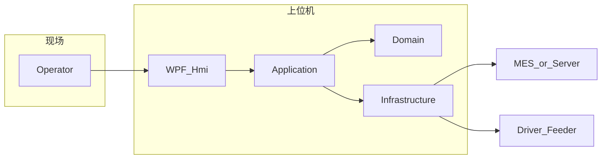

# 技术调研 — 自动锁附上位机

本文档记录**技术选型结论**、与 [doc/PRD.md](doc/PRD.md) 的对应关系及联调/部署要点。详细软件分层与模块说明见 [doc/Design.md](Design.md)。

| 版本 | 日期 | 说明 |
|------|------|------|
| 0.2 | 2026-05-11 | 按调研计划扩写：栈总表、架构与数据流、MES Mock、部署与风险 |

---

## 1. 背景与目标

- **业务**：产线智能锁附 — 气吸取钉、智能电批分段拧紧、扭矩–角度曲线与规则判定、扫码 SN→PN 工艺引导、结果与曲线追溯、MES 对接（见 PRD）。
- **上位机职责**：单工位 Windows 桌面程序，负责 HMI、作业编排、本地持久化与出站上传、设备/MES 适配；**不**在本文写死 PLC/电批型号与协议（以供应商 SDK 与公司 IT 规范为准）。

### 1.1 命名与范围：「作业台工具」与 PRD「系统」

| 表述 | 含义 | 说明 |
|------|------|------|
| **作业台工具**（对外/立项用语） | 单 PC 上位机 + 与电批、供料、MES 的集成边界 | 强调工位级交付，避免被误解为「仅取钉小脚本」 |
| **PRD 系统范围**（需求权威） | 含 HMI、锁附控制逻辑、曲线判定、≥50 组任务、三级权限、断网续传、归档与 MES 等 | 与 [doc/PRD.md](doc/PRD.md) In-Scope 一致；工具**实现**该范围在上位机侧的能力 |

二者指向**同一套上位机软件**；差异仅在沟通用语，实施与验收以 PRD 及后续 SPEC/IT 契约为准。

---

## 2. 技术栈总表（已定 / 待定）

| 类别 | 选型 | 状态 | 说明 |
|------|------|------|------|
| 运行时 | .NET 8 | **已定** | LTS 方向，与团队栈一致 |
| UI | WPF | **已定** | 状态绑定、1Hz 闪烁、大图钉位叠加、曲线展示；**不采用 WinForms**（含 SunnyUI 等工业 WinForms 套件已评估并否决） |
| MVVM | CommunityToolkit.Mvvm | **已定** | `ObservableObject`、`RelayCommand`、源生成器 |
| 工业风 UI（可选） | MahApps.Metro / HandyControl / 自研主题 | **待定** | 按需二选一或轻量混用，不阻塞核心功能 |
| 日志 | Serilog | **已定** | 文件滚动；可选远端 Sink（如 Seq）视现场而定 |
| HTTP 韧性 | Microsoft.Extensions.Http + Polly | **已定** | 重试、超时、熔断；与 `HttpClientFactory` 集成 |
| 本地库 | SQLite + EF Core | **已定（默认）** | 出站队列、`lock_record`/`screw_detail`、作业 checkpoint；若需更少样板可再评估 LiteDB，变更需更新本文与 Design |
| 配置 | appsettings.json + 用户目录覆盖 | **已定** | 与程序集解耦 |
| 曲线图（WPF） | ScottPlot.WPF / LiveCharts2 / OxyPlot | **待定其一** | 首版倾向 **ScottPlot**（性能）或 **LiveCharts2**（MVVM 友好）；定稿后改本表为唯一项 |
| 设备协议 | 供应商 SDK / 串口 / 以太网（TBD） | **待定** | 上位机侧固定 **端口接口 + 仿真实现**（见 Design） |

传输与安全原则：**TLS 1.2+**；敏感配置/令牌不明文落日志；磁盘敏感项原则为 **DPAPI** 或与 IT 约定的 **AES + 机绑密钥**（字段级随 MES 定稿）。

---

## 3. 架构（逻辑）

与 [doc/Design.md](Design.md) 一致；下图便于评审快速阅读。

**解决方案项目（实现骨架）**：

- `AutoScrew.Hmi` — WPF
- `AutoScrew.Application` — 用例与端口
- `AutoScrew.Domain` — 规则、状态机、值对象
- `AutoScrew.Infrastructure` — MES、EF/SQLite、文件、设备适配与 Mock

可选后续增加 `AutoScrew.Contracts`（DTO/MES 契约集中），当前不强制。

---

## 4. 数据流（曲线、落盘、上传）

1. **曲线采样**：设备适配在**非 UI 线程**向有界通道/环形缓冲推送采样点；Domain/Application 消费并做判定；VM 仅订阅**降采样**后的显示序列，避免阻塞 UI。
2. **落盘**：按 PRD 草案生成 `lock_log_*.json`、`torque_curve_{pos}_{ts}.csv` 等；**优先写本地工作目录**，网络路径可用时再同步至 `\\Server\Production\...`（网络不可用时产线仍可完成本地归档）。
3. **上传**：成功判定后组包 → 调用 MES API；失败或离线 → 写入 SQLite **出站表**（outbox），后台定时/网络恢复后重传，依赖**幂等键**避免重复上传。

---

## 5. MES 联调策略

- **契约来源**：以公司《MES 系统接口规范》及 IT 输出为准；PRD 中「MES 数据字段最终确认」为门禁。
- **α 阶段 Mock**：在 `Infrastructure` 中实现 `IMesClient` 的 Mock（固定 SN→固定 PN、可控延迟/失败），通过配置切换 `Development:UseMockMes=true`，避免等联调才具备可演示路径（对齐 PRD 风险表「接口联调延期」应对）。
- **字段映射**：Mock 与真实客户端共用 DTO；字段变更时同步追溯类文档（若仓库中 `doc/DATA_AND_TRACE.md` 恢复或合并，以其为字段权威）。

---

## 6. 风险与回退

| 风险 | 应对（技术侧） |
|------|----------------|
| MES 延期 | Mock + 配置开关；出站队列持久化 |
| 硬件协议未定 | `ISmartDriver`/`IFeeder` 仿真实现 + 后续替换 DLL/SDK |
| 上传重复 | 出站表状态机 + 服务端幂等键（与 IT 约定） |
| 网络盘不可用 | 本地完整数据路径为真源，网络盘为异步副本 |

---

## 7. 构建与部署

| 项 | 建议 |
|----|------|
| RID | `win-x64`（主目标工位机） |
| 发布 | `dotnet publish -c Release -r win-x64`；框架依赖 vs 自包含按现场 IT 策略选择 |
| 输出 | 单文件夹部署 + 版本号（程序集/`关于` 页）便于产线回溯 |
| 环境 | `appsettings.Development.json` / `Production.json` 区分 Mock、日志级别、MES BaseUrl |

---

## 8. 参考文档

- [doc/PRD.md](PRD.md) — 需求与验收摘要  
- [doc/Design.md](Design.md) — 软件方案设计与模块边界  
- [readme.md](../readme.md) — 仓库门面与范围说明  
