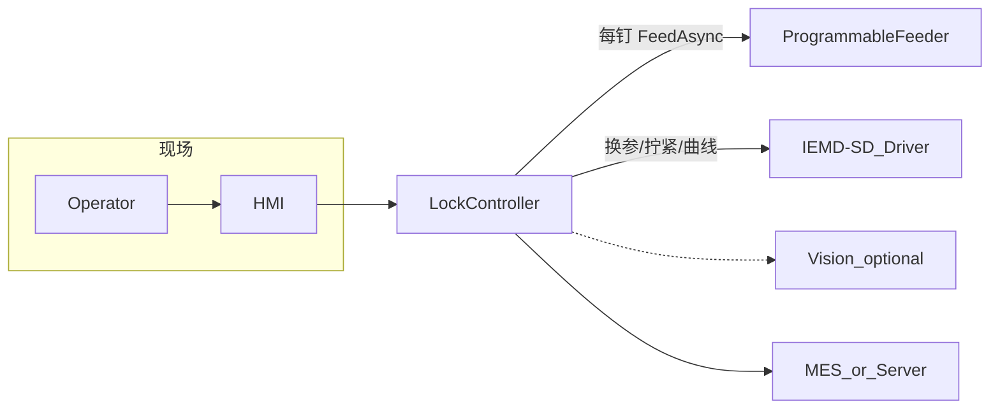

# 智能锁附系统

面向产线导入的**自动锁附**方案：替代人工重复取钉、锁附与判定，降低漏装/错装/未打紧风险，并以扭矩–角度曲线与 MES 追溯支撑工艺优化与质量稳定。

## 目标

- **人效**：压缩取钉、点数与锁附节拍（需求书给出约 4.5 s/颗、7.5 s/颗等估算，以线体实测为准）。
- **质量**：浮锁、滑牙、斜锁、卡钉、漏锁等可检测；螺钉歪斜与掉钉率满足验收指标。
- **工艺**：分段扭矩、转速/角度/时间可配；50 组任务与 SN→PN 模板一键下发。
- **可追溯**：按 SN/螺钉位保存曲线与结果，上传公司服务器并对接 MES。

## 范围

**本期包含**：**程控自动供料/上料**、智能电批控制、曲线采集与判定、任务与 SN/PN 配置、操作界面与报警、数据存储与 MES 接口（开放端口配合整合）。

**不在本期或单独约定**：视觉防错/识别（V1 讨论中为**二期**）、具体 MES 报文与服务器拓扑（依公司 IT 规范）、非本工位的整线节拍平衡。

详细条目、验收数值与阶段计划见 [doc/SPEC.md](doc/SPEC.md)（对齐 [doc/智能锁附系统开发 (V1).xls](<doc/智能锁附系统开发 (V1).xls>)）。

## 系统架构（逻辑 — PRD V1.1）

单工位由上位机统一编排 **供料器 + 电批** 双设备：

- **HMI**：扫 SN、显示 PN 示意图与螺钉位状态（黄闪/绿/红）、曲线与报警。
- **LockController**：任务调度、**供料→拧紧**编排、判定逻辑、与供料器/电批驱动交互。
- **ProgrammableFeeder**：程控上料设备；协议见 [doc/FEEDER_CONTROL.md](doc/FEEDER_CONTROL.md)（草案）。
- **MES_or_Server**：模板与结果回传；互锁与工艺下发策略由项目约定。

## 需求摘要

| 维度 | 要点 |
|------|------|
| 功能 | **程控供料上料**、预锁附/锁附/紧固、多吸头/力矩头快换、50 组任务、SN→PN 图片引导 |
| 工艺与判定 | 扭矩分段、转速/角度/时间可配；扭矩–角度曲线；歪斜 **>3°**、吸头外径相对螺钉头 **+0.6 mm** 等规则 |
| 追溯与防错 | SN/位号/结果/曲线存档；漏装、错料、未打紧、入牙异常报警；MES 对接 |
| 可靠性与维护 | 主轴寿命等见 SPEC 验收表；PRD 约定约 **300 万次**后传感器校正 |
| 人机与安全 | EHS、过扭保护 ≤110% 设定值；试运行与文档包见 SPEC |

## 与 PRD 会议结论对齐

见 [doc/PRD.md](doc/PRD.md)：

- 吸嘴**快切**更换；供料器独立布置不阻碍换吸嘴。
- 柜体 **250×200×150 mm** 内至少 **6** 台供料器布局需按螺钉规格调整：**M2 级**供料器宽约 **50 mm**，**M3–M4** 约 **120 mm**。
- 智能螺丝刀约 **300 万次**后做一次传感器校正（以供应商最新条款为准）。
- 控制器体积目标：在 **250×170×120 mm** 基础上缩减约 **1/2**（与 V1 会议记录中主机缩小目标一致，以详细结构为准）。

## 导入与验收

- **KPI 与检验项**：掉钉率、歪斜率、扭矩/角度精度与重复性、转速范围、寿命、7 天试运行、资料清单等以 [doc/SPEC.md](doc/SPEC.md)「批验收标准」为准。
- **文档包**：操作/维护说明书、电气原理图与接线图；网络与 MES 接口说明随整合进度补充。

### 项目管理与验证前置

| 文档 | 用途 |
|------|------|
| [doc/RISK_REGISTER.md](doc/RISK_REGISTER.md) | 风险登记（供料、节拍、噪声、吸头寿命、MES 窗口等） |
| [doc/VERIFICATION_FAT_SAT.md](doc/VERIFICATION_FAT_SAT.md) | FAT/SAT 检查表草案（与 SPEC 验收条可追溯） |
| [doc/DATA_AND_TRACE.md](doc/DATA_AND_TRACE.md) | 曲线采样、存盘字段、SN–位号绑定与 MES 最小集占位 |
| [doc/MULTI_SURFACE_TEMPLATE.md](doc/MULTI_SURFACE_TEMPLATE.md) | **草案**：多面产品模板 JSON 契约（v2）与 v1 兼容 |
| [doc/MULTI_SURFACE_UI_WIREFRAME.md](doc/MULTI_SURFACE_UI_WIREFRAME.md) | **草案**：多面模板编辑 / 作业台 UI 线框 |
| [doc/CONNECTION_STRING_ENCRYPTION.md](doc/CONNECTION_STRING_ENCRYPTION.md) | **部署必读**：MIMS 连接串加密与跨机配置方法 |

## 仓库结构

| 路径 | 说明 |
|------|------|
| [doc/PRD.md](doc/PRD.md) | 会议与供料/体积等 PRD 摘录 |
| [doc/SPEC.md](doc/SPEC.md) | V1 需求书 + 验收 + 计划 + 软件讨论追溯 |
| [doc/RISK_REGISTER.md](doc/RISK_REGISTER.md) | 风险台账 |
| [doc/VERIFICATION_FAT_SAT.md](doc/VERIFICATION_FAT_SAT.md) | FAT/SAT 验证检查表 |
| [doc/DATA_AND_TRACE.md](doc/DATA_AND_TRACE.md) | 数据模型与追溯契约 |
| [doc/MULTI_SURFACE_TEMPLATE.md](doc/MULTI_SURFACE_TEMPLATE.md) | 多面产品模板 JSON 契约（草案） |
| [doc/MULTI_SURFACE_UI_WIREFRAME.md](doc/MULTI_SURFACE_UI_WIREFRAME.md) | 多面模板 / 作业 HMI 线框（草案） |
| [doc/driverAnaC.md](doc/driverAnaC.md) | 智能电批 Modbus/FTP 通信与厂商 Demo 梳理 |
| [doc/IEMD_SD_MODBUS_COMMANDS.md](doc/IEMD_SD_MODBUS_COMMANDS.md) | IEMD-SD 附录功能码目录（TCP/RTU 通用） |
| [doc/FEEDER_CONTROL.md](doc/FEEDER_CONTROL.md) | **程控供料器**控制契约草案（PRD V1.1） |
| [doc/TODO.md](doc/TODO.md) | α→β 缺口清单与实施顺序 |
| `src/UDL.Delta.IemdSd` | 台达 IEMD-SD 驱动：`ExecuteModbusCommandAsync` + 产线强类型 API |
| [doc/智能锁附系统开发 (V1).xls](<doc/智能锁附系统开发 (V1).xls>) | 原始需求与验收表（含图） |
| `src/` | 应用软件代码（待建） |

## 参考与延伸阅读

开源与公开资料多为**科研、数据集或单模块集成**，整机栈（PLC/专有控制器）可能不同，**仅借鉴方法与数据形态**：

- [NizarMhatli/Robot_digital_screwdriver](https://github.com/NizarMhatli/Robot_digital_screwdriver) — 协作臂 + 数字螺丝刀 + 传感器/HMI 集成参考。
- [RROS-Lab/PhysicsInformedScrewDriving](https://github.com/RROS-Lab/PhysicsInformedScrewDriving) — IROS 2023，孔位不确定下的拧紧与失效相关研究。
- [nikolaiwest/pyscrew](https://github.com/nikolaiwest/pyscrew) — 工业拧紧实验数据（扭矩、角度、时间等）加载与处理。
- [o2ac/o2ac-ur](https://github.com/o2ac/o2ac-ur) — WRS2020 装配任务链与 ROS 组织方式参考。
- [Universal Robots — Screwdriving functionality](https://www.universal-robots.com/manuals/EN/HTML/SW5_22/Content/guide-hightorque/screwdrivingfunc.htm) — 力/扭矩检测与工艺模式（商业文档）。

产线级「拧紧数据 + MES 校验」多为厂商或自研方案，可对照国内总装**拧紧数据校验**类公开技术文章做架构对照（无统一开源套件）。

---

**导读**：典型工厂自动化新方案导入，从零到一协同硬件、电子与软件，形成可导入产线的工业级锁附系统。
