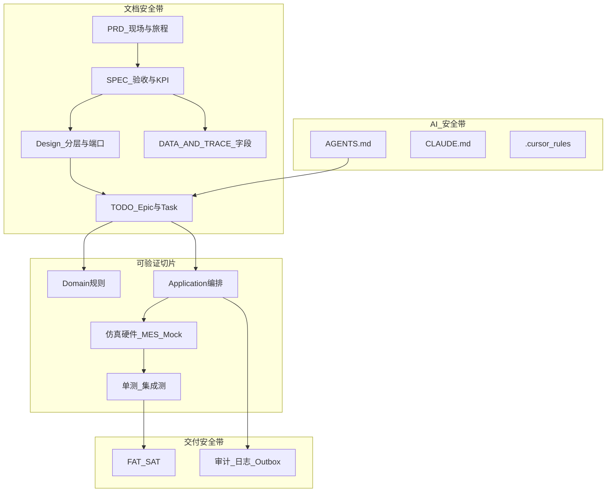

# AutoScrew 智能锁附系统：从零到一的项目总结

> 这不是一篇「我用了哪些框架」的技术清单，而是一次从产线问题出发，逐步形成 **需求记录 → 规格/设计 → Epic/Task → 驱动/HMI/追溯 → 验证 Harness** 的工程复盘。  
> 写给五年 WPF 经验、却感到在 AI 面前「业务理解 / 驱动 / 交互」被拉开差距的自己——差距往往不在 XAML，而在 **有没有可复用的工程安全带（Harness）**。

---

## 目录

0. [先说结论](#0-先说结论这次项目真正解决的是什么问题)  
1. [业务理解：把现场语言变成可执行闭环](#1-业务理解把现场语言变成可执行闭环)  
2. [**Harness Engineering：从 0 到 1 的主干方法**](#2-harness-engineering从-0-到-1-的主干方法)（最重要）  
3. [技术选型与架构](#3-技术选型与架构隔离变化而不是追求漂亮)  
4. [框架搭建：纵向切片先跑通](#4-框架搭建纵向切片先跑通)  
5. [EPIC / TASK：如何把 PRD 拆成可交付功能](#5-epic--task如何把-prd-拆成可交付功能)  
6. [建模粒度：状态、驱动、UI、数据](#6-建模粒度状态驱动-ui-数据)  
7. [AI 与上下文：VS Code 为何「知道得不够」](#7-ai-与上下文vs-code-为何知道得不够cursor-如何补齐)  
8. [**高阶 Cursor：多 Agent、Harness、防漏改**](#8-高阶-cursor多-agentharness防漏改)  
9. [做得好的 / 仍要警惕的 / 下一步](#9-做得好的--仍要警惕的--下一步)  
10. [给五年后的自己](#10-给五年后的自己)

---

## 0. 先说结论：这次项目真正解决的是什么问题

AutoScrew 面向产线**智能锁附工位**。它不是普通 CRUD，也不是「几个 WPF 页面 + 调个 DLL」，而是连接了：

操作员 · 产品工艺（PN/模板） · IEMD-SD 电批 · 扭矩–角度曲线判定 · 本地数据 · MES/LAN 追溯  

的小型工业控制系统。

**α / 一期边界（以仓库权威文档为准）**：

- 操作员**手动取钉**；上位机只控 **IEMD-SD**（参数 / 顺序 / 来源 / 拧紧 / 曲线）。
- 程控供料自动化、视觉识别：**不作为已实现能力**（见 [doc/PRD.md](doc/PRD.md) V1.4、[readme.md](readme.md)）。


**最大提醒**：五年 WPF 经验仍关键（绑定、线程、窗口生命周期、交互反馈），但工业软件的难点在于把现场语言翻译成稳定的 **状态、边界、事件、数据契约、验收方法**。AI 能高吞吐写代码，却不能替你决定「什么是正确的业务状态」，也不能替你承担真机风险。

因此本总结把 **Harness Engineering** 放在中心：不是「多写几个单测」，而是从第一天起构造一套让 AI、同事、未来的自己都能 **少猜、可追、可验** 的工程安全带。

---

## 1. 业务理解：把现场语言变成可执行闭环

### 1.1 一颗螺钉如何成为一条业务链

现场说：「扫 SN、按图锁螺钉、判断打紧、上传 MES」。软件必须展开为闭环：

1. 登录 → 角色 / 工位 / 设备状态  
2. 扫 SN → MES 或脱机路径校验  
3. SN→PN → 模板图、位号、工艺参数  
4. 手动取钉 → 上位机换参 / 拧紧周期  
5. 读报告与曲线 → 规则 ∪ 设备 OK/NG  
6. 记位号结果、曲线路径、用户、工位、时间；NG → 受控锁定（正式解锁 / 紧急解除）  
7. 多面翻面确认 → 整单完成 → 归档 / Outbox  

**产出不是页面列表**，而是：状态图、异常表、数据契约、验收场景。

### 1.2 边界意识：敢砍掉「听起来很酷」的范围

| 范围 | 处理 |
|------|------|
| 程控供料 | V1.1 曾进范围，V1.4 **改回手动**；驱动与配置页作废 |
| 智能电批 | 一期**唯一**必须真驱动 |
| 视觉 | 二期，不假装已实现 |
| MES | 接口抽象 + Mock；字段以 [DATA_AND_TRACE.md](doc/DATA_AND_TRACE.md) / IT 为准 |
| 安全 | 禁止绕过急停/互锁/扭矩保护 |

边界清楚，架构才不会被未定硬件绑死——这是 Harness 的第一层：**范围文档本身就是安全带**。

### 1.3 异常是一等公民

正常路径只有「扫 SN → 拧 → OK」。质量由异常路径决定：SN 拒收、配方缺失、电批忙/超时、曲线空、过扭、断电恢复、MES 断网、操作员紧急解锁等。  
**Harness 必须能复现失败**，而不是只测 happy path。

---

## 2. Harness Engineering：从 0 到 1 的主干方法

### 2.1 什么叫 Harness（在本项目里的定义）

这里的 Harness **不等于**「测试项目」 alone，而是一整套：



**一句话**：Harness = 让「需求怎么变、代码怎么改、怎么证明改对了」有固定轨道，人和 AI 都跑在轨道上。

### 2.2 从 0 到 1：文档流水线（必须按序，可迭代修订）

本仓库已经跑通的链路（可当作模板复用到下一个项目）：

| 阶段 | 本仓库锚点 | 回答的问题 | 不做会怎样 |
|------|------------|------------|------------|
| **原始需求** | `doc/*.xls`、会议记录 | 客户要什么画面/节拍/指标？ | 口头需求漂移 |
| **PRD** | [doc/PRD.md](doc/PRD.md) | 用户旅程、In/Out、异常场景、权限 | 开发按「想象的产线」写 |
| **SPEC** | [doc/SPEC.md](doc/SPEC.md)（若有）/ KPI 表 | 验收数字与追溯条目 | 无法对 FAT 勾选 |
| **Design** | [doc/Design.md](doc/Design.md) | 分层、端口、状态机、非目标 | 驱动细节渗进 UI |
| **数据契约** | [doc/DATA_AND_TRACE.md](doc/DATA_AND_TRACE.md) | MES/本地字段、幂等、路径 | 改一个字段牵全身 |
| **设备契约** | [doc/driverAnaC.md](doc/driverAnaC.md)、功能码目录 | 协议怎么说、联机四步 | 寄存器散落在页面 |
| **线框 / 工艺** | CONTROLLER_*_WIREFRAME、MULTI_SURFACE_* | HMI 布局与模板契约 | 前后端各画一张图 |
| **Epic/Task** | [doc/TODO.md](doc/TODO.md)、FusionTodo | P0/P1、状态、主要改动文件 | 「感觉做完了」无法验收 |
| **Agent 规则** | [AGENTS.md](AGENTS.md)、[CLAUDE.md](claude.md)、`.cursor/rules` | AI 先读什么、禁止什么 | 会话一长就丢边界 |

**关键纪律（本项目踩过坑后的定稿）**：

1. **MES / surface_id / 曲线字段**：先改 DATA_AND_TRACE，再改代码。  
2. **功能码**：先改目录/文档，再改驱动。  
3. **范围回退**（如供料改手动）：先改 PRD/TODO/Design，再删实现义务；代码可残留仿真，但清单必须标「作废」。  
4. **未确认二期能力**：禁止标成已完成。

### 2.3 PRD 怎么「记清楚」（可操作模板）

一份能喂给 AI 的 PRD，至少固定这些块：

1. **修订表**：版本 / 日期 / 变更原因（例：V1.4 供料回退手动）。  
2. **In-Scope / Out-of-Scope**：写成可勾选句子，不要散文。  
3. **角色 × 旅程**：操作员 / 技术员各一条 mermaid 或步骤列表。  
4. **单钉编排**：换参 → 拧紧 → 判定（含「不做什么」）。  
5. **验收场景**：Gherkin 或「Given/When/Then」最少 3 条（正常 / NG / 恢复）。  
6. **权威链接**：指向 SPEC、DATA、驱动文档。

AI 最怕「隐含默认」——Harness 的工作就是把默认写死。

### 2.4 PRD → SPEC：把愿望变成可验收条目

| PRD 说法 | SPEC / 验收侧要落成 |
|----------|---------------------|
| 漏锁为 0 | 完成前校验全部位 OK；测例与错误码 |
| 数据可追溯 | SN/位号/曲线路径/hostIp·Mac 字段表 |
| NG 锁定 | 谁可解锁、紧急解除是否审计 |
| 节拍 ≤ Xs | 明确 P95、样本数、是否含扫码 |

没有 SPEC 锚点的 PRD 句子，AI 会「实现一个看起来像的功能」，但 FAT 勾不上。

### 2.5 PRD → Design：把旅程落成分层与端口

Design 不重复 PRD 的 KPI，只回答：

- 哪些进 Domain（纯规则）？  
- 哪些进 Application（编排）？  
- 哪些进 Infrastructure（MES/DB/文件）？  
- 哪些进独立驱动项目（Modbus）？  
- HMI 只绑定什么状态，禁止直接调寄存器？

本项目的稳定形状：

```text
Hmi → Application → Domain
                ↘ Infrastructure → UDL.Delta.IemdSd
```

端口示例：`IMesClient`、`ILockStationHardware`、`ICurveArchive`、`ILockSessionRepository`、`IProcessLibraryService`。

### 2.6 验证 Harness（仿真 + 三层测试）

**仿真**：`SimulatedLockStationHardware`、Mock MES、仿真失败模式——目的是**制造失败**，不是永远绿。

**三层**：

1. Domain：状态机、曲线判定、编解码  
2. Application：SN→配方→逐钉→NG→恢复  
3. Driver/集成：Modbus、超时、报告/曲线、Outbox  

仿真通过 ≠ 真机通过；真机必须在脱机/维护模式下验。

### 2.7 Agent Harness：让 AI「少丢上下文」

仓库级：

- `AGENTS.md`：任务类型决策树、先读哪份文档  
- `CLAUDE.md` / 项目规则：安全边界、语言、最小 diff  
- `.cursor/rules`：始终生效的产线禁忌  

会话级：

- 一次只做一个 Epic 切片；改 MES 先贴 DATA 段落  
- 计划写在 `*.plan.md`，执行时禁止改计划本身（避免目标漂移）  
- 完成标准写进 Task：「单测 / 手测 / TODO 勾选」

这就是为什么 **同一套代码在 VS Code 里「感觉 AI 不懂项目」，在 Cursor 里却能持续推进**：差别多半不在模型智商，而在 **Harness 是否被加载进上下文**（见第 7 节）。

---

## 3. 技术选型与架构：隔离变化而不是追求漂亮

### 3.1 为何仍是 .NET 8 + WPF

适合：大图打点、实时曲线、复杂配置页、桌面部署、与 DI/日志/配置一体。  
WPF 解决表现层；**不替代**领域建模与协议设计。

### 3.2 分层职责（与 Design 对齐）

| 层 | 职责 | 禁止 |
|----|------|------|
| Domain | 状态机、曲线规则、模型 | 引用 WPF / EF / 设备 SDK |
| Application | 作业编排、用例、端口 | 写寄存器地址 |
| Infrastructure | SQLite、MES、文件、硬件适配 | 业务状态机散落 |
| Hmi | 绑定、命令、线程切回 | 自己实现整套流程 |
| UDL.Delta.IemdSd | Modbus + 强类型 API | 被页面直接依赖细节 |

### 3.3 接口优先

真 MES ↔ Mock、真电批 ↔ 仿真、SQLite ↔ 测试仓储——同一套 Application 编排。  
组合根集中注册，ViewModel 不 `new` 设备。

---

## 4. 框架搭建：纵向切片先跑通

推荐顺序（本项目实操版）：

1. 解决方案边界可编译  
2. 最小领域：SN/PN/位号/曲线样本/结果  
3. 状态机 + **仿真硬件** → 「扫 SN 拧一颗」离线可跑  
4. 作业台 VM 绑定真实状态（不是假按钮）  
5. 独立驱动项目接入真协议  
6. 持久化、审计、曲线归档、Outbox  
7. 权限、工艺库、发布与 FAT 资料  

原则：**每一步都有可演示的纵向切片**，而不是「基础设施全做完再等业务」。

驱动内再拆：传输 → 会话 → 命令执行 → 强类型 → 周期/报告。上层只认「初始化 / 换参 / 拧紧 / 读曲线」。

HMI 不是业务控制器：`OperatorSessionController` 编排；VM 订阅 `Changed` / 进度 / 曲线。

---

## 5. EPIC / TASK：如何把 PRD 拆成可交付功能

### 5.1 分层拆解示例（对本仓库）

```text
PRD「半自动锁附闭环」
  └─ Epic P0 产线闭环
       ├─ T-01 拧紧触发与当前钉绑定
       ├─ T-02 来源模式 #300
       ├─ T-05 NG 模态
       ├─ T-12 返修 / 清错 / 紧急解除
       └─ T-14 操作员菜单裁剪
  └─ Epic 工艺库
       ├─ 工艺卡导入（槽位文件名 → 设备 ID=槽+1）
       ├─ 顺序 Excel
       └─ 换产下发
  └─ Epic 追溯
       ├─ hostIp/hostMac
       ├─ LAN {MAC}/{SN}
       └─ History Dashboard
```

[TODO.md](doc/TODO.md) 的价值：每条 Task 带 **状态、层级、PRD 锚点、主要改动文件**——这是给 AI 的「最小充分上下文」。

### 5.2 好的 Task 长什么样

- **可演示**：导入一张卡 → 拧紧参数页出现 ID=1  
- **可回退**：范围取消时状态标「作废」，不是默默留半套 UI  
- **可验证**：单测断言 + 手测清单（操作员 / 技术员分角色）  
- **最小 diff**：不顺手重构无关模块  

### 5.3 真实切片回顾（说明 Harness 如何工作）

| 切片 | PRD/契约 | Task 形态 | 验证 |
|------|----------|-----------|------|
| 供料回退手动 | PRD V1.4 | TODO 作废 T-06* | 文档一致性 |
| NG 返修 + 紧急解除 | PRD 权限/异常 | T-12 | 分角色 UI + 审计 |
| 工艺卡无手填 ID | 厂商 1–500 | 槽位+1 + SaveLocalPreset | 解析单测 + 参数页可见 ID |
| 历史 Dashboard | DATA_AND_TRACE | T-25–T-32 | SQLite 查询 + LAN 路径 |

---

## 6. 建模粒度：状态、驱动、UI、数据

### 6.1 作业状态机（过程粒度）

```text
Idle → SnPending → LoadingRecipe → Running ⇄ NgLocked
                 ↘ AwaitFlip → Running → Completed
```

集中回答：允许什么动作、完成后去哪、非法如何拒绝。

### 6.2 三类模型不要揉成一个 DTO

- **工艺**：位号、扭矩分段、阈值  
- **运行时**：当前面/钉、状态、返修标记  
- **追溯**：SN、工位身份、曲线路径、上传幂等键  

### 6.3 设备协议粒度 vs 业务动作粒度

Modbus = 寄存器；业务 =「完成一次可判定的锁附」。驱动必须组合前者，并保留可诊断错误。

### 6.4 UI 粒度

后台高频采样 ≠ 每次刷新整页布局。区分：缓冲、增量曲线、周期结束归档。

### 6.5 最容易被低估的

断电记忆、重扫 SN、NG 权限、紧急解除审计、历史「谁在哪台工位何时做的」——这些是模型一部分，不是「以后加的页面」。

---

## 7. AI 与上下文：VS Code 为何「知道得不够」，Cursor 如何补齐

### 7.1 你感觉到的差距从哪来

| 维度 | 五年 WPF 经验 | AI 优势 | 若无 Harness |
|------|---------------|---------|--------------|
| 业务 | 懂现场口语 | 吞吐高、易编造「合理默认」 | 范围膨胀 / 假完成 |
| 驱动 | 怕踩真机 | 易生成 PoC | 寄存器进 UI |
| UI | 交互品味 | 快出 XAML | 无状态绑定、假按钮 |
| 全局 | 记不住全仓 | 可检索但依赖上下文窗 | 改 A 漏 B |

差距感往往是：**AI 在「有完整 Harness」时像资深搭档，在「只有打开的一个文件」时像实习生乱猜。**

### 7.2 VS Code 场景下的典型不足

用 VS Code + 通用补全/聊天写 [项目总结.md](项目总结.md) 或改业务时，常见缺口：

1. **未自动加载** `AGENTS.md` / 规则 / PRD 修订纪律  
2. **上下文窗**只看见当前文件或少量 `@`，看不到 TODO 与 DATA 契约  
3. **没有 Agent 工具链**（多文件搜索、跑测、按计划勾选）时，容易停在「文案正确、仓库脱节」  
4. **缺少「权威文档表」**，AI 用训练记忆填工业细节 → 看起来专业，实则未对齐合同/现场  

### 7.3 Cursor 侧本仓库已经具备的补齐手段

- 始终规则：产线安全、最小 diff、中文说明  
- Agent 可读：`AGENTS.md`、权威文档导航  
- 长任务：plan → 分 Task → 禁止改计划文件本身  
- 工具：跨文件 Grep/测试/终端证据  

**实践建议**：在 VS Code 写总结或设计时，至少手动把「PRD 修订段 + TODO 相关行 + Design 分层」贴进上下文；或把同一 Harness 迁到 Cursor 做实现，VS Code 只做轻编辑。

### 7.4 与 AI 协作的固定回路

```text
读权威文档 → 写清 In/Out 与验收 → 拆 Epic/Task
→ 最小实现 → 跑测/手测 → 勾 TODO → 记录边界回退
```

人的不可替代点：边界、真机安全、异常是否允许继续、审计证据、最终责任。

---

## 8. 高阶 Cursor：多 Agent、Harness、防漏改

> Ask / Plan / Agent / Multi / Debug 已会用时，瓶颈不再是「会不会开模式」，而是：**上下文怎么切、验证怎么闸、漏改与回归怎么挡**。

### 8.1 典型会话升级成「双闸门」流水线

```text
Ask（摸清边界与权威文档）
  → Plan（写清 In/Out、改动面、验收、明确不改什么）
  → Agent（最小 diff 实现；禁止改 plan 本身）
  → Verify（dotnet test / 手测清单 / TODO 勾选 —— 无证据不说完成）
  → Review Agent（独立会话审 diff，专找漏改与副作用）
```

| 闸门 | 谁做 | 防什么 |
|------|------|--------|
| **Plan 闸** | 你 + Plan | 范围膨胀、忘了角色差异、忘了文档同步 |
| **Verify 闸** | Agent 必须跑命令 | 「看起来改完了」但测试/构建未过 |
| **Review 闸** | 另开 Agent / Bugbot / Security | 主会话视野疲劳：漏字符串、漏操作员路径、碰共享状态机 |

原则：**完成声明必须有新鲜证据**（测例输出、手测勾选、diff 对照 plan），不能靠「应该没问题」。

### 8.2 多 Agent 并行：何时用、何时禁用

**适合并行（域独立、文件几乎不交叉）**

| Agent A | Agent B | 为何安全 |
|---------|---------|----------|
| 工艺卡解析单测 | History Dashboard 文案/查询 | 不同项目、无共享写锁 |
| 中英文 `Strings.*.xaml` 补键 | 某页 XAML 布局微调 | 约定 B 不改资源键名，或 A 先出键表 |
| 探索「谁调用 ClearErrors」 | 探索「Outbox 重试路径」 | 只读调研，主会话再合并结论 |

**禁止并行（会互相踩）**

- 两个 Agent 同时改 `OperatorSessionController` / 同一状态机  
- 一个改会话契约，另一个改绑定同一契约的 VM  
- 「一边实现 feature，一边大重构同目录」  

**并行调度模板（给子 Agent 的 prompt 要自包含）**

```text
范围：仅允许改 [路径列表]
目标：[可验证的一句话]
禁止：改 PRD 数字 / 改无关模块 / 扩 scope
权威上下文：贴 TODO 行 + DATA/PRD 相关段（不要假设子 Agent 继承你的聊天）
完成标准：跑 [具体命令]；回报：改了什么、测了什么、未做的风险
```

主会话只做：**拆域 → 派发 → 审 diff → 集成**，不要让子 Agent「自由发挥全仓」。

### 8.3 更好用 Harness：把「漏改」变成检查项，而不是靠记性

一次 feature 漏改或伤及它人功能，根因通常是下面四类——Harness 要对症：

| 漏改类型 | AutoScrew 实例 | Harness 对策 |
|----------|----------------|--------------|
| **契约漏同步** | 改了 ParameterId 规则，DATA/TODO/工艺库说明未写 | Task 验收含「文档勾选」；MES/字段先改 DATA |
| **角色路径漏** | 技术员能解锁，操作员紧急解除/提示漏 | Plan 写清角色矩阵；Review 专查操作员窗 |
| **共享状态副作用** | NG 锁定改动影响返修横幅 / 菜单裁剪 | Plan 列出「共享类型」；改后跑会话相关测 |
| **资源与发布漏** | 新字符串只加了 zh；help 未 CopyToOutput | csproj / 双语文案进验收清单 |

**Plan 阶段强制写「影响面（Blast Radius）」**（复制即用）：

```markdown
## Blast Radius
- 直接改：[...]
- 可能波及：状态机 / MES Outbox / 工艺库 / 操作页 Overlay / 权限
- 角色：操作员 | 技术员 | 管理员 —— 各验一条
- 文档：PRD / TODO / DATA / Design / 字符串 —— 哪些要动
- 明确不改：[...]
- 回归最小集：[列出 3～5 条既有路径，如「扫 SN→拧一颗 OK」「NG 锁定」「工艺卡再导入同槽=更新」]
```

没有 Blast Radius 的 Plan，默认视为**未就绪**，不要进 Agent。

### 8.4 Feature 交付的「防漏改」仪式（本仓库可落地）

1. **Todo 双轨**：实现项 + 验证项分开勾（实现完 ≠ 验证完）。  
2. **字符串双文件**：任何 UI 文案同时改 `Strings.zh-CN.xaml` / `Strings.en-US.xaml`。  
3. **共享编排敏感区**：动到 `OperatorSessionController`、`ILockStationHardware`、Outbox、工艺库 ID 映射 → **强制 Review Agent** + 相关单测。  
4. **范围回退**：像供料改手动那样，先改 PRD/TODO 状态为作废，再删实现义务，避免「半套自动化」残留成假功能。  
5. **完成后对照 Plan 逐条**：用独立 Ask/Agent：「对照 plan，列出未做项与可能回归」——主会话自己审容易「确认偏误」。

### 8.5 推荐的多会话分工（不必全开）


- **探索类**可并行 2～3 个只读 Agent，结论汇总进 Plan。  
- **实现类**默认单写者；第二 Agent 只做审查或只读影响分析。  
- **Debug**：只带最小复现 + 相关日志/测例，避免把整段聊天史塞进调试会话导致目标漂移。

### 8.6 一句话心法

> Cursor 的高阶不在「同时开更多 Agent」，而在 **Plan 写清影响面、实现保持最小 diff、完成必须有证据、审查用独立上下文专门找漏**。  
> Harness（PRD/TODO/DATA/测例/角色矩阵）就是把「靠人记得住」变成「靠清单跑得过」。

---

## 9. 做得好的 / 仍要警惕的 / 下一步

### 做得比较好的

- 范围可回退（供料手动）并同步文档，而不是代码偷偷留自动化主路径  
- Domain 状态机 + Application 编排 + 独立驱动  
- 仿真 / Mock / 测试分层，关键路径不绑死真机  
- 多面、checkpoint、NG/返修/紧急解除、Outbox、工艺库 ID 映射作为正式能力  
- PRD–Design–DATA–TODO–Agent 规则形成可复用 Harness  

### 仍要警惕

- 曲线启发式 ≠ 最终工艺真理，需真样本校准  
- Mock MES ≠ IT 定稿  
- 仿真绿 ≠ FAT 过  
- 任何绕过急停/互锁/扭矩保护/权限的「方便」都不可接受  
- **单次 feature 的漏改与共享状态副作用**（见 §8）——吞吐越高越要闸门  

### 下一步更值得投入

1. 真曲线标签集 → 量化误判/漏判  
2. 需求条目 ↔ 测例 ↔ 日志字段追溯矩阵  
3. 断线/半包/取消竞争的集成测  
4. 操作员 HMI：下一步能做什么、为何不能、找谁  
5. 把 Harness 写成团队默认：新功能必须先有 PRD/TODO 行再写代码  
6. **每个非琐碎 PR 强制 Blast Radius + Review Agent**  

---

## 10. 给五年后的自己

WPF 五年解决的是「窗口怎么做好」。  
AutoScrew 要升级的是：

> **从业务动作出发 → 用 PRD/SPEC 钉死范围与验收 → 用 Design 钉死分层与端口 → 用 Epic/Task 钉死切片 → 用状态机表达过程 → 用驱动隔离设备 → 用 Application 组织用例 → 用 HMI 呈现可操作状态 → 用仿真与测试提前验证失败 → 用追溯数据证明结果。**

这整条链，就是 **Harness Engineering**。

AI 让代码变快，也让错误假设传播更快。核心竞争力不是比 AI 多写几行，而是：

- 更清楚现场**为什么**要这段代码；  
- **什么时候不允许**执行；  
- 失败后必须留下**什么证据**；  
- 怎样证明系统**真的可以交给产线**；  
- **怎样用独立审查与影响面清单，挡住「实现了 A、弄坏了 B」。**

---

## 附录 A：本仓库 Harness 速查

| 用途 | 路径 |
|------|------|
| 门面 | [readme.md](readme.md) |
| PRD | [doc/PRD.md](doc/PRD.md) |
| 设计 | [doc/Design.md](doc/Design.md) |
| 追溯契约 | [doc/DATA_AND_TRACE.md](doc/DATA_AND_TRACE.md) |
| Epic/Task | [doc/TODO.md](doc/TODO.md) |
| 电批协议 | [doc/driverAnaC.md](doc/driverAnaC.md) |
| Agent 操作 | [AGENTS.md](AGENTS.md) |
| 原则/安全 | [claude.md](claude.md) |
| FAT/SAT | [doc/VERIFICATION_FAT_SAT.md](doc/VERIFICATION_FAT_SAT.md) |

## 附录 B：下一个项目启动检查单（复制即用）

- [ ] 原始需求归档 + PRD 初稿（含 In/Out、旅程、3 条验收）  
- [ ] SPEC/KPI 锚点（哪怕先占位）  
- [ ] Design：分层图 + 端口列表 + 非目标  
- [ ] 数据/设备契约文档  
- [ ] TODO：P0 Epic + 可勾选 Task（含改动路径）  
- [ ] AGENTS/规则：AI 先读顺序与禁止项  
- [ ] 仿真 + Domain 单测先于真机  
- [ ] 第一条纵向切片可演示后再铺基础设施  

## 附录 C：Feature 防漏改检查单（每次非琐碎改动）

- [ ] Plan 含 **Blast Radius**（直接改 / 可能波及 / 角色 / 文档 / 明确不改 / 回归最小集）  
- [ ] TODO 有实现项 + 验证项；完成后对照 Plan 逐条  
- [ ] 中英文字符串同步；涉及发布资源则查 csproj Copy  
- [ ] 动到会话/硬件/Outbox/工艺 ID → 独立 Review Agent  
- [ ] `dotnet test`（或相关子集）有新鲜输出，再声称完成  
- [ ] 手测：操作员路径至少一条 + 技术员路径至少一条（若涉及权限）  
- [ ] 回归最小集跑过（例：OK 闭环、NG 锁定、同槽工艺卡更新）  
- [ ] 若范围回退：PRD/TODO 先标作废，再处理代码义务  

---

*文档版本：对齐仓库 α 阶段实践（含 PRD V1.4 手动供料、工艺卡槽位→设备 ID、NG/返修 Harness、高阶 Cursor 防漏改）。随现场合同与 IT 定稿继续修订权威文档，再回写本节。*
